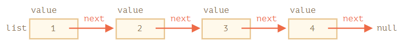
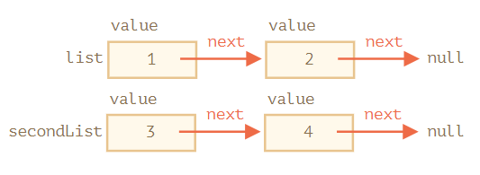
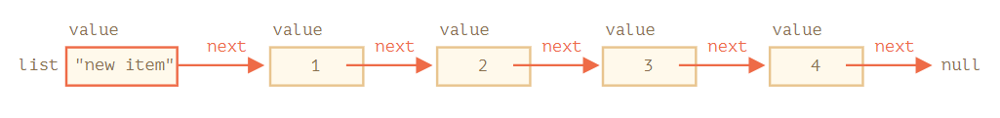
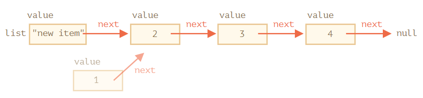

# 链表
**链表元素** 是一个符合递归结构的特殊对象，这种数据结构可以实现**快速插入/删除元素**。

一般结构如下
- `value` 自身的属性值
- `next` 引用下一个 **链表元素** （末尾的链表元素该属性值为 `null`）

```js
// 创建一个链表，符合递归结构
let list = { value: 1 };
list.next = { value: 2 };
list.next.next = { value: 3 };
list.next.next.next = { value: 4 };
list.next.next.next.next = null;
```



```js
let list = {
  value: 1,
  next: {
    value: 2,
    next: {
      value: 3,
      next: {
        value: 4,
        next: null
      }
    }
  }
};
```

:bulb: 链表通过 `next` 指针指向「邻居」链表，以构建一个有序的数据结构。

:bulb: 可以在 `next` 之外，再添加 `prev` 属性来引用前一个元素，以便轻松地往回移动。还可以添加一个名为 `tail` 的变量，该变量引用链表的最后一个元素（并在从末尾添加/删除元素时对该引用进行更新）。

## 操作链表
链表和数组类似，也是有序的数据结构，但它更容易被拆分、重组、在首位或中间插入元素，性能更佳。但是链表主要的缺点就是**无法很容易地通过元素的编号获取元素**，需要从起点元素开始，顺着 `next` 找 `N` 次才能获取到第 N 个元素；而数组就可以很容易基于索引访问特定的元素。

* 拆分为两个独立链表 `list` 和 `secondList`



```js
let secondList = list.next.next;
list.next.next = null;
```

* 合并链表

```js
list.next.next = secondList;
```

* 插入元素



```js
// 将新值添加到链表头部
list = { value: "new item", next: list };
```

* 删除元素



```js
// 要从中间删除一个值，可以修改前一个元素的 next 指针
list.next = list.next.next;
```

:bulb: 示例 `list.next` 从 `1` 跳到值 `2`。现在值 `1` 就被从链表中移除了。如果它没有被存储在其它任何地方，那么它会被自动从内存中删除。