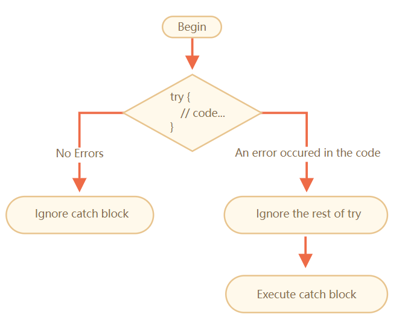

---
tags:
  - javascript
---

# 错误处理
脚本可能出现错误，是由于编写出错，或是与预期不同的用户输入，或是错误的服务端响应以及其他数千种原因。

常见的错误有：
* 语法错误：不符合 JavaScript 语法的错误
* 运行时错误：指代码没有语法错误时执行程序，但是在运行过程中发生的错误，常见的运行时错误有多种
    * `ReferenceError` 变量引用异常触发
    * `TypeError` 类型使用错误时触发
    * `RangeError` 一般在递归爆栈时触发

:bulb: 逻辑错误是指计算结果和预期不符合，一般是代码算法或编写逻辑错误引起的，可以在代码中使用关键字 `debugger` 或在浏览器的调试器中打断点，通过单步跟踪调试来解决这种错误。

## try-catch
通常如果发生错误脚本就会立即停止，并在控制台将错误打印出来，但是有一种语法结构 `try...catch`，它使我们可以「捕获」catch 错误，执行更合理的操作而不是让程序「死掉」。

```js
try {
  // 代码...
} catch (err) {
  // 错误捕获
}
```

按照以下步骤执行：

1. 首先执行 `try {...}` 中的代码
2. 如果这里没有错误，则忽略 `catch(err)` 执行到 `try` 的末尾，并跳过 `catch` 继续执行
3. 如果这里出现错误，则 `try` 执行停止，控制流转向 `catch(err)` ，变量 `err`（可以使用任何名称）将包含一个 `error` 对象，该对象包含了所发生事件的详细信息，我们会在 `catch(err) {...}` 代码块中执行相应的处理（而不会停止脚本）。



```js
try {
  alert('Start of try runs');
  lalala; // Error，变量未定义！
  alert('End of try (never reached)');  // 由于错误，终止执行该语句
} catch(err) {
  alert(`Error has occurred!`);   // Error has occurred!，由于 try 中出现错误，该语句执行
}
```

:bulb: 如果我们不需要 `error` 的详细信息可以忽略它，即在 `catch` 中可以不带参数；也可以只使用 `try` 代码块而不需要 `catch` 代码块，即无论是否发生错误都跳过，继续执行外部的代码。

:warning: `try..catch` 只能处理有效代码之出现的错误，即**代码必须是可执行的，如果代码包含语法错误那么 `try...catch` 将无法正常工作**，如含有不匹配的花括号。由于 JavaScript 引擎首先会读取代码，在读取阶段发生的错误被称为「解析时间」parse-time 错误，并且无法恢复（从该代码内部），这是因为引擎无法理解该代码，这类的错误无法使用 `try...catch` 捕抓；当解析正常后运行它发生的错误，这类错误被称为「运行时的错误」 runtime errors，有时被称为「异常」exceptions，这类错误才可能被 `try...catch` 处理。

:warning: 如果在计划的 scheduled 代码中发生异常，如在 `setTimeout` 中，则设置在外部的 `try...catch` **不会捕获**到异常，因为 `try...catch` 包裹了计划要执行的函数，该函数本身要稍后才执行，这时引擎已经离开了 `try...catch` 结构。为了捕获到计划的 scheduled 函数中的异常，那么 `try..catch` 必须在这个函数内

```js
setTimeout(function() {
  try {
    noSuchVariable; // try...catch 处理 error 了！
  } catch {
    alert( "error is caught here!" );
  }
}, 1000);
```

## Error 对象
在 `try...catch` 结构中 `try{...}` 代码发生错误时，JavaScript 生成一个包含有关其详细信息的对象，然后将该对象作为参数传递给 `catch` 用于进行相应的处理，一般是通过读取 Error 对象的属性以了解异常的具体信息。

对于所有内建的 `error` 对象，如 `SyntaxError`，`ReferenceError`，`TypeError` 等，具有两个主要属性：

* Error 名称 `name`，如对于一个未定义的变量，名称是 `ReferenceError`
* Error 信息 `message` 关于 error 的详细文字描述，而且一般都是可理解的友好提示

:bulb: 还有其他非标准的属性（在大多数环境中可用），其中被最广泛使用和支持的是 `stack`，一个描述当前调用栈的字符串，其中包含有关导致 `error` 的嵌套调用序列的信息。

## 抛出自定义 error
有时候程序在逻辑上可执行（不发生异常），但从功能上来说输出的并非预期的结果也可以当作是 `error`。我们可以在 `try{...}` 代码块中基于特定输出的结果使用**操作符 `throw` 「手动」抛出错误**，在 `catch{...}` 捕获错误并进行相应的处理

技术上讲可以将任何东西用作 `error` 对象，甚至可以是一个原始类型数据，如数字或字符串，但最好使用具有 `name` 和 `message` 属性的对象（某种程度上保持与内建 error 的兼容性）。JavaScript 中有很多内建的标准 error 的构造器，如 `Error`，`SyntaxError`，`ReferenceError`，`TypeError` 等，可以使用它们来创建 error 对象。对于内建的 error 属性 `name` 就是构造器的名字，属性 `message` 则来自于传递的参数。

```js
// 使用内建构造器创建 error 对象
let error = new Error(message);
let error = new SyntaxError(message);
let error = new ReferenceError(message);

// 传递的参数作为错误信息
let error = new Error("Things happen o_O");

alert(error.name); // Error
alert(error.message); // Things happen o_O
```

通过自定义特定条件抛出错误，这样就可以将 `catch` 成为所有  `error` 处理的唯一场所

```js
let json = '{ "age": 30 }'; // 不完整的数据

try {
  let user = JSON.parse(json);
  alert( user.name );   // undefine，该行代码可执行但是并非输出预计的结果，因为对象 user 没有预先声明 name 属性
} catch (e) {
  alert( "doesn't execute" );   // 并不运行，由于没有产生错误
}

/*---------- 分割线 ----------*/
let json = '{ "age": 30 }'; // 不完整的数据

try {
  let user = JSON.parse(json);
  if (!user.name) {
    throw new SyntaxError("Incomplete data: no name");   // 自定义抛出的错误
  }
  alert( user.name );
} catch(e) {
  alert( "JSON Error: " + e.message ); // JSON Error: Incomplete data: no name，此时可以处理 JSON.parse 异常情况
}
```

## 再次抛出
在 `try...catch` 设置了自定义抛出的错误，但在代码运行时可能发生 **另一个预料之外的 error**，这些错误也会被 `catch` 捕获，但是 `catch` 中预设的处理方法就可能不适用了，并且也会使代码变得更难以调试，此时可以**将预料之外的错误其再次抛出 rethrowing 给外部**的 `try..catch` 结构（如果存在）捕获到，进行另外的处理，如果外部不存在这种结构，那么脚本就会被杀死。

再次抛出步骤大致如下：

1. `catch` 捕获所有 `error`
2. 在 `catch(err) {...}` 块中对 error 对象信息进行分析
3. 如果我们不知道如何处理它，那我们就将其再次抛出

```js
function readData() {
  let json = '{ "age": 30 }';

  try {
    // ...
    blabla(); // error!
  } catch (e) {
    // ...
    if (e.name != 'SyntaxError') {
      throw e; // 再次抛出（不知道如何处理它）
    }
  }
}

try {
  readData();
} catch (e) {
  alert( "External catch got: " + e ); // 外部结构再次捕获了它！
}
```

## finally
`try...catch` 结构还可能添加一个子句 clause `finally` 用于放置无论出现什么情况都要完成的代码。如果它存在会**在所有情况下都会被执行**，`try` 之后（如果没有 error）或 `catch` 之后（如果没有 error）都会执行，即使在其中有 `return` 语句。

```js
try {
   ... 尝试执行的代码 ...
} catch(e) {
   ... 处理 error ...
} finally {
   ... 总是会执行的代码 ...
}
```

:bulb: `finally{...}` 代码块中用于放置无论如何都需要执行的任务，会在跳出 `try...catch` 代码块之前执行。

## 全局 catch
为了捕获 `try...catch` 结构以外的 error，（规范中没有相关内容）代码的执行环境一般会提供这种全局错误处理机制，如 Node.JS 有 [`process.on("uncaughtException")`](https://nodejs.org/api/process.html#process_event_uncaughtexception)；**在浏览器中可以将一个函数赋值给特殊的 [`window.onerror` 属性](https://developer.mozilla.org/zh/docs/Web/API/GlobalEventHandlers/onerror)，该函数将在发生未捕获的 error 时执行**。

```js
window.onerror = function(message, url, line, col, error) {
  // ...
};
```

函数参数说明

* `message` Error 信息
* `url` 发生 error 的脚本的 URL
* `line`，`col` 发生 error 处的代码的行号和列号
* `error` Error 对象

```js
<script>
  window.onerror = function(message, url, line, col, error) {
    alert(`${message}\n At ${line}:${col} of ${url}`);
  };

  function readData() {
    badFunc(); // 啊，出问题了！
  }

  readData();
</script>
```

:bulb: 全局错误处理程序 `window.onerror` 的作用通常不是恢复脚本的执行，如果发生编程错误几乎是不可能恢复的，它的作用是将错误信息发送给开发者。也有针对这种情况提供错误日志的 Web 服务，如 [https://errorception.com](https://errorception.com/) 或 [http://www.muscula.com](http://www.muscula.com/)，它们会执行以下步骤

1. 注册该服务，并拿到一段 JS 代码（或脚本的 URL），然后插入到页面中。
2. 该 JS 脚本设置了自定义的 `window.onerror` 函数。
3. 当发生 error 时，它会发送一个此 error 相关的网络请求到服务提供方。
4. 我们可以登录到服务方的 Web 界面来查看这些 error。

## 拓展 error
当我们在开发时，经常需要自定义 `error` 类来反映可能出错的特定任务，如对于网络操作中的 `error` 需要 `HttpError`，对于数据库操作中的 `error` 需要 `DbError`，对于搜索操作中的 `error` 需要 `NotFoundError` 等。可以通过**继承内建的 Error 创建自定义错误类的方式类拓展 `error` 的类别**，并通过关键字 `throw` 「手动」抛出自定义的错误，再结合使用 `obj instanceof Error` 来识别 `error` 对象所属的特定的错误类型，针对性地作出相应的处理。

:bulb: 继承 error 创建个性化的错误类时，注意修改该构造函数的 `name` 以提供更准确的错误信息，:warning: 别忘记在子类的 `constructor` 中先调用 `super` 通过父类的构造函数创建实例对象，再进行其他属性的设置。

```js
// ValidationError 错误类继承自内建类 Error
// 当 JSON 存在字段缺失或不正确时就会引起该错误
class ValidationError extends Error {
  constructor(message) {
    super(message);   // 调用父类构造器创建实例对象
    this.name = "ValidationError";   // 覆盖原有的 name 属性，改为与类同名
  }
}

// 用法
function readUser(json) {
  let user = JSON.parse(json);
  if (!user.age) {
    throw new ValidationError("No field: age");
  }
  if (!user.name) {
    throw new ValidationError("No field: name");
  }
  return user;
}

// try..catch 的工作示例

try {
  let user = readUser('{ "age": 25 }');
} catch (err) {
  // 匹配错误类型
  if (err instanceof ValidationError) {
    alert("Invalid data: " + err.message); // Invalid data: No field: name
  } else if (err instanceof SyntaxError) {
    alert("JSON Syntax Error: " + err.message);
  } else {
    throw err; // 未知的 error，再次抛出 (**)
  }
}
```

:bulb: 如果希望继承后，自定义错误类的 `name` 属性可以和类名一致（而不是每次手动设置），可以设置 `this.name=this.constructor.name` 作为一个基本的错误类，其他自定义类再继承

```js
class MyError extends Error {
  constructor(message) {
    super(message);
    this.name = this.constructor.name;
  }
}

class ValidationError extends MyError { }

class PropertyRequiredError extends ValidationError {
  constructor(property) {
    super("No property: " + property);
    this.property = property;
  }
}

// name 是对的
alert( new PropertyRequiredError("field").name ); // PropertyRequiredError
```

## 包装异常
包装异常是一项广泛应用的技术，用于处理多种不同的低级别异常，将它们合并为「高级别」 `error` 统一显示，具体的区别可以访问异常的属性获取更多信息，这种「封装」后的异常提示对于用户更友好。

```js
class ReadError extends Error {
  constructor(message, cause) {
    super(message);
    this.cause = cause;
    this.name = 'ReadError';
  }
}

class ValidationError extends Error { /*...*/ }
class PropertyRequiredError extends ValidationError { /* ... */ }

function validateUser(user) {
  if (!user.age) {
    throw new PropertyRequiredError("age");
  }

  if (!user.name) {
    throw new PropertyRequiredError("name");
  }
}

function readUser(json) {
  let user;

  try {
    user = JSON.parse(json);
  } catch (err) {
    if (err instanceof SyntaxError) {
      throw new ReadError("Syntax Error", err);
    } else {
      throw err;
    }
  }

  try {
    validateUser(user);
  } catch (err) {
    if (err instanceof ValidationError) {
      throw new ReadError("Validation Error", err);
    } else {
      throw err;
    }
  }

}

try {
  readUser('{bad json}');
} catch (e) {
  if (e instanceof ReadError) {
    alert(e);
    // Original error: SyntaxError: Unexpected token b in JSON at position 1
    alert("Original error: " + e.cause);
  } else {
    throw e;
  }
}
```

上述实例创建一个新的错误类 `ReadError` 并将原来由错误类 `PropertyRequiredError` 创建的两种错误对象都包装起来，具体的错误信息作为其属性 `cause` 这样可以将不同的字段缺失造成的错误都以高一个级别的错误「数据读取异常」统一表示。