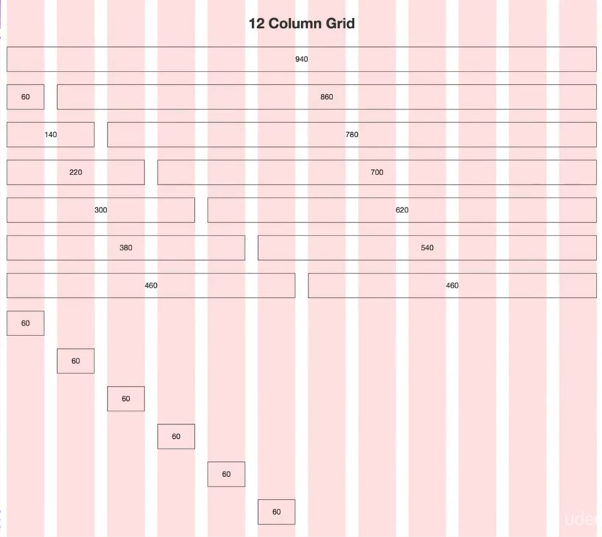
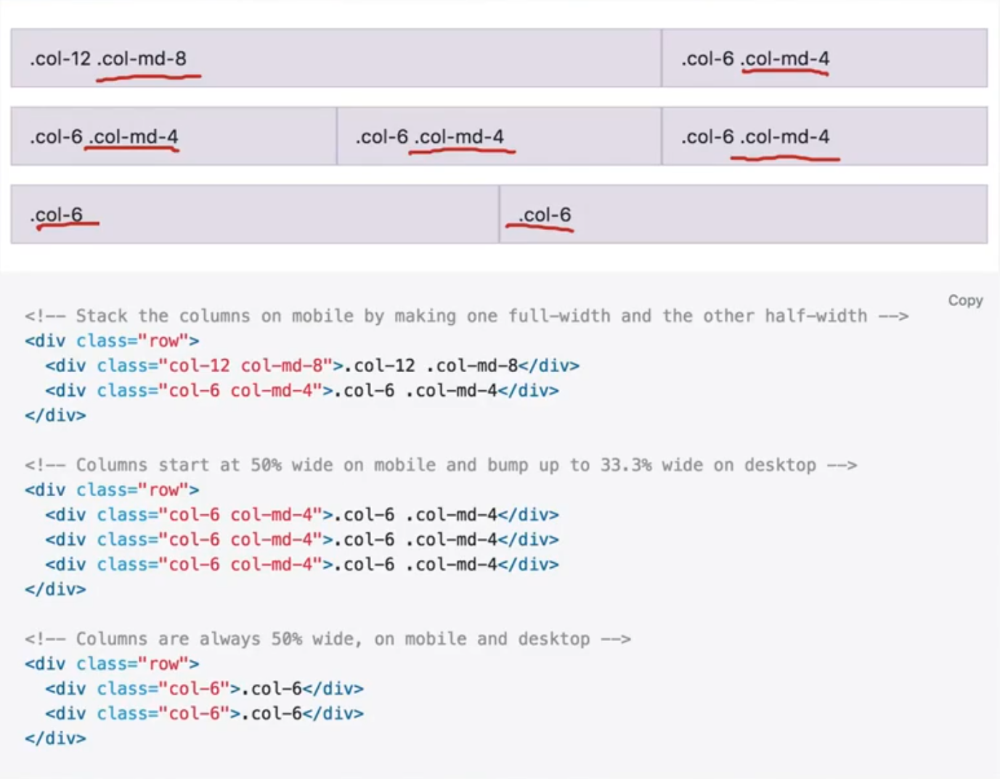
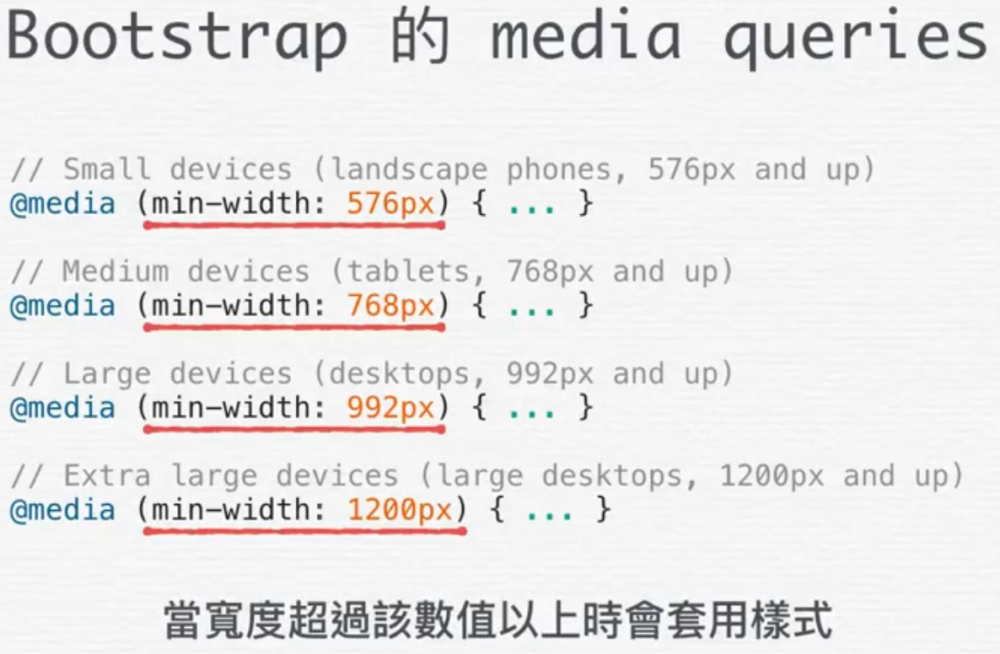
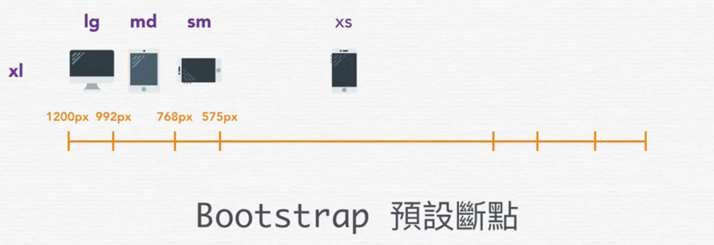
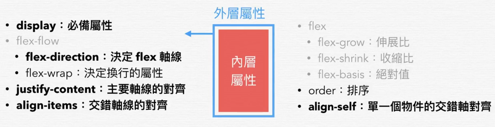

---
tags:
  - bootstrap
---

# 布局

## 网格系统
平面设计排版会使用网格系统，元素会依据预设的格线进行排布。

在早期屏幕宽度（分辨率）为 1024px，因此一般基于 960px 的网格系统进行网页设计。其中网格栏数/列数为 `12`（因为它是较多数字的公倍数方便通过不同栏数组合实现不同排布，如左右等距、三列等距……)。

相关参数：

* Total Width 总栏宽（去除左右外边距各 10px）为 940px
* Column Width 栏宽/列宽为 60px
* Gutter Width 列间距为 20px，Gutter on outside 最外侧列边距一般为一半值，即 10px
* Number of Columns 总栏数量为 12




Bootstrap 排版使用的网格系统是由平面设计的基础概念发展而来的，即将一行分为 12 栏，通过相应的属性组合可以实现不同的排版方式



### 使用规则
Bootstrap 的网格系统使用一系列容器 `container`、行 `row`、和栏 `col-n` 属性（`n` 范围从 1~12 分别表示该元素/栏的宽度在 12 列布局中占比多大）

:bulb: Bootstrap 网格布局是基于 flexbox 建立的，而且完全符合响应式（可以栏属性添加中断点关键字，如 `col-lg-3` 表示在较大 `lg` 视窗时该栏宽度占比为 3/12）。

```html
<!-- 一行三列的布局 -->
<div class="container">
  <div class="row">
    <div class="col-sm">
      One of three columns
    </div>
    <div class="col-sm">
      One of three columns
    </div>
    <div class="col-sm">
      One of three columns
    </div>
  </div>
</div>
```

* 在同一行的列元素 `class="col-xx"` 需要包括在行元素 `class="row"` 内
* 列元素只能作为框架，页面的内容/元素需要放置在其内（而不能直接将列元素作为其他），不然会造成空间「补回」和 flexbox 布局失效
* 整个网格布局应该放置在一个 `class="container"` 容器中，以限制网格宽度大小（避免由于内容过多造成网格过宽，使得网页出现卷轴），而且容器会补充行元素设置的负外边距，并容器会再添加 Gutter 外边距使得网格布局更美观。

:bulb: 如果为列元素 `.col-auto` 添加了 `auto` 后缀，列宽度会基于内容多少自动调节宽度。

:warning: 需要在 `.col` 外包裹 `.row` 类的元素，因为 Bootstrap 通过为每个列元素设置内边距构成 Gutter 列间距，并通过在行元素上设置**负**外边距，让列元素在左右最外侧多出的内边距「缩回」，这样才可以让每一行总宽度一致

```css
.row {
    margin-right: -10px;
    margin-left: -10px;
}

.col-* {
    padding-right: 10px;
    padding-left: 10px;
}
```

### 响应式
Bootstrap 基于移动优先的设计理念，即其样式设置一般适用于最小尺寸的设备，即默认针对最小断点 `xs` 。此外 Bootstrap 提供了许多中断点，可以在设置相应样式类属性时作为关键字插入，这样就可以在窗口（宽度）超过相应的大小时才套用该样式。在使用网格系统时可以为列元素添加关键字 `xs`（省略）、`sm`、`md`、`lg`、`xl` 实现在特定的视图下不同布局。






<p class="codepen" data-height="265" data-theme-id="light" data-default-tab="html,result" data-user="benbinbin" data-slug-hash="MWaWNje" style="height: 265px; box-sizing: border-box; display: flex; align-items: center; justify-content: center; border: 2px solid; margin: 1em 0; padding: 1em;" data-pen-title="MWaWNje">
  <span>See the Pen <a href="https://codepen.io/benbinbin/pen/MWaWNje">
  MWaWNje</a> by Benbinbin (<a href="https://codepen.io/benbinbin">@benbinbin</a>)
  on <a href="https://codepen.io">CodePen</a>.</span>
</p>
<script async src="https://static.codepen.io/assets/embed/ei.js"></script>

以上示例实现了一个响应式网格布局，在网页宽度大小大于中断点 `md` 时以一行 4 栏的形式排布，而网页宽度小于中断点 `md` 大于 `sm` 时以一行 2 栏排布，最后如果网页宽度比中断点 `sm` 还小就会以一行 1 栏的方式排布。

## Flexbox 布局
Bootstrap 4 与前一版最大的差别在于[新版使用 Flex 实现网格布局](https://getbootstrap.com/docs/4.4/utilities/flex/)（而上一版使用 float），因此在 Bootstrap 第 4 版中除了可以在网格系统中适用 Flexbox 技术，它还提供了多种相关的类，以方便地实现多种相应的 Flexbox 排版。




**Flex 容器属性**

|      对应的 CSS 属性      | Bootstrap `class` 组合规则（一般结合中断点） |                                                                                 Bootstrap 实例                                                                                 |
| :--------------------------: | :-----------------------------------------------------: | :--------------------------------------------------------------------------------------------------------------------------------------------------------------------------------: |
|           `flex`           |                 `.d-{size}-flex`                  |                                                                    `.d-sm-flex` 或 `.d-inline-flex`                                                                     |
|  **`flex-direction`**  |             `.flex-{size}-{属性值}`              |                                         `.flex-row`、`.flex-row-reverse`、`.flex-column`、`.flex-column-reverse`                                         |
| **`justify-content`** |       `.justify-content-{size}-{属性值}`       | `.justify-content-start`、`.justify-content-end`、`.justify-content-center`、`.justify-content-between`、`.justify-content-around` |
|    **`align-items`**     |        `.align-items-{size}-{属性值}`         |             `.align-items-start`、`.align-items-end`、`.align-items-center`、`.align-items-baseline`、`.align-items-stretch`              |
|       `flex-wrap`        |             `.flex-{size}-{属性值}`              |                                                        `.flex-nowrap`、`.flex-wrap`、`.flex-wrap-reverse`                                                        |
|     `align-content`     |       `.align-content-{size}-{属性值}`       |        `.align-content-start`、`.align-content-end`、`.align-content-center`、`.align-content-around`、`.align-content-stretch`        |

:bulb: `align-cotent` 设置容器中的**内容**在交叉轴的对齐方式，类似 `align-items`（设置容器中的项目在交叉轴上的对齐方式），但它只在了样式 `flex-wrap: wrap` 时才生效


**flex 项目属性**

|  对应的 CSS 属性   | Bootstrap `class` 组合规则（一般结合中断点） |                                                                             Bootstrap 实例                                                                             |
| :------------------------: | :----------------------------------------------------------------: | :---------------------------------------------------------------------------------------------------------------------------------------------------------------------------: |
| **`align-self`** |           `.align-self-{size}-{属性值}`           | `.align-self-start`、`.align-self-end`、`.align-self-center`、`.align-self-baseline`、`.align-self-stretch` |
|        `order`        |                `.order-{size}-{数值}`                 |                                                         `.order-1`、`.order-2`、`.order-lg-3`                                                          |

:bulb: 通过 `row`、`col` 一系列属性搭建的网格布局中，默认采用 `flex-wrap: wrap` 样式，即网格布局是自动换行的；而在容器中使用 `d-flex` 属性实现的 Flexbox 布局中并没有默认换行，可以为容器添加类属性 `.flex-wrap` 实现自动换行。

:warning: 必须先在容器中设置 `.d-flex` 类或使用网格模板（由 `.row` 和 `.col` 类），相关的样式类才可以生效

:bulb: **在 Flexbox 布局中**，为 flex 项目设置外边距可实现推移，可以通过`.offset-n`  或 [margin 通用類別](https://bootstrap.hexschool.com/docs/4.2/utilities/spacing/)来实现。使用前缀 `offset` 设置推移的宽度（基于 12 列布局），如 `offset-4` 将元素增加四栏位移；当为其中一个项目设置外边距为 `auto` ，如将项目左侧的外边距设置为 `ml-auto` 就可以将相应一侧的元素「推开」到一端，巧妙地实现 flex 项目左右布局的样式；

## 定位
Bootstrap 支持使用 `position` 对元素进行定位，其中提供了三种类属性以设置[https://getbootstrap.com/docs/4.4/components/navbar/](https://getbootstrap.com/docs/4.4/components/navbar/)

* `.fixed-top` 固定在顶部
* `.fixed-bottom` 固定在底部
* `.sticky-top` 当父元素向上滚动到顶部时，贴齐到可视区的顶部直至容器离开页面（或向下滚动）

:bulb: IE11 和 IE10 将`position: sticky` 当作 `position: relative` 使用。