# 组件
Bootstrap 提供了多种预设组件，可以直接复制/套用到项目中添加相应的组件，还可以定制出更多样的组件。

## 引用
Bootstrap 为引用文字和引用来源设置了样式，可通过 `class="blockquote"` 和 `class="blockquote-footer"` 属性来标记

## 列表
Bootstrap 将无序列表样式设置默认不带标记符号，通过 `class="list-unstyled"` 标记；列表常常用于菜单栏，需要将列表转换为行内元素，Bootstrap 提供 `class="list-inline"` 实现

在定义列表中，如果被定义列表项 `<dt>` 内容过长，Bootstrap 提供了 `class="text-truncate"` 自动基于整个表格的排版需求对内容进行「裁切」（默认显式 `...` 标记）:warning: 该属性样式需要元素在宽度限制下，文本内容超出宽度才生效

## 媒体对象
媒体对象 media object 是用于构建左右布局（一侧是图片等富媒体元素，另一侧是文字且不会环绕图片）的 Bootstrap 组件，如博客评论，推文等。

只需要使用两个类即可实现该布局：
* 容器 `.media`
* 文本内容（嵌套在容器内）`.media-body`

```html
<div class="media">
  
  <div class="media-body">
    <h5 class="mt-0">Media heading</h5>
    Cras sit amet nibh libero, in gravida nulla. Nulla vel metus scelerisque ante sollicitudin. Cras purus odio, vestibulum in vulputate at, tempus viverra turpis. Fusce condimentum nunc ac nisi vulputate fringilla. Donec lacinia congue felis in faucibus.
  </div>
</div>
```

:bulb: 它使用 Flexbox 实现，因此可以应用相关的属性样式，如为图片设置 `align-self-{属性值}` 可调节其垂直方向的对齐方式。

:bulb: 可使用通用空间样式，设置左右元素的间距。

:bulb: 允许在 `.media-body` 元素内继续嵌套媒体对象。

:bulb: 只需要调整图片元素和文本元素在 HTML 文档的顺序即可切换图片与文字左右排版顺序，:warning: 记得如果图片在右侧，调整与文字间距应该使用 `.ml` 属性

:bulb: 如果使用多个媒体对象，可以使用列表以增添语义。

```html
<ul class="list-unstyled">
  <li class="media">
    
    <div class="media-body">
      <h5 class="mt-0 mb-1">List-based media object</h5>
      Cras sit amet nibh libero, in gravida nulla. Nulla vel metus scelerisque ante sollicitudin. Cras purus odio, vestibulum in vulputate at, tempus viverra turpis. Fusce condimentum nunc ac nisi vulputate fringilla. Donec lacinia congue felis in faucibus.
    </div>
  </li>
  <li class="media my-4">
    
    <div class="media-body">
      <h5 class="mt-0 mb-1">List-based media object</h5>
      Cras sit amet nibh libero, in gravida nulla. Nulla vel metus scelerisque ante sollicitudin. Cras purus odio, vestibulum in vulputate at, tempus viverra turpis. Fusce condimentum nunc ac nisi vulputate fringilla. Donec lacinia congue felis in faucibus.
    </div>
  </li>
  <li class="media">
    
    <div class="media-body">
      <h5 class="mt-0 mb-1">List-based media object</h5>
      Cras sit amet nibh libero, in gravida nulla. Nulla vel metus scelerisque ante sollicitudin. Cras purus odio, vestibulum in vulputate at, tempus viverra turpis. Fusce condimentum nunc ac nisi vulputate fringilla. Donec lacinia congue felis in faucibus.
    </div>
  </li>
</ul>
```

## 关闭按钮
关闭按钮是一个 HTML 字符实体 `&times;` 以交叉形状的样式展示的 Bootstrap 组件，一般用在 `alert` 通知/警报或 `modal` 模态窗/浮动视窗中使用，以供用户点击关闭这些弹出窗口。

复制以下代码并添加到相应的弹出窗口元素内即可。

```html
<button type="button" class="close" aria-label="Close">
  <span aria-hidden="true">&times;</span>
</button>
```

:bulb: 请添加上属性 `aria-label="Close"` 以提供语义，供屏幕阅读器识别按钮的作用。

## 警告框
警告框 Alert 为用户操作提供内容回馈，可以包含任何长度内容插入到文档流中，而且可以选择性加入的关闭按钮以允许用户阅读后将警报关闭。

```html
<div class="alert alert-primary" role="alert">
  A simple primary alert—check it out!
</div>
```

Bootstrap 提供了 8 种外观样式，使用正确的颜色样式可以给用户更直观的提示，如错误警告使用 `.alert-danger` 或 `.alert-warning` 属性

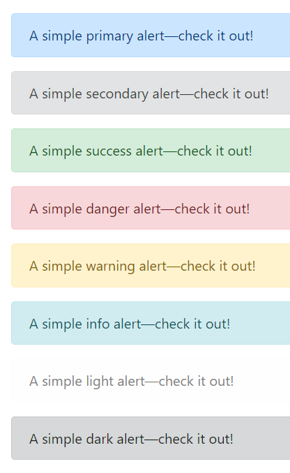

* `.alert-primary`
* `.alert-secondary`
* `.alert-success`
* `.alert-danger`
* `.alert-warning`
* `.alert-info`
* `.alert-light`
* `.alert-dark`

:bulb: 链接默认样式是具下划线的蓝色字体，为警告框内的**锚标签**添加类属性 `.alert-link` 将链接字体改为更符合视觉美学的样式（加粗、颜色与整体文本一致、悬停出现下划线）

可以为警告框组件添加关闭按钮，允许用户阅读后将警告关闭:warning: 关闭的警告框会从 DOM 中删除

* 在警告框组件添加类属性 `..alert-dismissible` 以允许该警告框组件可关闭
* 在警告框组件内加入**关闭按鈕**，并未按钮添加类属性 `.alert-dismissible` 以触发 JavaScript 脚本

```html
<div class="alert alert-warning alert-dismissible fade show" role="alert">
  <strong>Holy guacamole!</strong> You should check in on some of those fields below.
  <button type="button" class="close" data-dismiss="alert" aria-label="Close">
    <span aria-hidden="true">&times;</span>
  </button>
</div>
```

:bulb: 如果需要以动态方式展示/解除它们，可以为警告框组件添加类属性 `.fade` 和 `.show`

:warning: [添加关闭警告框的交互](https://getbootstrap.com/docs/4.4/components/alerts/#javascript-behavior)需要使用相应的内置 JavaScript 脚本（Bootstrap 基于 jQuery），而且会[提供了相应的 alert close 事件](https://getbootstrap.com/docs/4.4/components/alerts/#events)，监听关闭操作可以执行相关的操作。

## 徽章
徽章 Badge 看起来像在句子、连结、按钮中的后方随机加入的词或数字，一般作为链接或按钮的计数器，如一般在通知按钮后添加徽章以提示有多少条未读信息。

一般在元素 `<span>` 添加类属性 `.badge` 构成徽章元件，其内容一般是数字（使用行内元素可以让徽章随文本自动调整大小）。

```html
<button type="button" class="btn btn-primary">
  Notifications <span class="badge badge-light">4</span>
</button>
```

:bulb: 徽章默认样式是带圆角的方形，可以为徽章添加类属性 `badge-pill` 设置为胶囊按钮样式，使徽章更圆润（具有较大的边框半径和附加的水平 `padding`）

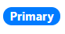

```html
<span class="badge badge-pill badge-primary">Primary</span>
```

:warning: 徽章可能会让使用屏幕阅读器及相关辅助技术的用户感到困惑，因为徽章的内容一般只有数字，通常提供外观样式提供视觉提示，而对于特殊需求的用户这些徽章会看起来像在句子、连结、按钮中的后方随机加入的词或数字。因此除非徽章内文是清楚的 (如前方文本为 `Notifications` 等与徽章中的数字结合，具有可理解的语义表示通知数量），否则应该使用视觉上隐藏的文字内容加以说明。

```html
<button type="button" class="btn btn-primary">
  Profile <span class="badge badge-light">9</span>
  <span class="sr-only">unread messages</span>
</button>
```

徽章提供颜色相关的类属性，应该使用合适的颜色主题以符合使用情景。

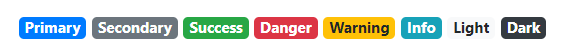

* `.badge-primary`
* `.badge-secondary`
* `.badge-success`
* `.badge-danger`
* `.badge-warning`
* `.badge-info`
* `.badge-light`
* `.badge-dark`

:bulb: 如果行内元素以锚标签 `<a>`（需要设置 `href="#"` 属性） 代替通用行内标签 `<span>` 并设置相应的颜色样式，可以实现鼠标悬停时颜色加深的变换，提供更多交互。

## 面包屑
面包屑 Breadcrumb 一般用于导航，目的是通过 CSS （伪元素选择器）为导航栏目之间自动添加分隔符号（默认是 `/` 斜线），模仿 URL 格式，以指示当前页面的层级关系。

需要为导航栏添加属性 `.breadcrumb` 和 `.breadcrumb-item`

* 在导航栏的有序列表元素 `<ol>` 添加属性 `.breadcrumb`，使用有序列表是因为面板屑用于标注层级/有顺序的页面关系
* 在导航栏的列表项 `<li>` 添加属性 `.breadcrumb-item`，Bootstrap 会使用伪元素 `::before` 自动为两个 `<li class=".breadcrumb-item">` 元素之间添加 `content: "/"` 也可以[自定义分隔符](https://getbootstrap.com/docs/4.4/components/breadcrumb/#changing-the-separator)


```html
<nav aria-label="breadcrumb">
  <ol class="breadcrumb">
    <li class="breadcrumb-item"><a href="#">Home</a></li>
    <li class="breadcrumb-item"><a href="#">Library</a></li>
    <li class="breadcrumb-item active" aria-current="page">Data</li>
  </ol>
</nav>
```

:bulb: 「面包屑」项目使用锚标签 `<a>` 而非 `<li>` 标签也可行，只需要在外层容器添加属性 `.breadcrumb`

```html
<nav class="breadcrumb">
    <a class="breadcrumb-item" href="#">Home</a>
    <a class="breadcrumb-item" href="#">Library</a>
    <a class="breadcrumb-item" href="#">Data</a>
    <span class="breadcrumb-item active">Bootstrap</span>
</nav>
```

## 按钮
为按钮元素 `<button>` **添加属性 `.btn` **以使用 Bootstrap 预设的多种按钮样式，如各种标准的填充颜色、线框颜色、大小尺寸等。

* 添加类属性 `.btn-{theme-color}` 可以为按钮设置填充颜色
* 添加类属性 `.btn-outline-{theme-color}` 可以为按钮添加线框颜色

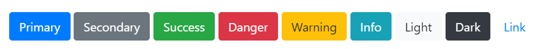

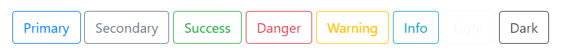

```html
<button type="button" class="btn btn-primary">Primary</button>
<button type="button" class="btn btn-secondary">Secondary</button>
<button type="button" class="btn btn-success">Success</button>
<button type="button" class="btn btn-danger">Danger</button>
<button type="button" class="btn btn-warning">Warning</button>
<button type="button" class="btn btn-info">Info</button>
<button type="button" class="btn btn-light">Light</button>
<button type="button" class="btn btn-dark">Dark</button>
<button type="button" class="btn btn-link">Link</button>

<button type="button" class="btn btn-outline-primary">Primary</button>
<button type="button" class="btn btn-outline-secondary">Secondary</button>
<button type="button" class="btn btn-outline-success">Success</button>
<button type="button" class="btn btn-outline-danger">Danger</button>
<button type="button" class="btn btn-outline-warning">Warning</button>
<button type="button" class="btn btn-outline-info">Info</button>
<button type="button" class="btn btn-outline-light">Light</button>
<button type="button" class="btn btn-outline-dark">Dark</button>
```

:bulb: 除了填充颜色外，还默认添加了悬停交互样式，如果使用填充颜色在鼠标悬停时按钮颜色会变深；如果使用线框颜色在鼠标悬停时，按钮会变成相应的填充颜色。

* 使用类属性 `.btn-sm` 或 `.btn-lg` 以设置按钮变得更小或更大。

* 使用类属性 `.btn-block` 可以创建块元素（宽度为 100%）级别的按钮

:bulb: 除了将 `.btn` 属性应用于元素 `<button>` 以外，还可以用于锚标签、表单等多种元素，它们的外观会变成按钮样式，并可以使用 Bootstrap 预设多种按钮样式。如当元素 `<a>` 用于触发页面内功能，如折叠内容（而不是连结到新页面或当前页面中的部分）时可以添加 `.btn` 以显示为按钮形式时，:warning: 锚元素还有应该添加属性 `role="button"` 以适当地传达该锚元素的不同目的到屏幕阅读器等辅助性技术。

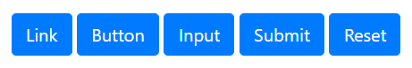

```html
<a class="btn btn-primary" href="#" role="button">Link</a>
<button class="btn btn-primary" type="submit">Button</button>
<input class="btn btn-primary" type="button" value="Input">
<input class="btn btn-primary" type="submit" value="Submit">
<input class="btn btn-primary" type="reset" value="Reset">
```

* 可以使用 `.active` 类属性将按钮默认设置为**激活**状态（按钮样式会变成背景和边框颜色更深、有内阴影）:warning: 应该相应地使用 `aria-pressed="true"` 屬性为屏幕阅读器传达相应的语义。

* 相应地可以将按钮设置为默认失活/不可用状态，对于元素 `<button>` 支持添加属性 `disabled`（一个布尔属性）；如果按钮是通过锚元素 `<a>` 构建的，则需要使用类属性 `class="disabled"`（由于锚元素不支持布尔属性 `disabled` 只能通过类属性用 CSS 模仿相应的样式，即半透明色无法点击，:warning: 由于锚元素不可以的 CSS 属性尚未标准化，实际依然可以使用键盘导览（即按 `Tab` 来启用这些锚标签的链接），它只是视觉上按钮是不可用的）:bulb: 相应地禁用按钮应包含 `aria-disabled="true"` 属性来向辅助性技术指示元素的停用状态。

* 除了单一的激活或停用状态，按钮还可以结合 JavaScript 实现**切换状态**功能，只需要在按钮添加属性 `data-toggle="button"` 默认是未激活状态，点击按钮后会保持在激活状态；再点击按钮又恢复为未激活状态。:bulb: 如果按钮默认处于激活状态，则可以同时添加类属性 `.active`（记得相应地添加 `aria-pressed="true"` 属性）

* 由多个元素构成的表单也「套用」Bootstrap 按钮样式，如多个 `<input type="checkbox"/>`  元素构成的复选框，多个 `<input type='radio'/>` 元素构成的单选按钮
    * 只需要在包含这些元素的**容器**添加 `.btn-group` 即可将创建群组按钮（这样 Bootstrap 就会将容器内的表单默认样式隐藏，如复选框每个选项前的方格，单选按钮每个选项前的空心圆）
    * 而其中的每一个按钮样式则是在表单**标记 `<label>` 元素**上进行设置，为每个标记元素添加属性 `.btn` 并设置合适的颜色样式 `.btn-{theme-color}`。

    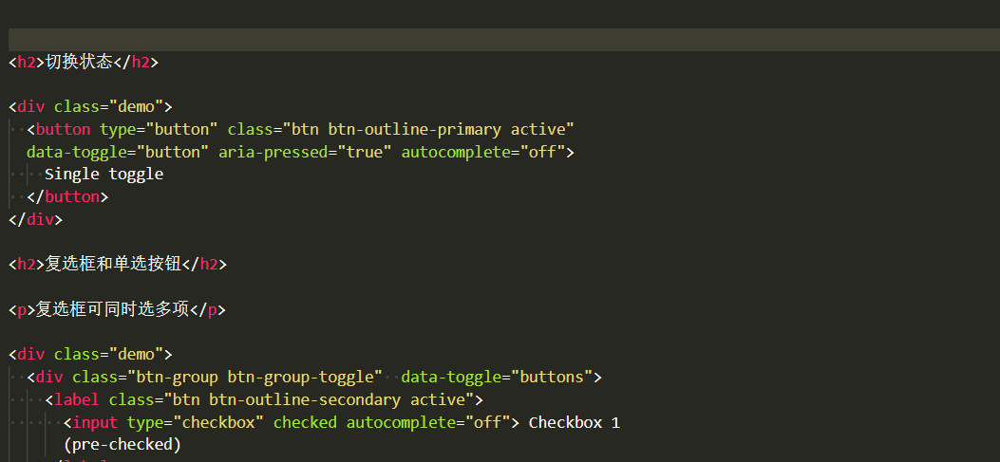

   :bulb: 如果需要按钮实现状态可切换就在容器添加类属性 `.btn-group-toggle` 和属性 `data-toggle="buttons"`（注意与上一个列表项中的区别，此处属性是**复数**）。

## 按钮组
将一系列按钮组合可以构成按钮群组，按钮会排列为一行（同一组内的按钮无间隔，通过 Flexbox 布局实现），并通过 JavaScript 实现更复杂的功能。

将一些列带有类属性 `.btn` 的按钮包装在容器中，并未容器添加类属性 `.btn-group` 即可构架按钮组。

```html
<!-- 由三个按钮构成的按钮组 -->
<div class="btn-group" role="group" aria-label="Basic example">
  <button type="button" class="btn btn-secondary">Left</button>
  <button type="button" class="btn btn-secondary">Middle</button>
  <button type="button" class="btn btn-secondary">Right</button>
</div>
```

:bulb: 为了辅助性技术（如屏幕阅读器）传达一系列按钮的分组讯息，需要提供一个适当的属性 `role="group"`，但大多数辅助性技术可能不会明确呈现他们，因此还需要使用 `aria-label`或 `aria-labelledby` 添加更多相关信息。

:bulb: 如果希望按钮组沿垂直方向排列可以在容器添加类属性 `.btn-group-vertical`

:bulb: 按钮组支持嵌套，如构建按钮组和下拉式表单的混合组件

```html
<div class="btn-group" role="group" aria-label="Button group with nested dropdown">
  <button type="button" class="btn btn-secondary">1</button>
  <button type="button" class="btn btn-secondary">2</button>

  <div class="btn-group" role="group">
    <button id="btnGroupDrop1" type="button" class="btn btn-secondary dropdown-toggle" data-toggle="dropdown" aria-haspopup="true" aria-expanded="false">
      Dropdown
    </button>
    <div class="dropdown-menu" aria-labelledby="btnGroupDrop1">
      <a class="dropdown-item" href="#">Dropdown link</a>
      <a class="dropdown-item" href="#">Dropdown link</a>
    </div>
  </div>
</div>
```

还可以将按钮组或更复杂的组件，如输入表单组合 `.input-group`，再进行组合构成按钮工具栏，只需要在容器添加属性 `.btn-toolbar` 即可。

```html
<div class="btn-toolbar mb-3" role="toolbar" aria-label="Toolbar with button groups">
  <div class="btn-group mr-2" role="group" aria-label="First group">
    <button type="button" class="btn btn-secondary">1</button>
    <button type="button" class="btn btn-secondary">2</button>
    <button type="button" class="btn btn-secondary">3</button>
    <button type="button" class="btn btn-secondary">4</button>
  </div>
  <div class="input-group">
    <div class="input-group-prepend">
      <div class="input-group-text" id="btnGroupAddon">@</div>
    </div>
    <input type="text" class="form-control" placeholder="Input group example" aria-label="Input group example" aria-describedby="btnGroupAddon">
  </div>
</div>
```

:bulb: 可以使用通用类别为各按钮组之间添加间隔。

类似地可以调节群组中所有按键的大小，只需要为容器添加 `.btn-group-sm` 或 `.btn-group-lg`

## 卡片
卡片 Cared 是一个灵活可扩展的内容容器，可以包含页眉、页脚、各种弹性内容（图片、文本等），甚至还可以添加导航栏（以实现卡片内容切换），卡片相当于一个「迷你」网页视窗。Bootstrap 4 卡片已将 Bootstrap 3 中 panels、wells、thumbnails （具有类似的功能）元件都整合到卡片内。

只需要为容器添加类属性 `.card` 即可创建一个卡片容器。卡片已为常见的内容样式进行了优化，包括图像、文本、清单组、链接等，只需要为这些元素添加相应的类属性（一般以前缀 `.card-*` 开头）

```html
<div class="card" style="width: 18rem;">
  
  <div class="card-body">
    <h5 class="card-title">Card title</h5>
    <p class="card-text">Some quick example text to build on the card title and make up the bulk of the card's content.</p>
  </div>
</div>
```

示例实现了一个基本的卡片，顶部图片用类属性 `.card-img-top` 标注（如果图片放在卡片底部则添加 `.card-img-bottom`，将图片设置为响应式)；卡片文本主体容器用类属性 `.card-body` 标注（以为卡片添加 `padding`），其中标题和文本内容分别用类属性 `.card-title` （副标题以 `.card-subtitle` 标注）和 `.card-text` 标注。:bulb: 卡片内的链接可以添加类属性 `.card-link` 以使用预设的样式（蓝色下划线，鼠标悬停颜色加深）

:warning: 卡片预设并没有 `margin` 可以依需求使用通用样式添加。

:bulb: 卡片如果没有固定的宽度，它们将自然填充其父元素的全部宽度

:bulb: 卡片其他样式可以通用样式进行设置，如文本颜色 `.text-{颜色关键字}`、背景颜色 `.bg-{颜色关键字}`、边框颜色 `.bord-{颜色关键字}`、文字对齐方式 `.text-center`、`.text-right`、`.text-left` 等

卡片可以设置页眉、页脚，只需要为卡片容器内第一个子元素添加类属性 `.card-header` 或为卡片容器内最后一个子元素添加类属性 `.card-footer` 即可。

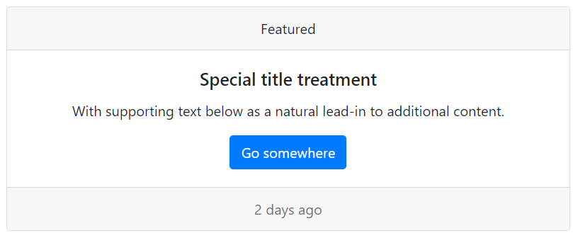

```html
<div class="card text-center">
  <div class="card-header">
    Featured
  </div>
  <div class="card-body">
    <h5 class="card-title">Special title treatment</h5>
    <p class="card-text">With supporting text below as a natural lead-in to additional content.</p>
    <a href="#" class="btn btn-primary">Go somewhere</a>
  </div>
  <div class="card-footer text-muted">
    2 days ago
  </div>
</div>
```
图片还可以作为卡片背景，将文字叠加在图片上，这种情景下文本主体应该使用类属性 `.card-img-overlay`

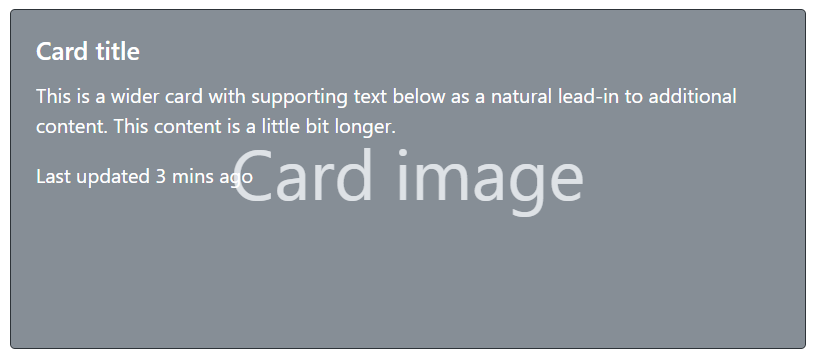

```html
<div class="card bg-dark text-white">
  
  <div class="card-img-overlay">
    <h5 class="card-title">Card title</h5>
    <p class="card-text">This is a wider card with supporting text below as a natural lead-in to additional content. This content is a little bit longer.</p>
    <p class="card-text">Last updated 3 mins ago</p>
  </div>
</div>
```

:warning: 内容不应大于图像的高度，否则将显示在图像外面。

卡片可以添加导航元件，额外添加 `.card-header-tabs` 或 `.card-header-pills` 即可针对卡片优化其样式。

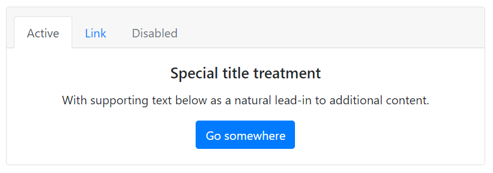

```html
<div class="card text-center">
  <div class="card-header">
    <ul class="nav nav-tabs card-header-tabs">
      <li class="nav-item">
        <a class="nav-link active" href="#">Active</a>
      </li>
      <li class="nav-item">
        <a class="nav-link" href="#">Link</a>
      </li>
      <li class="nav-item">
        <a class="nav-link disabled" href="#" tabindex="-1" aria-disabled="true">Disabled</a>
      </li>
    </ul>
  </div>
  <div class="card-body">
    <h5 class="card-title">Special title treatment</h5>
    <p class="card-text">With supporting text below as a natural lead-in to additional content.</p>
    <a href="#" class="btn btn-primary">Go somewhere</a>
  </div>
</div>
```

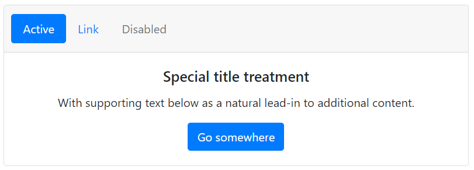

```html
<div class="card text-center">
  <div class="card-header">
    <ul class="nav nav-pills card-header-pills">
      <li class="nav-item">
        <a class="nav-link active" href="#">Active</a>
      </li>
      <li class="nav-item">
        <a class="nav-link" href="#">Link</a>
      </li>
      <li class="nav-item">
        <a class="nav-link disabled" href="#" tabindex="-1" aria-disabled="true">Disabled</a>
      </li>
    </ul>
  </div>
  <div class="card-body">
    <h5 class="card-title">Special title treatment</h5>
    <p class="card-text">With supporting text below as a natural lead-in to additional content.</p>
    <a href="#" class="btn btn-primary">Go somewhere</a>
  </div>
</div>
```

Bootstrap 除了对卡片内的内容进行设计外，还提供了多张卡片的排布方式，只需要在卡片组外容器添加相应的类属性即可：

* `.card-group` 卡片群组，将多个卡片和成为一个群组，他们具有相同宽度和高度的列，但没有间隔。当卡片带页脚他们的内容会自动对在同一线上。

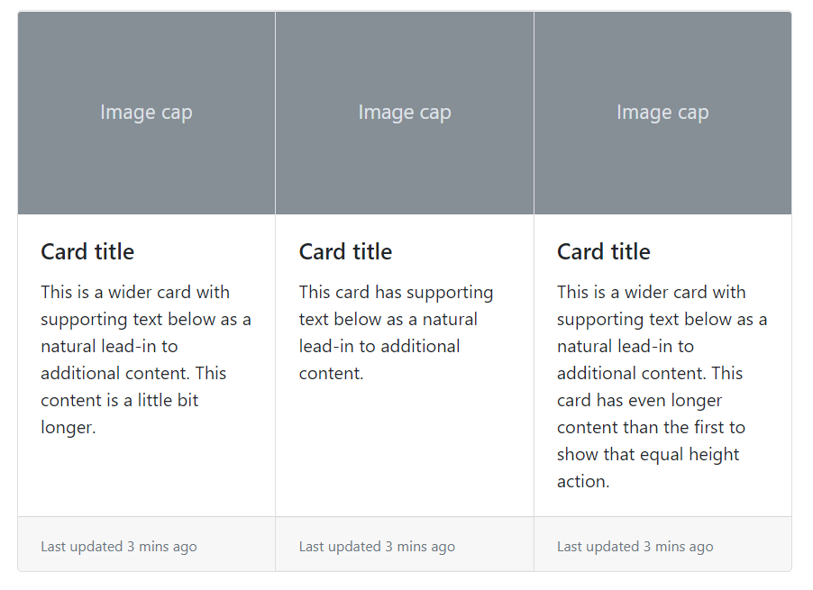

* `.card-deck` 卡片叠，互不相连但宽度和高度相同的卡片。当卡片带页脚他们的内容会自动对在同一线上。

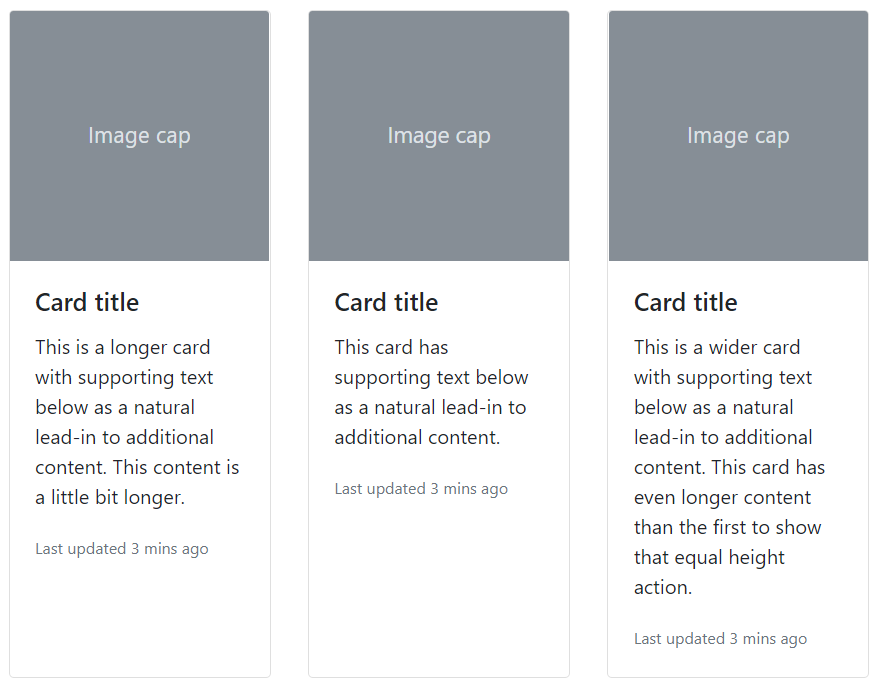

* `.card-columns` 卡片栏。将卡片像 [Masonry](https://masonry.desandro.com/) 那样的瀑布式排列。卡片是使用 CSS `column` 属性（而不是 flexbox）来构建，更便于对齐，排列是从上到下、从左到右。

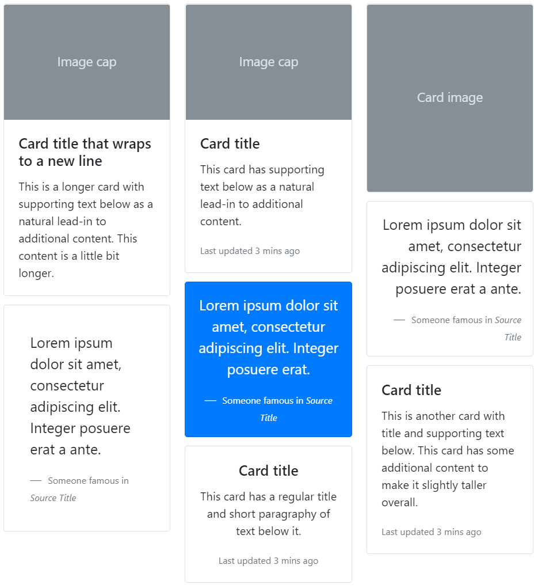

## 轮播
轮播 Carousel 是使用 CSS 3D 的变形转换和一些 JavaScript 构建的元件，使一系列内容可以循环切换，以展示展示一系列图像、文本或自定义内容，它还可以添加包括对上一个 / 下一个控制项和条形指示器以供用户手动切换。

轮播组件需要为容器添加类属性 `.carousel` 并设置一个唯一的 id（以供控制线或条形指示器进行绑定，实现交互式功能），此外还需要添加属性 `data-ride="carousel"` 访问相应的 data api 来执行动效。

在容器内，需要将切换的项目都放置在子容器 `.carousel-inner` 之中；而控制项和条形指示器则在子容器之外，它们需要通过**绑定容器的唯一 id** 以控制相应的轮播元件，控制项由锚标签构成，将属性 `href` 设置为 `#idName`，而条形控制器则是由有序列表构成，需要为列表项都添加属性 `data-target="#idName"`

```html
<div id="carouselExampleIndicators" class="carousel slide" data-ride="carousel">
  <ol class="carousel-indicators">
    <li data-target="#carouselExampleIndicators" data-slide-to="0" class="active"></li>
    <li data-target="#carouselExampleIndicators" data-slide-to="1"></li>
    <li data-target="#carouselExampleIndicators" data-slide-to="2"></li>
  </ol>
  <div class="carousel-inner">
    <div class="carousel-item active">
      
    </div>
    <div class="carousel-item">
      
    </div>
    <div class="carousel-item">
      
    </div>
  </div>
  <a class="carousel-control-prev" href="#carouselExampleIndicators" role="button" data-slide="prev">
    <span class="carousel-control-prev-icon" aria-hidden="true"></span>
    <span class="sr-only">Previous</span>
  </a>
  <a class="carousel-control-next" href="#carouselExampleIndicators" role="button" data-slide="next">
    <span class="carousel-control-next-icon" aria-hidden="true"></span>
    <span class="sr-only">Next</span>
  </a>
</div>
```

:warning: **需要將 `.active` 添加到其中一個轮播元素上**，以设置为首先可视的元素，否則轮播將不可見。

:bulb: 轮播不会自动使元素尺寸标准化，因此可能需要使用其它通用类别或自定义样式对元素进行调整，如示例中使用对轮播图像元素设置 `.d-block` 和 `.w-100` 以修正浏览器预设的图像对齐。

:bulb: 可以为轮播图片添加字幕，在切换的项目 `.carousel-item` 内为文本元素添加类属性 `.carousel-caption` 以添加字幕到幻灯片上。

:bulb: 在容器 `.carousel` 上使用 `.slide` 实现从右往左切入的项目转换动效，还可以叠加类属性 `.carousel-fade` 以采用淡入淡出的效果。

## 折叠
折叠 Collapse 是一个通过按钮或锚标签作为触发器将相应元素的内容进行隐藏或显示的元件，通过 JavaScript 控制折叠元素的类属性在三个相关属性值之间进行切换：

* `.collapse` 隐藏元素
* `.collapsing` 状态转换中（应用动态效果）
* `.collapse` 和 `.show` 结合显示元素

:bulb: 隐藏与显示的方法是将元素的 `height` 从当前值和 0 之间进行转换。

触发器基于折叠元素的唯一 id 进行绑定，按钮通过 `data-target="#idName"` 实现，锚标签通过 `href="#idName"` 实现；并添加属性 `data-toggle="collapse"` 以访问相应的 data api 来执行动效。在需要折叠的元素添加类属性 `class="collapse"` 以将其默认设置为折叠状态，并设置唯一 id。

:bulb: 记得添加 `role` 或 `aria-*` 为屏幕阅读器传达更多语义。

```html
<p>
  <a class="btn btn-primary" data-toggle="collapse" href="#collapseExample" role="button" aria-expanded="false" aria-controls="collapseExample">
    Link with href
  </a>
  <button class="btn btn-primary" type="button" data-toggle="collapse" data-target="#collapseExample" aria-expanded="false" aria-controls="collapseExample">
    Button with data-target
  </button>
</p>
<div class="collapse" id="collapseExample">
  <div class="card card-body">
    Anim pariatur cliche reprehenderit, enim eiusmod high life accusamus terry richardson ad squid. Nihil anim keffiyeh helvetica, craft beer labore wes anderson cred nesciunt sapiente ea proident.
  </div>
</div>
```

:bulb: 如果需要将触发器绑定多个折叠元素，可以使用 jQuery 类选择器（而不是基于 id）`data-target=".className"` 或 `href=".className"`

```html
<p>
  <button class="btn btn-primary" type="button" data-toggle="collapse" data-target=".multi-collapse" aria-expanded="false" aria-controls="multiCollapseExample1 multiCollapseExample2">Toggle both elements</button>
</p>
<div class="row">
  <div class="col">
    <div class="collapse multi-collapse" id="multiCollapseExample1">
      <div class="card card-body">
        Anim pariatur cliche reprehenderit, enim eiusmod high life accusamus terry richardson ad squid. Nihil anim keffiyeh helvetica, craft beer labore wes anderson cred nesciunt sapiente ea proident.
      </div>
    </div>
  </div>
  <div class="col">
    <div class="collapse multi-collapse" id="multiCollapseExample2">
      <div class="card card-body">
        Anim pariatur cliche reprehenderit, enim eiusmod high life accusamus terry richardson ad squid. Nihil anim keffiyeh helvetica, craft beer labore wes anderson cred nesciunt sapiente ea proident.
      </div>
    </div>
  </div>
</div>
```

Bootstrap 还为多个折叠元素提供了口风琴式折叠，即每次只能展开一个折叠元素。需要将这些折叠元素包含在容器 `.accordion` 之内，并为容器添加唯一 id，在所有折叠元素中分别添加 `data-parent='#idName"` 以绑定，这样在折叠时各元素之间的折叠状态就会相互关联。

```html
<div class="accordion" id="accordionExample">
  <div class="card">
    <div class="card-header" id="headingOne">
      <h2 class="mb-0">
        <button class="btn btn-link" type="button" data-toggle="collapse" data-target="#collapseOne" aria-expanded="true" aria-controls="collapseOne">
          Collapsible Group Item #1
        </button>
      </h2>
    </div>

    <div id="collapseOne" class="collapse show" aria-labelledby="headingOne" data-parent="#accordionExample">
      <div class="card-body">
        Anim pariatur cliche reprehenderit, enim eiusmod high life accusamus terry richardson ad squid. 3 wolf moon officia aute, non cupidatat skateboard dolor brunch. Food truck quinoa nesciunt laborum eiusmod. Brunch 3 wolf moon tempor, sunt aliqua put a bird on it squid single-origin coffee nulla assumenda shoreditch et. Nihil anim keffiyeh helvetica, craft beer labore wes anderson cred nesciunt sapiente ea proident. Ad vegan excepteur butcher vice lomo. Leggings occaecat craft beer farm-to-table, raw denim aesthetic synth nesciunt you probably haven't heard of them accusamus labore sustainable VHS.
      </div>
    </div>
  </div>
  <div class="card">
    <div class="card-header" id="headingTwo">
      <h2 class="mb-0">
        <button class="btn btn-link collapsed" type="button" data-toggle="collapse" data-target="#collapseTwo" aria-expanded="false" aria-controls="collapseTwo">
          Collapsible Group Item #2
        </button>
      </h2>
    </div>
    <div id="collapseTwo" class="collapse" aria-labelledby="headingTwo" data-parent="#accordionExample">
      <div class="card-body">
        Anim pariatur cliche reprehenderit, enim eiusmod high life accusamus terry richardson ad squid. 3 wolf moon officia aute, non cupidatat skateboard dolor brunch. Food truck quinoa nesciunt laborum eiusmod. Brunch 3 wolf moon tempor, sunt aliqua put a bird on it squid single-origin coffee nulla assumenda shoreditch et. Nihil anim keffiyeh helvetica, craft beer labore wes anderson cred nesciunt sapiente ea proident. Ad vegan excepteur butcher vice lomo. Leggings occaecat craft beer farm-to-table, raw denim aesthetic synth nesciunt you probably haven't heard of them accusamus labore sustainable VHS.
      </div>
    </div>
  </div>
  <div class="card">
    <div class="card-header" id="headingThree">
      <h2 class="mb-0">
        <button class="btn btn-link collapsed" type="button" data-toggle="collapse" data-target="#collapseThree" aria-expanded="false" aria-controls="collapseThree">
          Collapsible Group Item #3
        </button>
      </h2>
    </div>
    <div id="collapseThree" class="collapse" aria-labelledby="headingThree" data-parent="#accordionExample">
      <div class="card-body">
        Anim pariatur cliche reprehenderit, enim eiusmod high life accusamus terry richardson ad squid. 3 wolf moon officia aute, non cupidatat skateboard dolor brunch. Food truck quinoa nesciunt laborum eiusmod. Brunch 3 wolf moon tempor, sunt aliqua put a bird on it squid single-origin coffee nulla assumenda shoreditch et. Nihil anim keffiyeh helvetica, craft beer labore wes anderson cred nesciunt sapiente ea proident. Ad vegan excepteur butcher vice lomo. Leggings occaecat craft beer farm-to-table, raw denim aesthetic synth nesciunt you probably haven't heard of them accusamus labore sustainable VHS.
      </div>
    </div>
  </div>
</div>
```

## 下拉菜单
下拉选单 Dropdowns 是一个以按钮或锚标签作为触发器，通过点击可将内文框显示出来的元件。

:warning: 这些交互功能是基于第三方插件 Popper.js 所建构的，使用该元件请确保已引入相应的 JavaScript 脚本。

将下拉菜单放置在容器 `.dropdown` 之内，并为按钮或锚标签设置类实现 `.dropdown-toggle`，而且需要添加属性 `data-toggle="dropdown"` 以访问相关的 data api 实现动态交互。而菜单项需要放置在子容器 `.dropdown-menu` 之中，每一个菜单选项都需要使用类 `.dropdown-item` 标注，菜单选项可以使用锚元素，也可以使用按钮元素。

```html
<div class="dropdown">
  <button class="btn btn-secondary dropdown-toggle" type="button" id="dropdownMenuButton" data-toggle="dropdown" aria-haspopup="true" aria-expanded="false">
    Dropdown button
  </button>
  <div class="dropdown-menu" aria-labelledby="dropdownMenuButton">
    <a class="dropdown-item" href="#">Action</a>
    <a class="dropdown-item" href="#">Another action</a>
    <a class="dropdown-item" href="#">Something else here</a>
  </div>
</div>
```
:bulb: 可以为菜单项添加类属性 `.active` 或 `.disable` 以设置该选项默认启动或不可选。如果菜单项由多组构成，可以在组之间插入元素 `<div class="dropdown-divider"></div>` 以添加分割线。

:bulb: 下拉菜单可以组成按钮组，只需要将其容器变成 `.btn-group`（再将多个 `.btn-group` 下拉菜单内嵌在一个更大的容器 `.btn-group` 之中既可以将多个下来菜单并排一行）

分割按钮下拉菜单是将下拉按钮与标记分离（与单个按钮的下拉菜单不同），通过容器 `.btn-group` 包含两个分割按钮，并在插入符的按钮添加类属性 `.dropdown-toggle` 和 `.dropdown-toggle-split`（不是在主按钮添加，而且别忘了添加属性 `data-toggle="dropdown"` 以访问 data api）

```html
<div class="demo">
  <div class="btn-group">
    <button type="button" class="btn btn-danger">Action</button>
    <button type="button" class="btn btn-danger dropdown-toggle dropdown-toggle-split" data-toggle="dropdown" aria-haspopup="true" aria-expanded="false">
      <span class="sr-only">Toggle Dropdown</span>
    </button>
    <div class="dropdown-menu">
      <a class="dropdown-item" href="#">Action</a>
      <a class="dropdown-item" href="#">Another action</a>
      <a class="dropdown-item" href="#">Something else here</a>
      <div class="dropdown-divider"></div>
      <a class="dropdown-item" href="#">Separated link</a>
    </div>
  </div>
</div>
```

可以在容器添加相应的类属性设置弹出的内文框位置

* `.dropup` 向上弹出
* `.dropright` 向右弹出
* `.dropleft` 向左弹出

在内文框 `.dropdown-menu` 内除了可以包含菜单项，还可以添加文本、表单等，此外 Bootstrap 还为相关的文本设置了样式，如当文本设置 `.dropdown-header` 将其标记为菜单的标题。

## 表单
Bootstrap 为不同的表单类型进行了样式优化，只需要在对应的表单元素使用相应的类属性即可，还提供了自定义表单和表单验证优化等。

* 对于包含输入型的表单元素的**容器**，如 `<input>`、`<select>`、`<textarea>` 以及其相应的标记 `<label>`，添加类属性 `.form-group`；对于包含选择型的表单元素的**容器**，如 `<input type="checkbox">` 和 `<input type="radio">`，则添加类属性 `.form-check`
* 对于输入型的表单元素，如 `<input>` 和 `<select>`，添加类属性 `.form-controls`；而对于选择型的表单元素的**容器**，如 `<input type="checkbox">` 和 `<input type="radio">`，添加类属性 `.form-check-input` 其相应的标签 `<label>` 添加类属性 `.from-check-label`；对于范围选择表单 `<input type="range">` 添加类属性 `.form-control-range`

```html
<form>
    <div class="form-group">
      <label for="exampleInputEmail1">Email address</label>
      <input type="email" class="form-control" id="exampleInputEmail1" aria-describedby="emailHelp" placeholder="Enter email">
      <small id="emailHelp" class="form-text text-muted">We'll never share your email with anyone else.</small>
    </div>

    <div class="form-group">
      <label for="exampleFormControlSelect1">Example select</label>
      <select class="form-control" id="exampleFormControlSelect1">
        <option>1</option>
        <option>2</option>
        <option>3</option>
        <option>4</option>
        <option>5</option>
      </select>
    </div>

    <div class="form-group">
      <label for="exampleFormControlTextarea1">Example textarea</label>
      <textarea class="form-control" id="exampleFormControlTextarea1" rows="3"></textarea>
    </div>

    <div class="form-check">
      <input type="checkbox" class="form-check-input" id="exampleCheck1">
      <label class="form-check-label" for="exampleCheck1">Check me out</label>
    </div>
</form>
```

:bulb: 表单大小可以为 `<input>`、`<select>` 等元素添加类属性 `.form-control-sm` 或 `.form-control-lg` 进行设置。

如果需要使用 Bootstrap 提供的表单自定义样式，以提供跨浏览器更一致的体验，类属性一般以关键字 `custom`作为前缀

```html
<div class="custom-control custom-checkbox">
    <input type="checkbox" class="custom-control-input" id="customCheck1">
    <label class="custom-control-label" for="customCheck1">Check this custom checkbox</label>
</div>

<div class="custom-control custom-radio">
    <input type="radio" id="customRadioInline1" name="customRadioInline1" class="custom-control-input">
    <label class="custom-control-label" for="customRadioInline1">Toggle this custom radio</label>
</div>
```

:bulb: 如果希望表单仅供读取，可以在元素 `<input>` 添加布尔属性 `readonly`；如果进一步希望去除默认样式，仅显示预设的输入内容文本，可以再添加类属性 `.form-contorl-plaintext`

:bulb: 如果希望禁用部分表单元素，可以在 `<input>` 元素上添加一个布尔属性 `disabled`；如果希望整个表单都禁用，可以为表单容器 `<form>` 再添加一个子容器 `<fieldset>` 并添加布尔属性 `disabled`

Bootstrap 利用 Flexbox 对表单进行布局，默认每个元素为 100% 宽度，可以通过设置不同的类属性实现不同预设布局：

* 行内表单：对于输入型的表单，可以为容器 `<form>` 添加类属性 `.form-inline` 将元素转换为行内表单，使它们水平排列；对于选择型的表单，可以为容器添加类属性 `.form-check-inline` 将其转换为行内元素，使它们水平排列

* 网格表单：类似于网格布局模板，但是 Bootstrap 使用 `.form-row` 作为容器（取代 `.row`）以采用更小的 gutter 提供紧凑的布局

* 水平表单：默认布局下表单的标签和输入框是上下垂直布局的，如果希望标签和输入框左右水平布局，可以利用网格布局系统，将 `<label>` 作为一个网格项，需要为其添加类属性 `.col-form-label` 实现标签垂直居中对应表单元件；而 `<input>` 作为另一个网格项。

    ```html
    <div class="form-group row">
        <label for="inputEmail3" class="col-sm-2 col-form-label">Email</label>
        <div class="col-sm-10">
          <input type="email" class="form-control" id="inputEmail3" placeholder="Email">
        </div>
    </div>
    ```

为了监听表单验证结果（表单已提交后）以及时提供反馈（阻止未验证成功的表单提交（默认行为）并将提示语显示出来）需要为页面添加相应的脚本

```
<script>
// Example starter JavaScript for disabling form submissions if there are invalid fields
(function() {
  'use strict';
  window.addEventListener('load', function() {
    // Fetch all the forms we want to apply custom Bootstrap validation styles to
    var forms = document.getElementsByClassName('needs-validation');   // 获取需要监听的 form 表单对象
    // Loop over them and prevent submission
    var validation = Array.prototype.filter.call(forms, function(form) {
      form.addEventListener('submit', function(event) {
        if (form.checkValidity() === false) {
          event.preventDefault();
          event.stopPropagation();
        }
        form.classList.add('was-validated');
      }, false);
    });
  }, false);
})();
</script>
```

Bootstrap 表单验证反馈提供了两种方式：
* 基于 HTML 表单验证 API 结果，即预设元素两种伪类 `:invalid` 和 `:valid` 的样式
* 基于服务器反馈，使用脚本为元素添加相应的类属性 `.is-valid` 或 `.is-invalid` 以提供相应的样式

:bulb: HTML5 提供的表单验证是基于表单元素 `type` 属性，因此应该为表单元素设置正确的类型。表单验证的反馈通过 `:invalid` 和 `:valid` 两种样式实现。当表单验证后（提交后）就可通过伪元素 `:invalid` 和 `:valid` 筛选出验证成功或失败的相应元素，Bootstrap 就是利用这两个伪类基于验证结果为表单定制样式。

而反馈信息添加相应的类属性 `valid-feedback` 或 `.invaslid-feedback`，它们会（在验证后）基于验证结果显示出来。

:warning: 可以为表单元素添加布尔属性 `required` 要求该元素填写后才能提交表单。

## input 组
原生的表单输入控件 `<input>`、`<select>`、`<textarea>` 与标记元素 `<label>` 分别在两行，Bootstrap 提供 input 组元件，以将 `<input>` 与标记/附加的元素排列在一行中，并提供优化的标准样式。:bulb: 附加的内容可以是内容、按钮、按钮群组等，以构建更复杂的输入表单。

* 使用容器 `.jinput-group` 包含输入表单和附加元素
* 当附加的元素在输入表单前，则添加类属性 `.input-group-prepend`；当附加的元素在输入表单后，则添加类属性 `.input-group-prepend`。附加内容可以是下拉菜单、文字等，当附加的内容是文本需要添加类属性 `.input-group-text` 标记元素内容为提示文字。

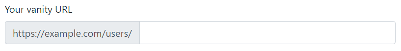

```html
<label for="basic-url">Your vanity URL</label>
<div class="input-group">
  <div class="input-group-prepend">
    <span class="input-group-text">https://example.com/users/</span>
  </div>
  <input type="text" class="form-control" id="basic-url" aria-describedby="basic-addon3">
</div>
```

:bulb: 可以为容器添加 `.input-group-sm` 或 `.input-group-lg` 设置大小

## 巨幕
巨幕 Jumbotron 是一个用于展示网页的 Hero 图像/文字的组件，将需要醒目显示的内容包含在容器 `.jumbotron` 中，即可采用扩展为 100% 宽的排版布局。

```html
<div class="jumbotron">
  <h1 class="display-4">Hello, world!</h1>
  <p class="lead">This is a simple hero unit, a simple jumbotron-style component for calling extra attention to featured content or information.</p>
  <hr class="my-4">
  <p>It uses utility classes for typography and spacing to space content out within the larger container.</p>
  <a class="btn btn-primary btn-lg" href="#" role="button">Learn more</a>
</div>
```

:bulb: 如果不希望背景边框有弧度，可以再添加 `.jumbotron-fluid`

## 列表组
Bootstrap 针对列表进行样式定制，只需要为 `<ul>` 添加类属性 `.list-group`，为每个列表项 `<li>` 添加类属性 `.list-group-item` 即可套用预设样式。:bulb: 可以为容器添加属性 `.list-group-flus` 以使用另一种预设样式，即移除部分边框及圆角，用来产生边缘贴齐的列表群组。

```html
<div class="demo">
  <ul class="list-group">
    <li class="list-group-item active">Cras justo odio</li>
    <li class="list-group-item disabled">Dapibus ac facilisis in</li>
    <li class="list-group-item">Morbi leo risus</li>
  </ul>
</div>
```

:bulb: 为列表项添加布尔属性 `active` 可以将当前的列表项设置为选中状态，默认样式为蓝底白字；为列表项添加布尔属性 `disabled` 可以将列表项设置为「失活」状态，默认样式为灰字。

除了使用列表元素构成列表项，还可以使用一系列的锚标签，只需要为容器添加 `.list-group`，每个锚标签添加 `.list-group-item` 即可。而锚标签中还可以添加其他的内容，如包含标题、段落、图片等结构以构建更复杂的列表组。:bulb: 如果为每个锚标签添加 `.list-group-item-action` 可以实现鼠标悬停在锚元素上时背景颜色变灰的效果。

:bulb: 为列表项添加属性 `list-group-item-{theme-color}` 设置不同的颜色

列表组可以作为分页的切换按钮，需要为列表项添加 `data-toggle="list"` 访问数据 API 实现动态交互功能，同时每个列表项（锚元素）的 `href` 或 `data-target` 需要绑定相关的分页 id。

```html
<div class="row">
    <!-- List group -->
    <div class="col-4">
      <div class="list-group" id="list-tab" role="tablist">
        <a class="list-group-item list-group-item-action active" id="list-home-list" data-toggle="list" href="#list-home" role="tab" aria-controls="home">Home</a>
        <a class="list-group-item list-group-item-action" id="list-profile-list" data-toggle="list" href="#list-profile" role="tab" aria-controls="profile">Profile</a>
        <a class="list-group-item list-group-item-action" id="list-messages-list" data-toggle="list" href="#list-messages" role="tab" aria-controls="messages">Messages</a>
      </div>
    </div>

    <!-- Tab panes -->
    <div class="col-8">
      <div class="tab-content" id="nav-tabContent">
        <div class="tab-pane fade show active" id="list-home" role="tabpanel" aria-labelledby="list-home-list">1</div>
        <div class="tab-pane fade" id="list-profile" role="tabpanel" aria-labelledby="list-profile-list">2</div>
        <div class="tab-pane fade" id="list-messages" role="tabpanel" aria-labelledby="list-messages-list">3</div>
      </div>
    </div>
</div>
```

## 模态框
模态框 Modal 是一个互动视窗元件，会生成一个对话视窗，以输出用户提示或完整的自定义内容。

该元件由两部分构成：

* 触发器：一般是按钮元件（或锚标签），需要添加 `data-toggle="modal"` 访问 data api 实现交互式功能，而且需要添加属性 `data-taget="#idName"`（锚标签可以通过 `href` ）进行模态框的绑定
* 模态框：有容器 `.modal` 包含，其中子容器 `.modal-dialog` 内包含着内容 `.modal-cjontent`，内容划分为三部分 `.modal-header`（一般包含关闭按钮元件）、`.modal-body`、`.modal-footer`

```html
<!-- Button trigger modal -->
<button type="button" class="btn btn-primary" data-toggle="modal" data-target="#exampleModal">
  Launch demo modal
</button>

<!-- Modal -->
<div class="modal fade" id="exampleModal" tabindex="-1" role="dialog" aria-labelledby="exampleModalLabel" aria-hidden="true">
  <div class="modal-dialog" role="document">
    <div class="modal-content">
      <div class="modal-header">
        <h5 class="modal-title" id="exampleModalLabel">Modal title</h5>
        <button type="button" class="close" data-dismiss="modal" aria-label="Close">
          <span aria-hidden="true">&times;</span>
        </button>
      </div>
      <div class="modal-body">
        ...
      </div>
      <div class="modal-footer">
        <button type="button" class="btn btn-secondary" data-dismiss="modal">Close</button>
        <button type="button" class="btn btn-primary">Save changes</button>
      </div>
    </div>
  </div>
</div>
```

:bulb: 可以在容器 `.modal-dialog` 设置模态框的大小（设置的是最大宽度，根据内置的中断点会响应式地调整其宽度，以避免在较窄的 viewport 上出现水平卷轴）。

|     Size      |      Class       | Modal max-width |
| :-------------: | :----------------: | :-----------------------: |
|    Small     | `.modal-sm` |        `300px`        |
|   Default    |      None      |        `500px`        |
|    Large     | `.modal-lg` |        `800px`        |
| Extra large | `.modal-xl` |       `1140px`       |

:bulb: 弹出的模态框默认定位在网页偏上水平居中，可以为容器 `.modal-dialog` 添加类属性 `.modal-dialog-centered` 实现水平垂直居中。

## 导航
导航 Navs 元件基于列表或一系列锚元素通过 Flexbox 技术提供一个基础的导览样式。基于列表时，元素 `<ul>` 添加类属性 `.nav`，列表项 `<li>` 添加类属性 `.nav-item`，其中的锚元素添加类属性 `.nav-link`；基于锚元素时，其容器添加类属性`.nav` ，锚元素添加类属性 `.nav-link`

```html
<!-- 基于列表 -->
<ul class="nav">
  <li class="nav-item">
    <a class="nav-link active" href="#">Active</a>
  </li>
  <li class="nav-item">
    <a class="nav-link" href="#">Link</a>
  </li>
  <li class="nav-item">
    <a class="nav-link disabled" href="#" tabindex="-1" aria-disabled="true">Disabled</a>
  </li>
</ul>

<!-- 基于锚标签 -->
<nav class="nav">
  <a class="nav-link active" href="#">Active</a>
  <a class="nav-link" href="#">Link</a>
  <a class="nav-link disabled" href="#" tabindex="-1" aria-disabled="true">Disabled</a>
</nav>
```

:bulb: 可以为锚标签添加 `.active` 或 `.disabled` 让链接应用激活或失活的状态样式。

:bulb: 由于导航元件布局是基于 Flexbox 技术，可以使用相应的属性进行设置，如为容器 `.justify-content-center` 可以让列表居中；添加  `.flex-column` 让导航项垂直排布。

Bootstrap 为导航元件设置了两种更美观的样式

* 分页标签，在容器 `.nav` 添加类属性 `.nav-tabs` 即可生成分页标签
    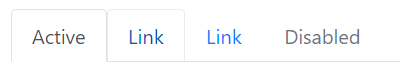
* 片状，在容器 `.nav`添加类属性 `.nav-pills` 即可生成片状导航
    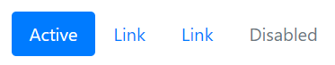

导航元件可以提供交互式功能，为锚元素 `data-toggle="tab"` 或 `data-toggle="pill"` 访问 data api 实现页面切换功能，还需要通过 `data-target="#idName"` 或 `href="#idName"` 进行不同页面内容的绑定。

```html
<!-- nav tab -->
<nav class="nav nav-tabs" id="myTab" role="tablist">
    <a class="nav-item nav-link active" id="nav-home-tab" data-toggle="tab" href="#nav-home" role="tab" aria-controls="nav-home" aria-expanded="true">Home</a>
    <a class="nav-item nav-link" id="nav-profile-tab" data-toggle="tab" href="#nav-profile" role="tab" aria-controls="nav-profile">Profile</a>
    <div class="dropdown">
      <a class="nav-item nav-link dropdown-toggle" data-toggle="dropdown" href="#" role="button" aria-haspopup="true" aria-expanded="false">
        Dropdown
      </a>
      <div class="dropdown-menu">
        <a class="dropdown-item" id="nav-dropdown1-tab" href="#nav-dropdown1" role="tab" data-toggle="tab" aria-controls="nav-dropdown1">@fat</a>
        <a class="dropdown-item" id="nav-dropdown2-tab" href="#nav-dropdown2" role="tab" data-toggle="tab" aria-controls="nav-dropdown2">@mdo</a>
      </div>
    </div>
  </nav>

<!-- page content -->
  <div class="tab-content" id="nav-tabContent">
    <div class="tab-pane fade show active" id="nav-home" role="tabpanel" aria-labelledby="nav-home-tab">1</div>
    <div class="tab-pane fade" id="nav-profile" role="tabpanel" aria-labelledby="nav-profile-tab">2</div>
    <div class="tab-pane fade" id="nav-dropdown1" role="tabpanel" aria-labelledby="nav-dropdown1-tab">3</div>
    <div class="tab-pane fade" id="nav-dropdown2" role="tabpanel" aria-labelledby="nav-dropdown2-tab">4</div>
  </div>
```

## 导航条
导航条是包含产品 logo、导航、搜索框等复杂元素的元件，一般定位于页面的顶部或底部。

使用容器 `.navbar` 包含导航条内容，它可以支持以下元素/组件的内嵌

* `.navbar-brand` 标记图片或文字元素作为网页的 logo
* `.navbar-nav` 标记导航元件，一般在导航元件添加类属性 `.collapse` 和 `.navvbar-collapse` 默认折叠该导航 :bulb: 一般在到汉中包括搜索框/输入表单，需要添加类属性 `.form-inline` 以排列成一行

当需要使用响应式折叠交互功能，需要在容器 `.nav` 为导航设置展开的断点 `.nav-expend-{break-point}`；在切换按钮添加属性 `data-toggle="collapse"` 访问 data api 实现交互式功能，以及添加属性 `data-target="#idName"` 或 `href="#idName"` 绑定相应的导航 id

```html
<nav class="navbar navbar-expand-lg navbar-light bg-light">
    <!-- brand logo -->
    <a class="navbar-brand" href="#">Navbar</a>

    <!-- toggle button -->
    <button class="navbar-toggler" type="button" data-toggle="collapse" data-target="#navbarSupportedContent" aria-controls="navbarSupportedContent" aria-expanded="false" aria-label="Toggle navigation">
      <span class="navbar-toggler-icon"></span>
    </button>

    <!-- nav content -->
    <div class="collapse navbar-collapse" id="navbarSupportedContent">
      <ul class="navbar-nav mr-auto">
        <li class="nav-item active">
          <a class="nav-link" href="#">Home <span class="sr-only">(current)</span></a>
        </li>
        <li class="nav-item">
          <a class="nav-link" href="#">Link</a>
        </li>
        <li class="nav-item">
          <a class="nav-link disabled" href="#">Disabled</a>
        </li>
      </ul>
      <form class="form-inline my-2 my-lg-0">
        <input class="form-control mr-sm-2" type="text" placeholder="Search" aria-label="Search">
        <button class="btn btn-outline-success my-2 my-sm-0" type="submit">Search</button>
      </form>
    </div>
  </nav>
```

:bulb: 导航条可以设置颜色主体和背景颜色，两者应该相对应，如在容器 `.navbar` 添加 `.navbar-dark bg-primary` 采用黑色主题（字体白色）和蓝色的背景。

导航条可以采用三种定位方式，在容器 `.navbar` 设置相应的类属性

* `.fixed-top` 固定在顶部
* `.fixed-bottom` 固定在底部
* `.sticky-top` 粘在顶部

## 分页
分页 Pagination 元件使用 `<nav>` 元素包装组织链接到多个页面的锚标签，使用方块外观样式提供更大的点击区域。分页是使用列表元素构建的，因此屏幕阅读器可以列出可用连结的数量。

* 为列表元素添加属性 `.pagination`
* 为列表项添加属性 `.page-item`，为其中的锚标签添加 `.page-link`（可以实现悬停背景色变深的效果）

```html
<nav aria-label="Page navigation example">
  <ul class="pagination">
    <li class="page-item"><a class="page-link" href="#">Previous</a></li>
    <li class="page-item"><a class="page-link" href="#">1</a></li>
    <li class="page-item"><a class="page-link" href="#">2</a></li>
    <li class="page-item"><a class="page-link" href="#">3</a></li>
    <li class="page-item"><a class="page-link" href="#">Next</a></li>
  </ul>
</nav>
```

:bulb: 列表项 `<li>` 可以设置 `.active` 或 `.disabled` 套用激活或失活（不可点击）的样式，:warning: 为了避免锚元素通过 `Tab` 健选中，应该添加属性 `tabindex="-1"`

分页元件支持大小调节，在容器 `.pagination` 添加属性 `.pagination-sm` 或 `.pagination-lg`

:bulb: 分页元件使用 Flexbox 进行布局，可以应用相应的属性，如为容器 `.pagination` 添加属性 `justify-content-center` 可以将元件居中

## 弹出框
弹出框 Popovers 元件用以实现点击按钮或锚标签时弹出显示预设文字提示的功能。

* 在按钮添加 `data-toggle="popover"` 以访问 data api 实现交互功能
* 弹出框的内容作设置在元素的属性 `title` 和 `data-content` 之中
* 还需要手动添加相应的脚本以开启交互功能

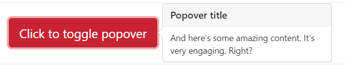

```html
<button type="button" class="btn btn-danger" data-toggle="popover" title="Popover title" data-content="And here's some amazing content. It's very engaging. Right?">Click to toggle popover</button>
```

:bulb: 弹出提示框依靠第三方函式库 Popper.js 进行定位。 在使用弹出提示框工作之前，页面必须引入 popper.min.js 脚本

:warning: 弹出提示框因为效能消耗较大原因所以是选择加入，所以必须在页面添加额外的脚本将他们初始化。

```js
// 在任何地方啟用彈出提示框
$(function () {
  $('[data-toggle="popover"]').popover()
})
```

可以添加属性 `data-placement={direction}` 设置弹出框的方向 `top`、`right`、`bottom`、`left`

:bulb: 默认需要再次点击相同的按钮才可以消除弹出框，为元素添加属性 `data-trigger="focus"` 以实现点击任意地方（让按钮失去「焦点」，推荐使用锚标签）移除弹出框

## 工具提示框
与弹出框类似，工具提示框 Tooltips 用以实现在工具悬停时弹出提示文字

* 在按钮添加 `data-toggle="tooltip"` 以访问 data api 实现交互式功能
* 提示内容设置在元素的属性 `title` 之中

:warning: 也需要手动在页面添加一段脚本启动交互功能

```js
// 在任何地方启用工具提示框
$(function () {
  $('[data-toggle="tooltip"]').tooltip()
})
```

:bulb: 可以添加属性 `data-placement={direction}` 设置提示框的弹出位置

## 滚动监听
滚动监听 Scrollspy 用以根据滚动位置自动更新导航或列表元件的样式，一般是实现 `active` 样式的切换

* 导航/导航条元件中的锚标签绑定页面相关部分（基于元素的 id）
* 页面内容的容器添加属性 `data-spy="scroll"` 访问 data-api 以实现家父管理，而且需要**添加属性 `data-target` 绑定相关的导航元件**

:bulb: 页面需要滚动导航栏的标签才会进行切换

```html
<!-- style -->
<style>
    .scrollspy-example {
        position: relative;
        height: 200px;
        margin-top: .5rem;
        overflow: auto;
    }
</style>

<!-- nav -->
<nav id="navbar-example2" class="navbar navbar-light bg-light">
  <a class="navbar-brand" href="#">Navbar</a>
  <ul class="nav nav-pills">
    <li class="nav-item">
      <a class="nav-link" href="#fat">@fat</a>
    </li>
    <li class="nav-item">
      <a class="nav-link" href="#mdo">@mdo</a>
    </li>
    <li class="nav-item dropdown">
      <a class="nav-link dropdown-toggle" data-toggle="dropdown" href="#" role="button" aria-haspopup="true" aria-expanded="false">Dropdown</a>
      <div class="dropdown-menu">
        <a class="dropdown-item" href="#one">one</a>
        <a class="dropdown-item" href="#two">two</a>
        <div role="separator" class="dropdown-divider"></div>
        <a class="dropdown-item" href="#three">three</a>
      </div>
    </li>
  </ul>
</nav>

<!-- content -->
<div data-spy="scroll" data-target="#navbar-example2" data-offset="0" class="scrollspy-example">
  <h4 id="fat">@fat</h4>
  <p>Ad leggings keytar, brunch id art party dolor labore. Pitchfork yr enim lo-fi before they sold out qui. Tumblr farm-to-table bicycle rights whatever. Anim keffiyeh carles cardigan. Velit seitan mcsweeney's photo booth 3 wolf moon irure. Cosby sweater lomo jean shorts, williamsburg hoodie minim qui you probably haven't heard of them et cardigan trust fund culpa biodiesel wes anderson aesthetic. Nihil tattooed accusamus, cred irony biodiesel keffiyeh artisan ullamco consequat.</p>
  <h4 id="mdo">@mdo</h4>
  <p>Veniam marfa mustache skateboard, adipisicing fugiat velit pitchfork beard. Freegan beard aliqua cupidatat mcsweeney's vero. Cupidatat four loko nisi, ea helvetica nulla carles. Tattooed cosby sweater food truck, mcsweeney's quis non freegan vinyl. Lo-fi wes anderson +1 sartorial. Carles non aesthetic exercitation quis gentrify. Brooklyn adipisicing craft beer vice keytar deserunt.</p>
  <h4 id="one">one</h4>
  <p>Occaecat commodo aliqua delectus. Fap craft beer deserunt skateboard ea. Lomo bicycle rights adipisicing banh mi, velit ea sunt next level locavore single-origin coffee in magna veniam. High life id vinyl, echo park consequat quis aliquip banh mi pitchfork. Vero VHS est adipisicing. Consectetur nisi DIY minim messenger bag. Cred ex in, sustainable delectus consectetur fanny pack iphone.</p>
  <h4 id="two">two</h4>
  <p>In incididunt echo park, officia deserunt mcsweeney's proident master cleanse thundercats sapiente veniam. Excepteur VHS elit, proident shoreditch +1 biodiesel laborum craft beer. Single-origin coffee wayfarers irure four loko, cupidatat terry richardson master cleanse. Assumenda you probably haven't heard of them art party fanny pack, tattooed nulla cardigan tempor ad. Proident wolf nesciunt sartorial keffiyeh eu banh mi sustainable. Elit wolf voluptate, lo-fi ea portland before they sold out four loko. Locavore enim nostrud mlkshk brooklyn nesciunt.</p>
  <h4 id="three">three</h4>
  <p>Ad leggings keytar, brunch id art party dolor labore. Pitchfork yr enim lo-fi before they sold out qui. Tumblr farm-to-table bicycle rights whatever. Anim keffiyeh carles cardigan. Velit seitan mcsweeney's photo booth 3 wolf moon irure. Cosby sweater lomo jean shorts, williamsburg hoodie minim qui you probably haven't heard of them et cardigan trust fund culpa biodiesel wes anderson aesthetic. Nihil tattooed accusamus, cred irony biodiesel keffiyeh artisan ullamco consequat.</p>
  <p>Keytar twee blog, culpa messenger bag marfa whatever delectus food truck. Sapiente synth id assumenda. Locavore sed helvetica cliche irony, thundercats you probably haven't heard of them consequat hoodie gluten-free lo-fi fap aliquip. Labore elit placeat before they sold out, terry richardson proident brunch nesciunt quis cosby sweater pariatur keffiyeh ut helvetica artisan. Cardigan craft beer seitan readymade velit. VHS chambray laboris tempor veniam. Anim mollit minim commodo ullamco thundercats.
  </p>
</div>
```

## 进度条
进度条 Progress 元件用以添加一个进度条，支持设置不同的样式，甚至可以加上动效。

* 使用 `.progress` 作为容器，可以调节高度产生高度粗细不同的进度条，如添加属性 `style="height: 30px"`
* 内部元素 `.progress-bar` 来设置当前的进度，通过样式属性 `style` 设置，如 `style="width: 25%"` 表示当前进度为 25% :bulb: 可以将相应的进度值作为内容填入在页面显示出来

:bulb: 支持多进度条进行堆叠，只需要在容器 `.progress` 中设置多个 `.progress-bar` 同级元素即可，它们的「进度值」之和应该不超过 100%

:bulb: 如果希望修改进度条颜色，可以在 `.progress-bar` 元素设置不同的背景颜色 `.bg-{theme-color}`

:bulb: Bootstrap 还提供条纹样式，在 `.progress-bar` 元素添加属性 `progress-bar-strip`，如果需要动效条纹可以同时添加属性 `.progress-bar-animated`

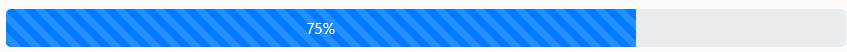

```html
<div class="demo">
  <div class="progress" style="height: 30px;">
    <div class="progress-bar progress-bar-striped progress-bar-animated" role="progressbar" aria-valuenow="75" aria-valuemin="0" aria-valuemax="100" style="width: 75%">75%</div>
  </div>
</div>
```
