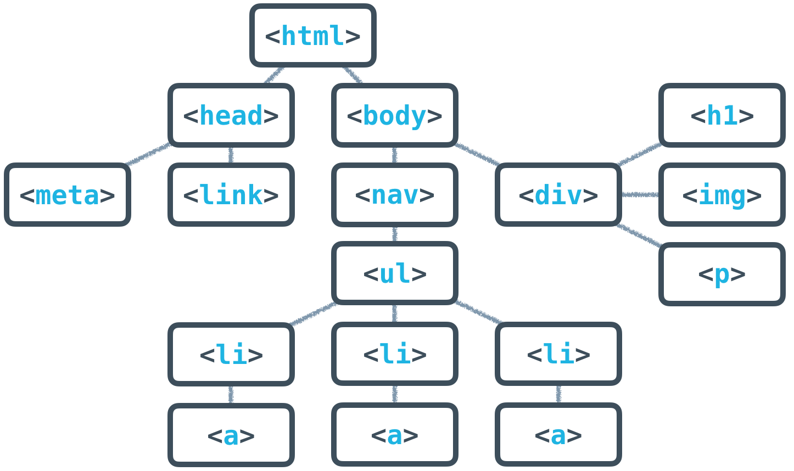

---
tags:
  - html
---

# HTML概述
HTML 全称为 Hyper Text Markup Language 是一个专门用来制作网站的语言。

HTML 由不同元素 `element` 构成，不同的元素有其独特的标签 `tag` 标识，一般的元素格式为 `<tag>content</tag>`。

浏览器根据一种跨平台约定，即 **文档对象模型 DOM（document object model），将 HTML （及其它标示语言）中代表对象和与对象交互的标记转换为树状的元素，并在页面中显示出 DOM 元素**。每个 HTML 标签对应于 DOM 中的一个元素，该模型中每个文档的节点都是以树状结构组织的，称为 DOM 树。

:bulb: 术语 「标签」和「元素」密切相关，有时可互换使用
* 标签是一个 HTML 源码
* 元素是在浏览器呈现给用户看到的可视化组件，或者可以将元素理解为由一个开始标签至相应结束标签组成的（包括其中内嵌的其他标签和内容）

## 树结构
HTML 语言构建的文件可以可以通过概念树结构展示，以可视化不同元素或内容之间的关系组成，以表示数据的层级关系

* 父节点 `parent`
* 子节点 `child`
* 同级关系 `siblings`

:bulb: 可以依据数据树清晰地创建 HTML 文件

## HTML 标签
HTML 文档的各种标签对内容进行标记，让原始的文本 **「结构化」** 使得浏览器可以正确地解析，如 `<html></html>` 标签内的所有内容会被解析为 HTML，`

` 标签内的内容会被解析为段落。

HTML 标签还可以在开始标签添加属性 `<element attributeName="value">` 以提供更详细的信息和设置，如属性 `style` 添加内联样式，属性 `bgcolor` 设置元素的背景颜色。

:bulb: 允许添加多个属性，属性之间以空格分隔，属性名与属性值以赋值符号相连 `<element attr1="value" attr2="value2">`