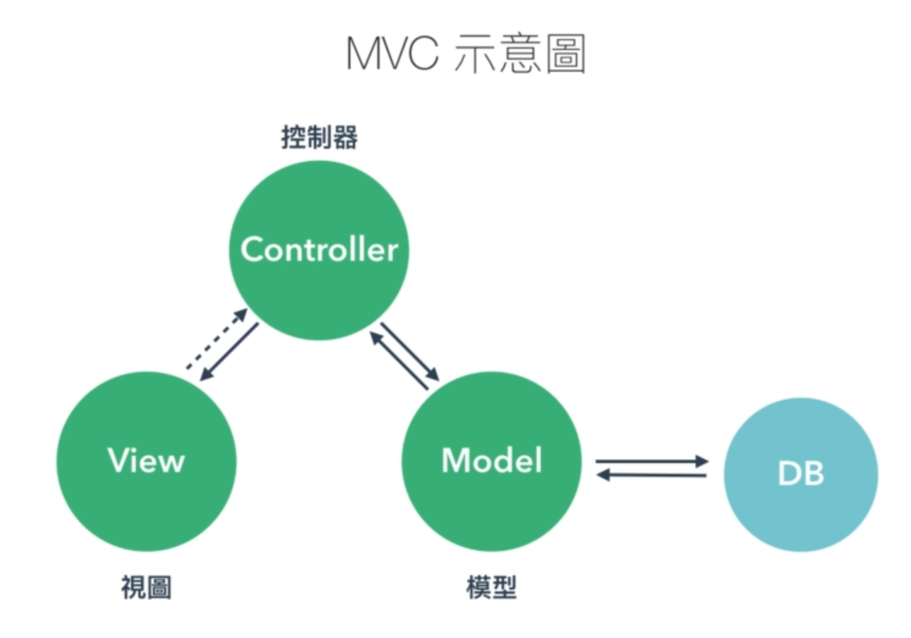

# MOV
Model Octopus View，MOV 模型是指数据与视图分离的项目架构，这样就可以尽可能少地修改代码，实现数据和视图的响应式变化。其中 Octopus 是该模型的核心，它泛指用于连接的程序/方法，而 **模型 Model/服务端/数据** 与 **视图 View/客户端** 就是它连接的两个目标。市场上各种 JavaScript 框架都可以实现类似的模型，如 MVC、MVVC 等。

对于一个网页应用可以分为不同部分

* **模型 Model**：数据存储部分，数据包括来自服务器和用户（输入）的数据。有的模型中将多个模型组合而成的数据称为 集合 Collections
* **视图 View**：用户看到的以及可以互动的部分，包括 DOM 元素，输入元素等。作为用户与应用之间的接口，用于（接收用户输入）为应用提供数据，以及读取数据（加载来自 model 的数据）。:bulb: 其中路由器 Routers，即浏览器的 URL 栏（用以跟踪 URL 的状态）也属于视图，因为它是用户可见并与其进行交互
* **章鱼（连接） Octopus**：这部分是在各种框架底层进行封装的，只要通过构建相应的应用/对象实例即可使用提供的方法。它相当于模型和视图交互中添加了一个「缓冲」buff 层，让开发者可以不直接修改视图 view 或数据 model，而是在 octopus 中进行操作，即修改 view 和 model 之间传输时的数据，安全性更有保障（其他部分的功能并未被破环），不同的模型对于连接称呼不同，如 ViewModel、Controller。

不同对于 连接 octopus 方式有不同的称呼，常见的模型有
* MVC（model view controller）模型视图控制器。其中 `Controller` 为控制跳转和工作流的程序。
* MVVM（model view viewmodel）模型视图。其中 `ViewModel` 称为视图模型
* MVP（model view presenter）模型视图演示器。其中 `Presenter` 称为演示器

许多 JavaScript 库 Library/框架都实现了 MOV 模型，如 [Knockout](https://knockoutjs.com/index.html)、[Vue.js](https://cn.vuejs.org/) 等，可以利用这些框架实现视图和模型分离式的开发。

## 核心概念

* **视图 ViewModel**：把分离的模型和视图连接起来。
* **声明式绑定 Decalrative Bindings**：声明绑定是指在 HTML 元素添加相应的属性，就可以将视图/页面 DOM 与模型/数据关联起来（即通过 ViewModel 连接）。
* **自动 UI 刷新 Automatic UI Refresh**：在模型更改时会自动更新视图；同样地通过声明式绑定可以实现双向绑定，因此视图发生更改时也会自动更新模型（如在表单中输入数据、选中复选框等操作）。
* **依赖性跟踪 Dependency Tracking**：在模型的之间可以创建依赖项，框架会自动追踪并在模型数据更改时自动更新这些依赖项。