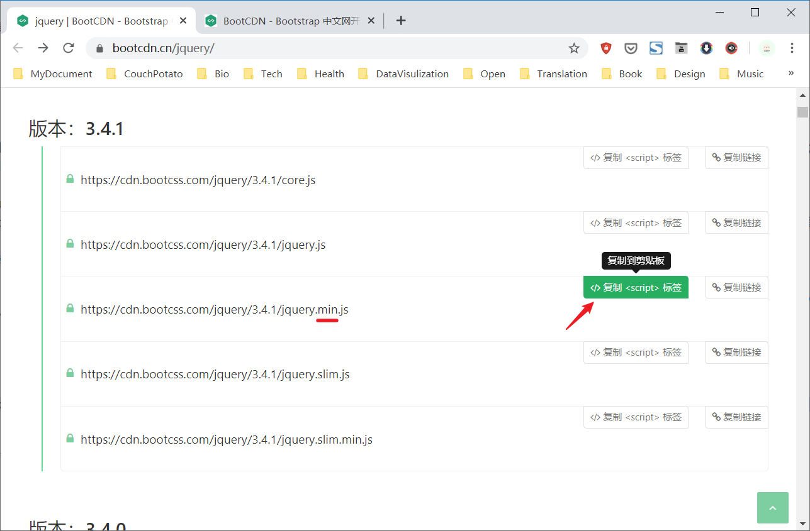

---
tags:
  - jquery
---

# jQuery
参考：
* [jQuery](https://jquery.com/)
* [jQuery API 中文文档](https://www.jquery123.com/) | jQuery 中文网
* [The Complete jQuery Course: From Beginner To Advanced!](https://www.udemy.com/course/jquery-tutorial/) | Udemy

jQuery 是一个十分流行的 JavaScript 开源库/框架，与原生的 JavaScript 相比，它使用类似 CSS 选择器的方法操纵 DOM，因此十分容易学习和使用，此外它对于 JavaScript 常用的功能，如事件处理和异步请求，都进行了优化。

其他 JavaScript 库：

* [YUI](https://yuilibrary.com/) 全称 Yahoo User Interface library（已停止维护）
* [Dojo Toolkit](https://dojotoolkit.org/) 一个大型 JavaScript 库
* [mootools](https://mootools.net/) 一个小型 JavaScript 库，主要用于页面的特效、动画制作
* [Underscore](http://underscorejs.org/) 一个轻量级的 JavaScript 库，不包括动画、异步请求等组件

## 使用 jQuery
要在网页中使用 jQuery 需要下载相应的脚本。开发者可以先将[脚本下载到网页所在的服务器中](https://jquery.com/download/)，当浏览器加载页面时随网页文件一并传送给用户；也可以在 HTML 文档的元素 `<script>` 设置属性 `href` 添加 CDN 链接，从内容分发网络中下载脚本文件。

:bulb: **推荐使用从 CDN 下载 jQuery 脚本文件**，因为这比从一般比服务器下载要快，同时也可以利用浏览器的缓存特性。
> CDN 全称 Content Delivery Network 内容分发网络，使得内容传输更快速、更稳定，CDN系统能够实时地根据网络流量和各节点的连接、负载状况以及到用户的距离和响应时间等综合信息将用户的请求重新导向离用户最近的服务节点上。
> *参考：[CDN是什么？使用CDN有什么优势？ - 视界云的回答](https://www.zhihu.com/question/36514327/answer/184247188) - 知乎*

可以在主流搜索引擎中搜寻关键字 `jQuery cdn` 获取免费的 jQuery 相应版本的 CDN 链接，[官网](https://code.jquery.com/)、[Google](https://developers.google.cn/speed/libraries/devguide#jquery) 等都有有提供，但推荐使用国内 [BootCDN](https://www.bootcdn.cn/) 提供的[链接](https://www.bootcdn.cn/jquery/)（国内网络访问更快速）以提高页面加载速度。



```js
// 使用 jQuery 版本为 3.4.1
<script src="https://cdn.bootcss.com/jquery/3.4.1/jquery.min.js"></script>
```

:bulb: 使用 jQuery 的精简版本（带有关键字 `min` 的版本经过压缩处理，文件体积更小，仅有约 30kb）以提高网页的加载速度

