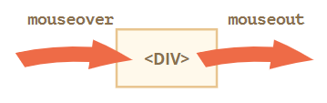
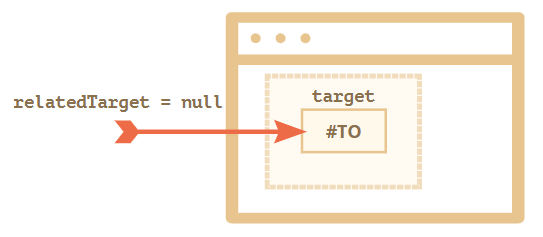
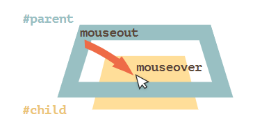

---
tags:
  - javascript
  - dom
  - browser
---

# UI事件
在浏览器的所有事件中， UI（user interface）用户界面交互事件是最常见的，如鼠标事件、按键事件等。

## 鼠标事件
**常用的简单鼠标事件**

* `mousedown/mouseup` 在元素上点击/释放鼠标按钮。
* `mouseover/mouseout` 鼠标指针从一个元素上移入/移出。
* `mousemove` 鼠标在元素上的每个移动都会触发此事件。
* `contextmenu` 尝试打开上下文菜单时触发。在最常见的情况下，此事件发生在鼠标右键被按下时。虽然，还有其他打开上下文菜单的方式，如使用特殊的键盘键，所以它不完全是一个鼠标事件。

**常用的复杂鼠标事件**

:bulb: 复杂事件是由简单事件组成的，因此从理论上讲如果没有这些复杂事件，我们也能实现相应的功能，但它们的存在却给我们提供了极大的便利。

* `click` 如果使用的是鼠标左键，则在同一个元素上的 `mousedown` 及 `mouseup` 相继触发后，触发该事件。
* `dblclick` 双击一个元素后触发。

:bulb: 鼠标事件不仅可能来自于「鼠标设备」触发的，还可能来自于对此类操作进行了模拟以实现兼容性的其他设备，如手机和平板电脑等触屏设备。

:bulb: 一个行为可能会触发多个事件，这些事件触发是有顺序的，而且顺序是固定的。如鼠标点击（单击）首先触发 `mousedown`，然后释放鼠标按钮时会触发 `mouseup` 和 `click`。


### 组合键
所有的鼠标事件的对象都包含有关按下的组合键的信息，如果在事件期间按下了相应的键，则相应的属性的值为 `true`。

- 事件属性 `event.shiftKey` 表示是否按下 Shift 键，`true` 为按下该键
- 事件属性 `event.altKey` 表示是否按下 Alt（或对于 Mac 是 Opt），`true` 为按下该键
- 事件属性 `event.ctrlKey` 表示是否按下 Ctrl，`true` 为按下该键
- 事件属性 `event.metaKey` 表示是否按下（对于 Mac）Cmd 键，`true` 为按下该键

```html
<button id="button">Alt+Shift+Click on me!</button>

<script>
  button.onclick = function(event) {
    // 如果同时按下 Alt 和 Shift 键并点击按钮时，会弹出提示信息 Hooray！
    if (event.altKey && event.shiftKey) {
      alert('Hooray!');
    }
  };
</script>
```

:warning: 在 Windows 和 Linux 上有 Ctrl 键，在 Mac 上相应有 Cmd 键，它对应于点击对象的属性 `metaKey`。在 MacOS 上按着 Ctrl 使用左键单击会被解释为 **右键单击**，并且会生成 `contextmenu` 事件，而不是像 Windows/Linux 中的 `click` 事件。因此如果我们想让所有操作系统的用户都感到舒适，应该在涉及检查 Ctrl 键的事件时，对 `ctrlKey` 与 `metaKey` 一起进行检查，即在 JS 代码中应该检查 `if (event.ctrlKey || event.metaKey)`。

:bulb: 对于点击与键盘组合的事件，可能需要考虑访客的设备没有键盘，如触屏设备，应该有另一种方法来做到这一点，则触发事件的方式和监听器应该对这种情况兼容。

### 坐标
对于所有的鼠标事件有[两种形式的坐标](./坐标.md)

* 相对于窗口的坐标 `clientX` 和 `clientY`，它们是相对于窗口计算的，类似于 `position:fixed` 定位规则。
* 相对于文档的坐标 `pageX` 和 `pageY`，它们是从文档的左上角而不是窗口开始计算的。

:warning: 如果事件在 `iframe` 标签中触发并执行相应的处理程序，则坐标就是针对 `iframe` 的嵌入式视窗的。

### 点击事件
#### which
如果我们跟踪与点击相关的事件时，如 `mousedown` 和 `mouseup`，事件对象会具有 `which` 属性以允许获取确切的鼠标按钮，它有三个可能的值：

- `event.which == 1` 左按钮
- `event.which == 2` 中间按钮
- `event.which == 3` 右按钮

:warning: 它不是 `click` 和 `contextmenu` 事件的事件对象的属性，因为前者只在点击左键时发生，而后者只在点击右键时发生；但对于事件 `mousedown` 和 `mouseup`，因为这些事件会在任何按钮上触发，所以 `which` 让我们能够区分 "right-mousedown"  和 "left-mousedown"，而中间按钮现在有些特殊，很少被使用了。

#### 禁用选择
双击鼠标和按下鼠标左键并在不松开会有副作用，在某些界面中可能会触发浏览器的默认行为，即选择文本，对交互造成干扰。由于`mousedown` 的默认浏览器操作是文本选择，因此可以阻止浏览器对 `mousedown` 事件的默认操作解决这个问题。

```html
BeforeText...
<b ondblclick="alert('Click!')" onmousedown="return false">
  Double-click me
</b>
...TextAfter
```

上述实例代码组织了部分文字（粗体问题）的点击事件 `onmousedown` 的浏览器默认行为，因此在双击粗体元素时它们不会被选中，从而避免了不必要的默认执行阻碍其他事件处理程序。**但是其中的文本仍然是可选择的，只是在该文本之前或之后开始选择即可**，通常这对用户来说挺好的。


:bulb: 利用禁止选择可以实现文本**防止复制**的功能，此外还可以使用事件 `oncopy` 并设置为 `return false` 阻止复制。当然用户可以访问页面的 HTML 源码，并且可以从那里获取内容，但并不是每个人都知道如何做到这一点。

```html
<!-- 当用户选中 div 元素中的文本并执行复制操作（右键点选复制或使用快捷键 Ctrl + C，会弹出提示信息，并阻止复制文本的默认行为 -->
<div oncopy="alert('Copying forbidden!');return false">
  Dear user,
  The copying is forbidden for you.
  If you know JS or HTML, then you can get everything from the page source though.
</div>
```

### 移动事件
与鼠标移动的事件有很多，如 `mousemove`、`mouseover` 与 `mouseout`、`mouseenter` 与 `mouseleave`

**事件 `mousemove`**
当鼠标移动时就会触发 `mousemove` 事件。

**事件 `mouseover` 与事件 `mouseout`**

* 当鼠标指针移到某个元素上时会触发 `mouseover` 事件
* 当鼠标指针离开某个元素时会触发 `mouseout` 事件



**事件 `mouseenter` 与事件 `mouseleave`**
* 当鼠标指针进入某个元素上时会触发 `mouseenter` 事件
* 当鼠标指针离开某个元素时会触发 `mouseleave` 事件

:bulb: 事件 `mouseenter/mouseleave` 类似于 `mouseover/mouseout`，但关于鼠标在子元素和父元素之间移动时行为会有明显区别

* 事件 `mouseenter/mouseleave` 在元素内部（后代）之间的移动并不会引起事件变化
* 事件 `mouseenter/mouseleave` 不会冒泡，因此不能使用事件委托监听子元素的相应事件

:bulb: 移动事件的对象都具有属性 `relatedTarget`，是 `target` 属性的补充

* 对于 `mouseover/mouseenter`（鼠标移动方向 `relatedTarget` → `target`）
    - `event.target` 是鼠标移过的那个元素，即当前指针位置下的元素
    - `event.relatedTarget` 是鼠标来自的那个元素

* 对于 `mouseout/mouseleave`（鼠标移动方向 `target` → `relatedTarget`）
    - `event.target` 是鼠标离开的元素。
    - `event.relatedTarget` 是鼠标移动到的，即当前指针位置下的元素。

#### 跳过元素
如果访问者非常快地移动鼠标，`mouseout` 事件和 `mouseover` 事件可能在某些 DOM 元素就可能被跳过，即鼠标指针并不会「访问」所有元素。它可以「跳过」一些元素，则对性能很有好处。但是如果一个元素的 `mouseover` 事件被触发了，那么一旦鼠标离开它，就会有相应的 `mouseout` 事件发生。

:warning: `relatedTarget` 属性可以为 `null`，这是正常现象。因为鼠标可以不是来自另一个元素，而是来自窗口之外（而且鼠标移动很快）；或者它离开了窗口而并不指向另一个元素。当我们在代码中使用 `event.relatedTarget` 时，我们应该牢记这种可能性，如果我们访问 `event.relatedTarget.tagName`，那么就会出现错误。



#### 移动到子元素
事件 `mouseout` 和 `mouseover` 的一个重要功能是当鼠标指针**从元素移动到其后代时触发**，看起来似乎是从父元素离开，但实际上只是「更深入」移入到子元素而已（通过追踪 `event.target` 可观察），鼠标指针依然位于父元素上。

如果我们在 `#parent` 上，然后将鼠标指针更深入地移入 `#child`，在 `#parent` 上会得到 `mouseout`！



**根据浏览器的逻辑，鼠标指针随时可能位于单个元素上，即嵌套最多的那个元素（z-index 最大的那个）**，因此如果鼠标转到另一个元素（甚至是一个后代），那么就认为它离开前一个元素，此时前一个元素（父元素）的事件 `mouseout` 会被触发，后一个元素（子元素）的事件 `mouseover` 会被触发（请留意由于事件冒泡，如果父元素上具有 `mouseover` 处理程序将会被触发）。

:warning: 如果（最顶部的元素）监听的事件是  `mouseenter/mouseleave` 则行为不同。当鼠标指针该元素时会触发事件  `mouseenter`；当鼠标指针离开该元素时，事件 `mouseleave` 才会触发。而鼠标指针在元素或其后代中的确切位置无关紧要，它在后代之间的移动会被忽略。

#### 事件委托
只有可冒泡的移动事件 `mouseover/mouseout` 才可以通过事件委托的方式监听子元素的事件。

但是由于这两个事件对于父元素和子元素的不同对待行为，可能造成不必要的事件触发，可以通过 `event.target.colsest(parentElem)` 来判断鼠标是否依然存在于父元素中，即将鼠标在后代之间的移动过滤掉，选择性执行事件处理程序。

实例参考：[事件委托](https://zh.javascript.info/mousemove-mouseover-mouseout-mouseenter-mouseleave#shi-jian-wei-tuo)

### 拖放事件
拖放 Drag'n'Drop 是一个很赞的用户界面交互方案，，如通过拖放实现文档/元素的移动，它是一种简单明了的交互方式。在现代 HTML 标准中有一个 [关于拖放的部分](https://html.spec.whatwg.org/multipage/interaction.html#dnd)，这个交互过程包含了特殊的浏览器事件，如 `dragstart` 和 `dragend` 事件。

这些关于拖放的事件很有用，因为它们使我们能够轻松地解决简单的任务，如能够处理将「外部」文件拖放到浏览器中的操作，从而使 JavaScript 可以访问其内容。但是原生的拖放事件也有其局限性，如无法将拖放限制在某个区域内，并且无法将拖放变成「水平」或「垂直」拖放。此外移动设备基本都不支持此事件。我们可以取消原生的 `ondragstart` 事件触发的浏览器默认行为，并借助鼠标事件 `mousedown`、`mousemove`、`mouseup` 实现基本的拖放算法，完成特定的拖放交互功能。

基础的拖放算法：

1. 事件流：`elem.mousedown` -> `document.mousemove`（在 document 上跟踪 `mousemove` 事件）-> `elem.mouseup`（:bulb: 不要忘记取消原生 `ondragstart` 事件的浏览器默认行为）。
2. 在拖动开始时，记住鼠标指针相对于元素的初始偏移（shift） `shiftX/shiftY`，并在拖动过程中保持它不变。
3. 使用 `document.elementFromPoint` 检测鼠标指针下的 "droppable"  的元素，在「经过」`mouseover` 时高亮显示，以提示用户可以在此处「放下」拖拽的元素。

:bulb: 有一些框架 `DragZone`，`Droppable`，`Draggable` 及其他 class 已经将体系结构构建好，可以为页面提供丰富的拖拽交互功能。

:point_right: 实例演示：[拖放球进球门](https://zh.javascript.info/mouse-drag-and-drop#qian-zai-de-fang-zhi-mu-biao)

## 按键事件
按一个按键总是会产生一个键盘事件，无论是符号键，还是例如 Shift 或 Ctrl 等特殊按键。使用键盘事件可以对键盘行为（虚拟键盘也算）作出响应。

* 当按键被按下时，会触发 `keydown` 事件
* 当按键被释放时，会触发 `keyup` 事件

:bulb: 按键事件一般只会在聚焦的元素上触发，可以通过 `elem.onfous()` 或点击可聚焦的元素再特定元素上实现聚焦，然后按键就可以触发按键事件。

:warning: 笔记本电脑的键盘上的 Fn 键没有键盘事件，因为它通常是被在比 OS 更低的级别上实现的。

:bulb: 过去曾经有一个 `keypress` 事件，返回的是 ASCII 码，还有键盘事件对象的属性 `keyCode`、`charCode` 、`which`。浏览器对它们都存在兼容性问题，以致使该规范的开发者不得不弃用它们。旧的代码仍然有效，因为浏览器还在支持它们，但现在完全没必要再使用它们。

### event.code 和 event.key
* 按键事件对象的属性 `event.key` 允许获取字符（相当于显示的字符）
*  按键事件对象的属性 `event.code` 则允许获取「物理按键代码」（相当于键盘按键）

| 键盘按键 | 针对 Z 的属性 `event.key` | 针对 Z 的属性 `event.code` |
| :----------: | :-----------------------------------: | :-------------------------------------: |
|      Z      |           `z`（小写）            |               `KeyZ`                |
| Shift+Z  |           `Z`（大写）            |               `KeyZ`                |

:bulb: 每个按键的代码 `event.code` 都取决于该按键在键盘上的位置，因此在不同的语言输入状态下，属性 `event.key` 可能不同，而属性 `event.code` 是始终都一样的，**因此检查 `event.code` 会更好**。[UI 事件代码规范](https://www.w3.org/TR/uievents-code/) 中描述了按键代码，有关更多按键代码请参见 [规范的字母数字部分](https://www.w3.org/TR/uievents-code/#key-alphanumeric-section)。

- 字符键的代码为 `"Key<letter>"`：`"KeyA"`，`"KeyB"` 等。
- 数字键的代码为 `"Digit<number>"`：`"Digit0"`，`"Digit1"` 等。
- 特殊按键的代码为按键的名字 `"Enter"`，`"Backspace"`，`"Tab"` 等。

按下特殊的按键在页面上并不显示字符，其属性 `event.key` 与 `event.code` 大致相同，但属性 `event.code` 会提供更准确的信息，如 Shift 键大多数键盘有两个 Shift 键，一个在左边，一个在右边，属性 `event.code` 会区分按下是哪个 Shift 键；而 `event.key` 只对按键的「含义」负责，因此并不区分两个 Shift 键。

|      Key      | `event.key` |            `event.code`             |
| :-------------: | :----------------: | :----------------------------------------: |
|      F1       |      `F1`       |                   `F1`                   |
| Backspace | `Backspace` |             `Backspace`             |
|     Shift     |    `Shift`     | `ShiftRight` 或 `ShiftLeft` |

:warning: 有一个特殊的热键在处理时需要考虑兼容性，在 Windows 和 Linux 系统的按键 Ctrl ，在 Mac 是按键 Cmd 实现相应功能，因此在监听按键事件如果需要该按键时需要考虑不同系统情况。

```js
document.addEventListener('keydown', function(event) {
  if (event.code == 'KeyZ' && (event.ctrlKey || event.metaKey)) {
    alert('Undo!')
  }
});
```

:warning: [规范](https://www.w3.org/TR/uievents-code/#table-key-code-alphanumeric-writing-system) 中明确提到了使用德式布局键盘按下 Y 时，`event.code` 将等于美式布局键盘的 `KeyZ`，因此使用属性 `event.code` 可能由于意外的键盘布局而与错误的字符进行了匹配，由于不同键盘布局中的相同字母可能会映射到不同的物理键。对于这种情况为了可靠地跟踪与**受键盘布局影响的字符，使用 `event.key`** 可能是一个更好的方式。

:warning: 过去键盘事件有时会被用于跟踪表单字段中的用户输入，但由于语言切换或键盘映射的问题使得结果并不可靠，应该使用 `input` 和 `change` 事件来处理任何输入，它们在任何类型的输入（包括复制粘贴或语音识别）后触发。而键盘事件应该只用于对热键或特殊键组合作出反应。

### 自动重复
如果按下一个键足够长的时间，它就会开始「自动重复」触发 `keydown` 事件，直到按键被释放。因此有很多 `keydown` 却只有一个 `keyup` 是很正常的。

对于由自动重复触发的事件，其属性 `event.repeat` 被设置为 `true`。

### 默认行为
按键有多种，对应的事件默认行为都不同，如出现在屏幕上的一个字符（最常见的结果）、一个字符被删除（Delete 键）、滚动页面（PageDown 键）、打开「保存页面」对话框（Ctrl+S）等。

按键事件 `keydown` 大多数的默认行为都可以阻止（使用 `event.preventDefault()` 或 `on<event>` 返回 `return false`），但**基于 OS 的特殊按键除外**，如在 Windows 中 Alt+F4 会关闭当前浏览器窗口，无法通过脚本阻止该按键组合事件的默认行为。

## 滚动事件
事件 `scroll` 在页面或元素（在 CSS 上设置属性 `overflow` ）滚动时触发，可以基于该事件对滚动操作作出响应，如当用户向下滚动到页面末端时加载更多数据。

:bulb: 使用方法 `elem.scrollLeft/scrollTop`获取（设置了 `overflow` 且文本溢出）元素的滚动大小，从元素的左上角开始滚动出元素的上半部分的宽/高（像素）。文档的滚动状态可以使用 `document.documentElement.scrollLeft/Top` 获取，但在较旧的基于 WebKit 的浏览器中则不行，如在 Safari（bug [5991](https://bugs.webkit.org/show_bug.cgi?id=5991)）中，我们应该使用 `document.body` 而不是 `document.documentElement`。💡 或者使用更通用的方法 `window.pageXOffset/pageYOffset` 获取。

:warning: 我们不能通过在 `onscroll` 监听器中使用 `event.preventDefault()` 来阻止滚动，因为它会在滚动发生 **之后** 才触发。但是我们可以在导致滚动的事件上，如在 pageUp 和 pageDown 的 `keydown` 事件上，使用 `event.preventDefault()` 来阻止滚动。

:bulb: 滚动的两个重要特性：

* **滚动是“弹性的”**。在某些浏览器/设备中，我们可以在文档的顶端或末端稍微多滚动出一点，超出部分显示的是空白区域，然后文档将自动「弹回」到正常状态。
* **滚动并不精确**。当我们滚动到页面末端时，实际上我们可能距真实的文档末端约 0-50px，因此「滚动到末端」应该意味着访问者离文档末端的距离不超过 100px。