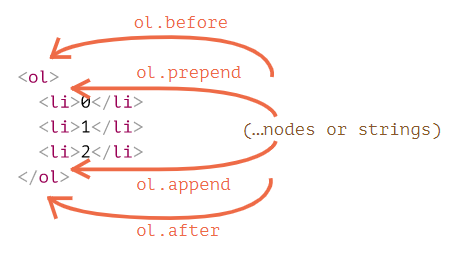
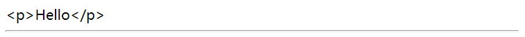
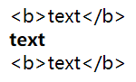
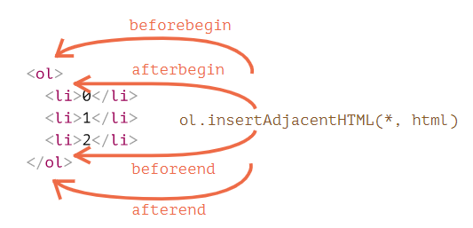
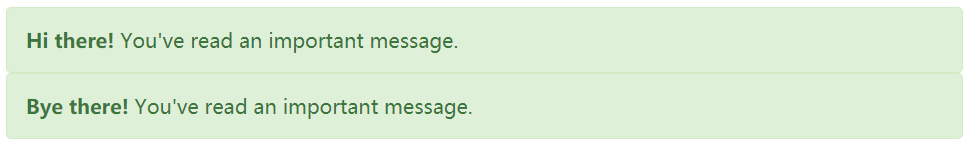
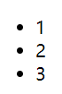

---
tags:
  - javascript
  - dom
---

# 修改 DOM
修改 DOM 是创建「实时」页面的关键。常用的修改 DOM 方法如下

**创建新节点的方法**

- `document.createElement(tag)` 用给定的标签创建一个元素节点
- `document.createTextNode(value)` 创建一个文本节点（很少使用）
- `elem.cloneNode(deep)` 克隆元素，如果 `deep==true` 则与其后代一起克隆

:bulb: 如果需要创建一个注释节点可以使用方法 `document.createComment()`

**插入和移除节点的方法**

- `node.append(...nodes or strings)` 在 `node` （内部）末尾插入，
- `node.prepend(...nodes or strings)` 在 `node` （内部）开头插入，
- `node.before(...nodes or strings)` 在 `node` 之前插入，
- `node.after(...nodes or strings)` 在 `node` 之后插入，
- `node.replaceWith(...nodes or strings)` 替换 `node`。
- `node.remove()` 移除 `node`。

:warning: 使用这些方法添加 HTML 片段会被作为纯文本插入。

**「旧式」方法**

调用这些方法将节点（HTML 片段）插入到指定位置，而且一般返回新增的 `node`。

- `parent.appendChild(node)`
- `parent.insertBefore(node, nextSibling)` 当第二个参数传递 `null` 相当于 `parent.appendChild(node)`
- `parent.removeChild(node)`
- `parent.replaceChild(newElem, node)` 返回被替换的节点 `node` 以备还需要使用被删除的节点


**专门用于插入 `html` 代码的方法** `elem.insertAdjacentHTML(where, html)` 会根据 `where` 的值来插入它：

- `"beforebegin"` — 将 `html` 插入到 `elem` 前面，
- `"afterbegin"` — 将 `html` 插入到 `elem` 的开头，
- `"beforeend"` — 将 `html` 插入到 `elem` 的末尾，
- `"afterend"` — 将 `html` 插入到 `elem` 后面。

:bulb: 类似的方法，`elem.insertAdjacentText` 和 `elem.insertAdjacentElement` 它们会插入文本字符串和元素节点，但很少使用。

**要在页面加载完成之前将 HTML 附加到页面**(多见于旧脚本) `document.write(html)`，:warning: 如果在页面加载完成后调用该方法，将会擦除文档。

## 创建元素
有两种方法创建新的 DOM 节点

* `document.createElement(tag)` 用给定的标签创建一个新元素节点（element node）
* `document.createTextNode(text)` 用给定的文本创建一个文本节点

然后为了让新增的节点显示出来，可以使用多种方法将新增的节点插入到 DOM 树结构中



- `node.append(otherNodes or strings)` 在 `node` 内部的末尾插入其他节点或字符串
- `node.prepend(otherNodes or strings)` 在 `node` 内部的开头插入其他节点或字符串
- `node.before(otherNodes or strings)` 在 `node` 前面插入其他节点或字符串
- `node.after(otherNodes or strings)` 在 `node` 后面插入其他节点或字符串
- `node.replaceWith(otherNodes or strings)` 将 `node` 替换为给定的其他节点或字符串

:bulb: 这些方法可以在单个调用中**插入多个节点列表和文本片段**，如果插入的是带 HTML 代码片段，它们都会被作为纯文本（字符串）形式插入，就相当于 `elem.textContent` 所做的一样

```html
<div id="div"></div>
<script>
  div.before('<p>Hello</p>', document.createElement('hr'));
</script>
```



:bulb: 如果希望插入 HTML 代码并正确解析显示出来，可以先**使用属性 `innerHTML`** 将需要插入的 HTML 片段包含到新建的节点里。

```html
<div id="elem1"></div>
<div id="elem2"></div>
<div id="elem3"></div>
<script>
  let text = '<b>text</b>';

  elem1.append(document.createTextNode(text));
  elem2.innerHTML = text;
  elem3.textContent = text;   // 相当于第一种方法
</script>
```



:bulb: 节点属性 `className` 获取类属性值，也可以通过赋值来设置相应元素的类属性。

也可以使用另一个非常通用的**方法 `elem.insertAdjacentHTML(where, html)`**

参数说明

* 第一个参数 `where` 指定代码相对于 `elem` 插入位置，必须为以下之一：

    - `"beforebegin"`  将 `html` 插入到 `elem` 前
    - `"afterbegin"` 将 `html` 插入到 `elem` 开头
    - `"beforeend"` 将 `html` 插入到 `elem` 末尾
    - `"afterend"` 将 `html` 插入到 `elem` 后

    

* 第二个参数 `html` 是 HTML 字符串，该字符串会被**作为 HTML 插入**。

```html
<div id="div"></div>
<script>
  div.insertAdjacentHTML('beforebegin', '<p>Hello</p>');
  div.insertAdjacentHTML('afterend', '<p>Bye</p>');
</script>
```

:hammer:

```html
<p>Hello</p>
<div id="div"></div>
<p>Bye</p>
```

:bulb: 还有两个类似的方法

* **`elem.insertAdjacentText(where, text)`** 语法一样，但是将 `text` 字符串作为纯文本插入而不是作为 HTML
* **`elem.insertAdjacentElement(where, elem)`** 语法一样，但是插入的是一个元素节点

但一般很少使用这两种方法，如果插入的是 HTML 代码片段就使用方法 `inserAdjacentHTML`，如果插入的是元素节点（对象）或文本就使用方法 `append/prepend/before/after`

:bulb: 插入节点还有一些老式的方法 （不推荐使用，而应该使用 `append`，`prepend`，`before`，`after`，`remove`，`replaceWith` 这些更加灵活的现代方法），可能会在许多就脚本中遇到它们。

* `parentElem.appendChild(node)` 将 `node` 作为最后一个子元素附加到 `parentElem` 内
* `parentElem.insertBefore(node, nextSibling)` 在 `parentElem` 的 `nextSibling` 前插入 `node`
* `parentElem.replaceChild(node, oldChild)` 将 `parentElem` 的后代中的 `oldChild` 替换为 `node`
* `parentElem.removeChild(node)` 从 `parentElem` 中删除 `node`（假设 `node` 为 `parentElem` 的后代）

所有这些方法都会返回插入/删除的节点，如 `parentElem.appendChild(node)` 返回 `node`，但是通常我们不会使用返回值，我们只是使用对应的方法。

:warning: 另一个「古老」的方法 `document.write(html)` 可以将 HTML 代码写入页面，这个方法来自于没有 DOM，没有标准的「上古时期」，但因为还有脚本在使用它，所以这个方法依被保留了下来。它有一个巨大的缺陷，即只在页面加载时工作，会「就地立马」将 HTML 写入页面，如果在稍后调用则**原有的整个文档内容将被擦除**，因此在某种程度上讲，它在「加载完成」阶段是不可用的，这与其他现代的操作 DOM 方法不同。

```html
<p>After one second the contents of this page will be replaced...</p>
<script>
  // 1 秒后调用 document.write
  // 这时页面已经加载完成，所以它会擦除现有内容，最终页面只有 ...By this 字符串
  setTimeout(() => document.write('<b>...By this.</b>'), 1000);
</script>
```

但由于它是在浏览器解析 HTML 时调用的，因为它 **不涉及 DOM 修改**（此时 DOM 尚未构建），它运行起来出奇的快，这是它的一个好处。因此如果我们需要向 HTML 动态地添加大量文本，并且我们正处于页面加载阶段，并且速度很重要，那么它可能会有帮助。但实际上这些要求很少同时出现。

## 节点移除
可以使用方法 `node.remove()` 移除一个节点

:bulb: 如果我们要将一个元素 移动 到另一个地方，该节点会先从自动从旧位置删除（因此无需调用方法 `remove()`），再插入到相应的新位置。

```html
// 进行元素交换
<div id="first">First</div>
<div id="second">Second</div>
<script>
  // 无需调用 remove
  second.after(first); // 获取 #second 并在其后面插入 #first 后
</script>
```

## 克隆节点
方法 `elem.cloneNode(true)` 创建元素 `elem` 的一个「深」克隆，即拷贝该元素节点的所有特性（attribute）和子元素；如果调用 `elem.cloneNode(false)`（默认）克隆的节点就不包括子元素。

```html
<style>
.alert {
  padding: 15px;
  border: 1px solid #d6e9c6;
  border-radius: 4px;
  color: #3c763d;
  background-color: #dff0d8;
}
</style>

<div class="alert" id="div">
  <strong>Hi there!</strong> You've read an important message.
</div>

<script>
  let div2 = div.cloneNode(true); // 克隆消息
  div2.querySelector('strong').innerHTML = 'Bye there!'; // 修改克隆

  div.after(div2); // 在已有的 div 后显示克隆
</script>
```



## 文本节点合并
如果通过 DOM 操作为元素添加文本（节点）可能造成视觉上连续的字符串实际是由多个文本节点构成的，这会对后续的 DOM 操作造成不便，可以使用 `parent.normalize()` 将给定的元素节点内的文本节点合并。

```js
let div = document.querySelector('div');
let text1 = document.createTextNode('text one');
let text2 = document.createTextNode('text two');

div.append(text1);
div.append(text2);

console.log(div.childNodes.length);   // 2

div.normalize();
console.log(div.childNodes.length);   // 1
```

## 文本节点分割
使用 `parent.splitText(n)` 以传递的参数索引，在文本子节点的相应字符的位置分割字符串，返回分割后产生的新的文本子节点（后一半段字符串）。

```js
let div = document.querySelector('div');
let text = document.createTextNode('longText');
div.append(text);

let newNode = div.firstChild.splitText(4);
console.log(div.firstChild.nodeValue);   // long
console.log(newNode.nodeValue);   // Text
```

## DocumentFragment
`DocumentFragment` 是一个特殊的 DOM 节点，作为来传递**节点列表**的包装器 wrapper，即我们可以将多个节点先添加 `append` 到该容器中，并将容器再添加到目标节点内，则包装器中的所有节点就会作为内容插入到目标节点内。

```html
<ul id="ul"></ul>

<script>
function getListContent() {
  // 创建节点列表容器
  let fragment = new DocumentFragment();
  for(let i=1; i<=3; i++) {
    let li = document.createElement('li');
    li.append(i);
    fragment.append(li);   // 收集节点
  }
  return fragment;
}

// 添加节点到 ul 元素内
ul.append(getListContent());
</script>
```



但`DocumentFragment` 很少被显式使用，我们一般通过数组收集节点，再结合 spread 语法将数组「分解」为单个元素添加 `append` 到目标节点内

```html
<!-- 功能相同 -->
<ul id="ul"></ul>

<script>
function getListContent() {
  let result = [];
  for(let i=1; i<=3; i++) {
    let li = document.createElement('li');
    li.append(i);
    result.push(li);
  }
  return result;
}

ul.append(...getListContent());   // 使用 spread 操作符
</script>
```

