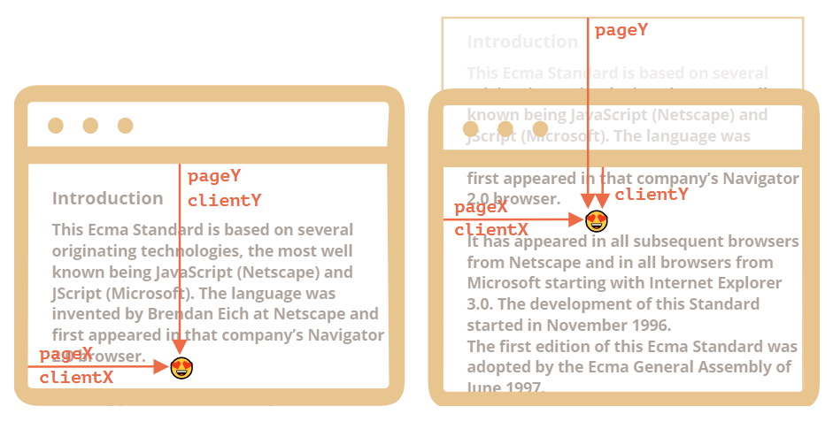
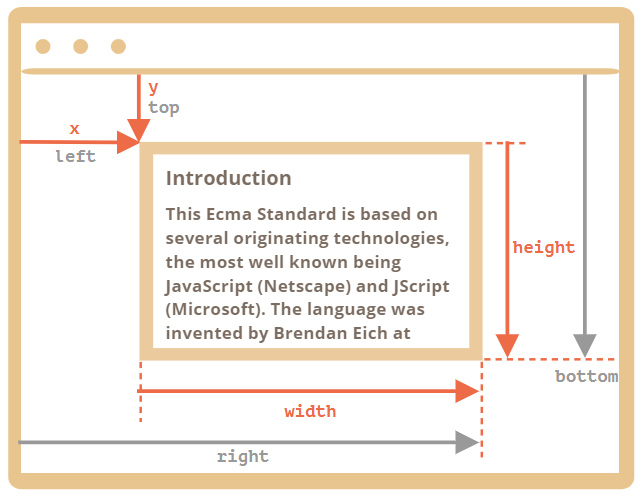
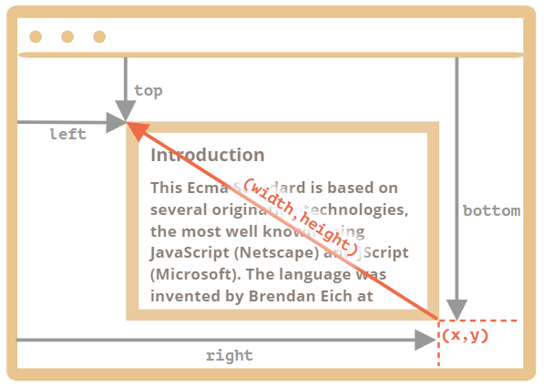

---
tags:
  - javascript
  - dom
---

# 坐标
在网页定位元素时大多数 JavaScript 方法处理的是以下两种坐标系中之一

* **相对于窗口**的坐标，类似于 `position:fixed`，从窗口的顶部/左侧边缘计算得出，一般使用 `clientX/clientY` 表示
* **相对于文档**的坐标，类似于 `position:absolute`（参照系为文档根 document root，即 `<body>` 元素），从文档的顶部/左侧边缘计算得出，一般使用 `pageX/pageY` 表示

当页面滚动到最开始时，此时窗口的左上角恰好是文档的左上角，它们的坐标彼此相等；但是在文档移动之后，元素的窗口相对坐标会发生变化，因为元素在窗口中移动，而元素在文档中的相对坐标保持不变。

- `pageY` 表示元素在文档中的相对坐标保持不变。
- `clientY` 表示元素在窗口相对坐标发生了变化，因为同一个点越来越靠近窗口顶部。



:bulb: 所有坐标都从左上角开始计数。

## 获取坐标
使用节点方法 `elem.getBoundingClientRect()` 返回元素的最小矩形窗口的坐标，该矩形将 `elem` 作为内建 [DOMRect](https://www.w3.org/TR/geometry-1/#domrect) 类的对象，该对象有描述元素形状和定位的属性

- `x/y` 矩形原点**相对于窗口**的 X/Y 坐标，可以用于设置 `position: fixed` 固定定位的元素
- `width/height` 矩形的 width/height（可以为负）

还有派生的属性
- `top/bottom` 矩形的顶部/底部边缘距离窗口顶部的距离，实际上 `left = x`，而 `top = y`
- `left/right` 矩形的左/右边缘距离窗口左侧的距离，实际上 `right = x + width`，而 `bottom = y + height`



:bulb: 坐标可能是小数，由于浏览器内部使用小数进行计算，在设置 `style.left/top` 时，我们不是必须对它们进行舍入。

:bulb: 坐标可能是负数，如滚动页面后使 `elem` 现在位于窗口的上方，则 `elem.getBoundingClientRect().top` 为负数。

:bulb: 属性 `width/height` 值表示元素矩形定位从其右下角开始，然后向左上方「增长」，此时派生属性 `left/top` 与 `x/y` 不相等



:warning: 由于历史原因，IE 和 Edge 浏览器不支持 `x/y` 属性。可以写一个 polyfill（在 `DomRect.prototype` 中添加一个 getter），或者仅使用 `top/left`，因为对于正值的 `width/height` 来说，它们和 `x/y` 一直是一样的。

元素的文档相对坐标从文档的左上角开始计算，但 JavaScript 没有标准方法来获取元素的文档坐标。可以创建一个函数 `getCoords(elem)`  获取元素 `elem` 的文档相对坐标，从 `elem.getBoundingClientRect()` 获取元素的窗口相对坐标，并向其添加当前页面的滚动

- `pageY` = `clientY` \+ 文档的垂直滚动出的部分的高度。
- `pageX` = `clientX` \+ 文档的水平滚动出的部分的宽度。

```js
// 获取元素的文档坐标
function getCoords(elem) {
  let box = elem.getBoundingClientRect();

  return {
    top: box.top + window.pageYOffset,
    left: box.left + window.pageXOffset
  };
}
```

## 基于坐标创建元素
**创建固定定位元素**

使用 `elem.getBoundingClientRect` 获取「参照」坐标，该坐标是相对窗口的坐标，可用于为 `position: fixed` 元素设置定位。

```js
// 基于 elem 元素的窗口坐标创建一个固定定位的元素 message
let elem = document.getElementById("coords-show-mark");

function createMessageUnder(elem, html) {
  // 创建 message 元素
  let message = document.createElement('div');
  // 在这里最好使用 CSS class 来定义样式
  message.style.cssText = "position:fixed; color: red";

  // 分配坐标，不要忘记 "px"！
  let coords = elem.getBoundingClientRect();

  message.style.left = coords.left + "px";
  message.style.top = coords.bottom + "px";

  message.innerHTML = html;

  return message;
}

// 用法：
// 在文档中添加 message 保持 5 秒
let message = createMessageUnder(elem, 'Hello, world!');
document.body.append(message);
setTimeout(() => message.remove(), 5000);
```

**创建绝对定位元素**
使用 `elem.getBoundingClientRect` 加上 `window.pageYOffset` 或 `window.pageXOffset` 获取「参照」坐标，该坐标是相对页面的坐标，可用于为 `position: absolute` 元素设置定位（默认以文档 `<body>` 元素作为参照系）。

```js
// 获取元素的文档坐标
function getCoords(elem) {
  let box = elem.getBoundingClientRect();

  return {
    top: box.top + window.pageYOffset,
    left: box.left + window.pageXOffset
  };
}

// 基于 elem 元素的文档坐标创建一个固定定位的元素 message
function createMessageUnder(elem, html) {
  let message = document.createElement('div');
  message.style.cssText = "position:absolute; color: red";

  let coords = getCoords(elem);

  message.style.left = coords.left + "px";
  message.style.top = coords.bottom + "px";

  message.innerHTML = html;

  return message;
}
```

:warning: 使用方法 `getBoundingClientRect` 返回的对象的属性 `x/y`、`left/right`、`top/bottom` 都是数值，如果需要通过 `elem.style` 设置定位时，需要添加单位 `px`。

:bulb: 可以直接基于给定的窗口坐标 `(x, y)` 获取元素，使用方法 `document.elementFromPoint(x, y)` 返回在窗口坐标 `(x, y)` 处**嵌套最多（the most nested）的元素**，即树结构中「最里层」的单个元素。:warning: 如果传递的参数是负值或者超过了窗口的 width/height 的坐标，即在窗口之外的坐标，则该方法就会返回 `null`，因为方法 `document.elementFromPoint(x,y)` 只对在可见区域内的坐标 `(x,y)` 起作用。

```js
// 高亮位于窗口中间的元素
let centerX = document.documentElement.clientWidth / 2;
let centerY = document.documentElement.clientHeight / 2;

let elem = document.elementFromPoint(centerX, centerY);

elem.style.background = "red";
alert(elem.tagName);
```
