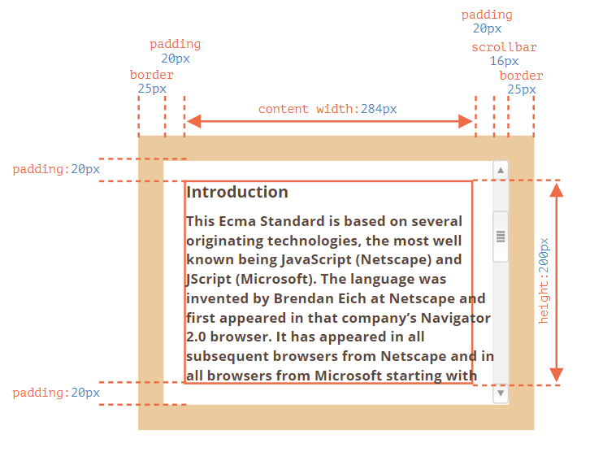
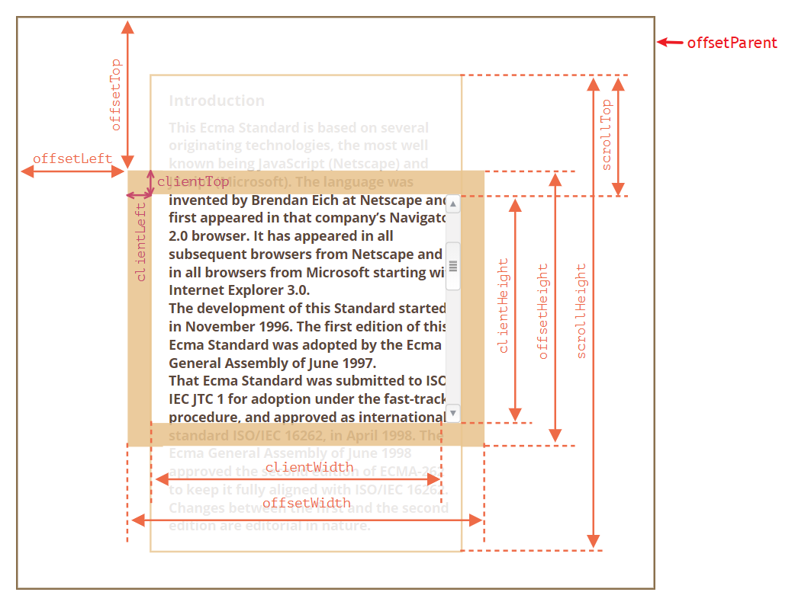
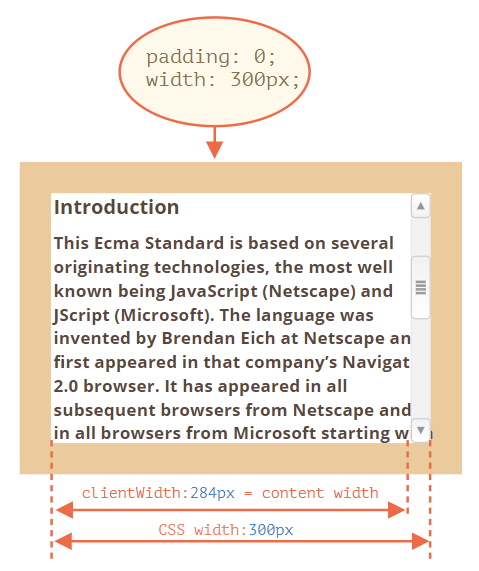
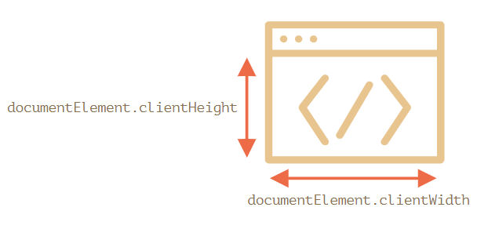

---
tags:
  - javascript
  - dom
---

# 尺寸与滚动
尺寸和滚动是日常使用网页经常遇到的，包括浏览页面视窗大小和页面滚动，以及元素的尺寸和内部内容的滚动（设置了 `overflow`）也是十分常见的交互，相关属性值都可以通过 JavaScript 获取。

## 元素大小与滚动
JavaScript 中有许多节点属性可让我们读取有关元素的宽度、高度和其他几何特征的信息，这些属性值都是数值，它们是基于像素进行测量的。

```html
<!-- 元素及尺寸设置 -->
<!-- 它有边框 border，内边距 padding 和滚动条，但没有外边距 margin，因为它们不是元素本身的一部分 -->
<div id="example">
  ...Text...
</div>
<style>
  #example {
    width: 300px;
    height: 200px;
    border: 25px solid #E8C48F;
    padding: 20px;
    overflow: auto;
  }
</style>
```





- `offsetParent` 获取最接近的 CSS 定位的祖先元素节点（即设置了属性 `position` 为 `absolute/relative/fixed` 的祖先元素节点），或者是 `td`，`th`，`table`，`body` 节点
    ```html
     <main style="position: relative" id="main">
      <article>
        <div id="example" style="position: absolute; left: 180px; top: 180px">...</div>
      </article>
    </main>
    <script>
      alert(example.offsetParent.id); // main
      alert(example.offsetLeft); // 180（注意：这是一个数字，不是字符串 "180px"）
      alert(example.offsetTop); // 180
    </script>
    ```
- `offsetLeft/offsetTop` 获取元素相对于 `offsetParent` 祖先元素的左侧/上方边缘的距离
- `offsetWidth/offsetHeight` 元素的宽/高（是指包括边框，内边距、内容的完整元素大小），如果
- `clientLeft/clientTop` 内侧与外侧的距离，即从元素左上角外角到左上角内角的距离。对于从左到右显示内容的操作系统来说，它们始终是左侧/顶部 border 的宽度。:bulb: 而对于从右到左显示内容的操作系统来说，垂直滚动条在左边，所以 `clientLeft` 也包括滚动条的宽度。
- `clientWidth/clientHeight` 内容的宽/高，包括 `padding`，但不包括滚动条 scrollbar
- `scrollWidth/scrollHeight` 内容的宽/高，就像 `clientWidth/clientHeight` 一样，**但还包括元素的滚动出的不可见的部分**。
    :bulb: 通过**修改 `scrollLeft/scrollTop` 浏览器会滚动对应的元素**。

    :bulb: 利用这个属性可以将元素展开 expand

    ```js
    // 将元素展开（expand）到完整的内容高度
    element.style.height = `${element.scrollHeight}px`;
    ```
- `scrollLeft/scrollTop` 从元素的左上角开始，滚动出元素的上半部分的宽/高，即表示滚动了多少像素。

    :warning: 如果一个元素（或其任何祖先）具有 `display:none` 或不在文档中，则所有几何属性均为零（或 `offsetParent` 为 `null`）。当我们创建了一个元素，但尚未将其插入文档中，或者它（或它的祖先）具有 `display:none` 时，则 `offsetParent` 为 `null`，并且 `offsetWidth` 和 `offsetHeight` 为 `0`，我们可以用这个特性来检查一个元素是否被隐藏

    ```js
    function isHidden(elem) {
      return !elem.offsetWidth && !elem.offsetHeight;
    }
    ```

:bulb: 除了 `scrollLeft/scrollTop` 外，元素的所有几何属性都是只读的。

:bulb: 当元素设置了 `overflow` 并且文本溢出而含有滚动条时，元素的尺寸度量会变得十分复杂，一些浏览器（并非全部）通过从内容宽度 content width 中获取空间来为滚动条保留空间，如元素的内容宽度设置为 `300 px`，但滚动条宽度是 `16px`（不同的设备和浏览器，滚动条的宽度可能有所不同），那么实际容纳内容的宽度只有 `300 - 16 ＝ 284px`



应该避免使用方法 `getComputedStyle(elem)` 来读取元素的 CSS 宽 `width` 和高 `height`，因为 CSS 属性 `width/height` 取决于另一个属性 `box-sizing`；而且 CSS 的 `width/height` 可能是 `auto`，如内联（inline）元素，获取的不是真正的元素尺寸；当元素含有滚动条时，有的浏览器（如 Chrome）返回的是实际内部宽度减去滚动条宽度，而某些浏览器（如 Firefox）返回的是 CSS 宽度（忽略了滚动条），这种跨浏览器的差异是不使用 `getComputedStyle` 而依靠几何属性的原因。

## 视窗大小和滚动
使用根文档元素节点 `document.documentElement` 的属性 `clientWidth` 或 `clientHeight` 获取窗口（window）的宽度和高度。



:bulb: 浏览器支持 `window.innerWidth/innerHeight` 属性，但它们返回的是包括滚动条的窗口大小（假设页面有滚动条），而 `document.documentElement.clientWidth/clientHeight` 是减去滚动条宽度后可用于内容的显示，文档的可见部分的视窗大小，它们一般比前者大小更小。在大多数情况下，我们需要 **可用** 的窗口宽度以绘制或放置某些东西，所以一般应该使用 `documentElement.clientHeight/Width` 获取窗口尺寸大小。

:warning: 当 HTML 中没有 `<!DOCTYPE HTML>` 时，顶层级（top-level）几何属性的工作方式可能就会有所不同，可能会出现一些不可预计的错误情况。因此在现代 HTML 中始终都应该写 `DOCTYPE`。

对于页面的宽高可以使用根文档元素节点 `document.documentElement` 的属性 `scrollWidth/ScrollHeight` 获取文档的完整大小。

:warning: 但在 Chrome/Safari/Opera 浏览器中，如果没有滚动条 `document.documentElement.scrollHeight` 甚至可能小于 `document.documentElement.clientHeight` 理论上讲，这些不一致来源于远古时代，而非「聪明」的逻辑。为了可靠地获得完整的文档高度，我们应该采用以下这些属性的最大值：

```js
let scrollHeight = Math.max(
  document.body.scrollHeight, document.documentElement.scrollHeight,
  document.body.offsetHeight, document.documentElement.offsetHeight,
  document.body.clientHeight, document.documentElement.clientHeight
);

alert('Full document height, with scrolled out part: ' + scrollHeight);
```

**获取当前滚动**
文档的滚动状态可以使用 `document.documentElement.scrollLeft/Top` 获取，但在较旧的基于 WebKit 的浏览器中则不行，如在 Safari（bug [5991](https://bugs.webkit.org/show_bug.cgi?id=5991)）中，我们应该使用 `document.body` 而不是 `document.documentElement`。:bulb: 或者使用更通用的方法 `window.pageXOffset/pageYOffset` 获取。

**滚动页面**

有多种方法实现页面滚动：

* 通过赋值修改属性 `document.documentElement.scrollTop/Left` 滚动页面（Safari 除外，而应该使用 `document.body.scrollTop/Left` 代替）。
* 通过方法 [`window.scrollBy(x,y)`](https://developer.mozilla.org/zh/docs/Web/API/Window/scrollBy) 和 [`window.scrollTo(pageX,pageY)`](https://developer.mozilla.org/zh/docs/Web/API/Window/scrollTo) 滚动页面，它们更简单且适用于所有浏览器。
    * 方法 `scrollBy(x,y)` 将页面滚动至 **相对于当前位置的 `(x, y)` 位置**。例如，`scrollBy(0,10)` 会将页面向下滚动 `10px`。
    * 方法 `scrollTo(pageX,pageY)` 将页面滚动至 **绝对坐标**，使得可见部分的左上角具有相对于文档左上角的坐标 `(pageX, pageY)`。就像设置了 `scrollLeft/scrollTop` 一样。
* 通过方法 [`elem.scrollIntoView(top)`](https://developer.mozilla.org/zh/docs/Web/API/Element/scrollIntoView) 将滚动页面以使 `elem` 元素可在视窗中显示，其参数 `top` 是一个布尔值，用于设置元素 `elem` 滚动后的定位。
    - 如果 `top=true`（默认值），页面滚动使 `elem` 出现在窗口顶部，即元素的上边缘与窗口顶部对齐。
    - 如果 `top=false`，页面滚动使 `elem` 出现在窗口底部，即元素的底部边缘与窗口底部对齐。

:warning: 必须在 DOM 完全构建好之后才能通过 JavaScript 滚动页面，如果尝试从 `<head>` 中的脚本滚动页面，它将无法正常工作。

**禁止滚动**

有时候我们需要使文档「不可滚动」，如网页一般会使用弹出框显示一条信息以立即引起注意时（消息覆盖在文档上，如 Bootstrap 库中的 modal 插件），我们希望访问者与该消息而不是与文档进行交互，因此需要禁止页面滚动，需要设置  `document.body.style.overflow = "hidden"` 这样页面就会「冻结」在当前位置，可以通过 `document.body.sthle.overflow=''` 取消禁止命令。

:bulb: 这个方法的缺点是会使滚动条消失，如果滚动条占用了一些空间，它原本占用的空间就会空出来，那么内容就会「跳」进去以填充它使得页面布局有细微的改变，在视觉上有卡顿感，这看起来有点奇怪。我们可以对比冻结前后的 `clientWidth` 如果它增加了（滚动条消失后），那么我们可以在 `document.body` 中滚动条原来的位置处**通过添加 `padding` 来替代滚动条**，保持了滚动条冻结前后文档内容宽度相同。