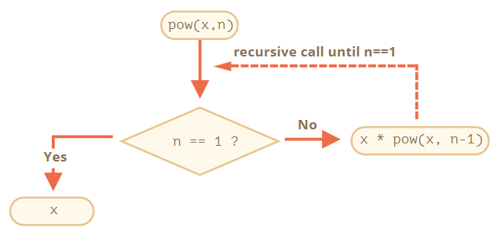
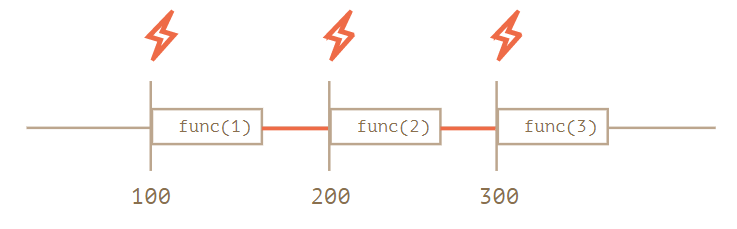
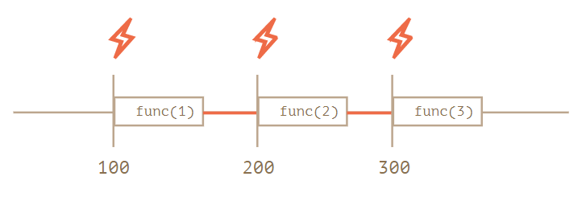

---
tags:
  - javascript
---

# 函数
函数是将执行相同步骤的代码打包/封装成可重复使用的代码块，并在程序中更方便使用（调用）。JavaScript 内置多种函数，也允许开发者创建自己的函数。

:bulb: 好的函数应该遵守 DOT 规则，即 do one thing 只做一件事

## 声明函数
用关键字 `function` 声明函数，其后是函数名，参数设置在小括号 `()` 里，多个形参用逗号 `,` 分隔（也可以没有任何参数），函数体在花括号 `{}` 之间。

```javascript
function name(parameters) {
    // code_block
}
```

:bulb: 声明结束不需要添加分号 `;` 类似地在代码块的结尾也不需要加分号，如 `if { ... }` 和 `for { }` 等语法结构后面都不用加。

:bulb: 函数名遵循小驼峰命名法 camelCase 规则，即第一个单词小写，所有单词首字母大写。常用的函数有时会有非常短的名字。

:bulb: 函数是行为所以一般用动词前缀模糊地描述了这个动作，因此好的命名也是很好的注释
* `get...` 返回一个值
* `calc…` 计算某些内容
* `create…` 创建某些内容
* `check…` 检查某些内容并返回 boolean 值

:bulb: 函数名应该尽可能简短，如 jQuery 框架用 `$` 定义一个函数，LoDash 库的核心函数用 `_` 命名

:warning: 严格模式下，当一个函数声明在一个代码块内时，它在该代码块内的任何位置都是可见的。但在代码块外不可见。

```js
let age = prompt("What is your age?", 18);

// 在代码块中声明一个函数
if (age < 18) {
  function welcome() {
    alert("Hello!");
  }
} else {
  function welcome() {
    alert("Greetings!");
  }
}

// 在代码块外不可使用
welcome(); // Error: welcome is not defined
```

### 返回值
一般函数会有返回语句 `return` 以明确规定函数结束时返回的一个值

在调用函数时，可以将返回值赋值给一个变量，以将函数的「运算结果」存储起来

:bulb: 在一个函数中可能会出现很多次 `return`（如条件语句中不同分支返回值不同），但当程序调用了 `return` 语句，函数就会停止执行完全退出，因此只能返回一个值

:bulb: 也可以没有返回值（返回为空）只有关键字 `return` 让函数立即退出，当返回为空或未指定返回值，则默认返回 `undefined`

:bulb:  `returun` 语句是在函数结束时返回特定信息，与命令 `console.log()` 在控制台中打印输出程序返回值不一样。

:warning: 不要在 return 与返回值之间添加新行，因为 JavaScript 默认会在 return 之后加上分号，如果要返回一个表达式，且写成跨多行的形式，应该在 `return` 的同一行开始写此表达式，且用小括号 `()` 将多行表达式包括起来。

### 参数
使用参数将任意数据传递给函数，会被复制到函数的局部变量，以供内部使用。一般编程语言将参数分为形参和实参，实际是同一变量的两种状态。

Parameter 形参 和 Argument 实参的区别
* **parameter 形参**是变量名称，并出现在函数声明中，用于存储传递到函数中的数据，是构建函数的一部分。
* **argument 实参**是一个具体值，在函数调用时，传递给函数变量（形参）的具体值，是实际应用某个方法时的参数。

参数可以设置默认值（也可以是表达式），在声明函数时使用赋值符号 `=` 设置默认值；如果未提供参数，且调用时未显式地传递实参，那么其默认值则是 `undefined`。

```js
function showMessage(from, text = "no text given") {
  alert( from + ": " + text );
}

showMessage("Ann");   // Ann: no text given
```

:bulb: 旧版本的 JavaScript 不支持默认参数，可以在函数内部条件性地给参数赋值，如基于`undefined` 的显式检查或使用 `||` 运算符

```js
// 判断参数的值是否为 undefined 设置默认值
function showMessage(from, text) {
  if (text === undefined) {
    text = 'no text given';
  }

  alert( from + ": " + text );
}

// 通过或运算的短路取值设置默认值
function showMessage(from, text) {
  // 如果 text 能转为 false，那么 text 会得到“默认”值
  text = text || 'no text given';
  ...
}
```

### 参数默认值
可以为函数参数设置默认值，只需在声明函数时在参数列表中使用等号 `=` 为参数提供默认值即可。当调用函数时没有为所需的参数传递值，才使用预设的默认值。

```js
function greet(name = 'Student', greeting = 'Welcome') {
  return `${greeting} ${name}!`;
}

greet(); // Welcome Student!
greet('James'); // Welcome James!
greet('Richard', 'Howdy'); // Howdy Richard!

// 将默认值与数组解构结合
function createGrid([width = 5, height = 5] = []) { // 函数接受一个二维数组并将其解构，默认值为一个空数组，还设置了解构后各元素的默认值，分别为 width 为 5，height 为 5
  return `Generating a grid of ${width} by ${height}`;
}
createGrid(); // Generates a 5 x 5 grid
createGrid([2, 3]); // Generates a 2 x 3 grid

// 将默认值与对象解构结合
function createSundae({scoops = 1, toppings = ['Hot Fudge']} = {}) { // 函数接受一个对象并将其解构，默认值为一个属性为空的对象，还设置了解构后各属性的默认值，分别为 scoops 为 1，toppings 为数组 ['Hot Fudge']
  const scoopText = scoops === 1 ? 'scoop' : 'scoops';
  return `Your sundae has ${scoops} ${scoopText} with ${toppings.join(' and ')} toppings.`;
}
createSundae(); // Your sundae has 1 scoop with Hot Fudge toppings.
```

:bulb: 当使用「智能函数」（即参数是接受数组或对象，并通过解构将元素赋值给一些列变量应用于函数体中），推荐使用对象。因为对于以对象作为参数的，且已设置默认值的函数，可跳过部分（解构后）选项只修改部分元素的值；而数组是基于位置的，在传入数组时则无法跳过部分参数的设置。

```js
// 默认值与数组解构结合
function createSundae([scoops = 1, toppings = ['Hot Fudge']] = []) { … }

// 调用时仅修改第二个参数，但由于数组基于位置，需用以奇怪的方式来传递数组
// 在采用默认值就可以的数组相应位置设置 undefined
createSundae([undefined, ['Hot Fudge', 'Sprinkles', 'Caramel']]);

// 默认值与对象解构结合
function createSundae({scoops = 1, toppings = ['Hot Fudge']} = {}) { … }

// 调用时传入的对象只需要设置修改的属性即可
createSundae({toppings: ['Hot Fudge', 'Sprinkles', 'Caramel']});
```

### 函数变量作用域
作用域是限制变量或函数的可访问的区域。在函数中声明的局部变量只在该函数内部可见，即作用域限制在函数内。

:warning: 函数对外部变量拥有全部的访问权限，函数也可以修改外部变量，但函数外部「看不到」更改（因为函数修改的是复制的外部变量值副本）；如果**在函数内部声明了同名局部变量**，函数会 「遮蔽」 外部变量，在函数内部优先使用局部变量。

```js
// 修改外部变量
function showMessage(from, text) {
  from = '*' + from + '*';   // 此时的 from 是外部变量的一个副本
  alert( from + ': ' + text );
}

// 在函数内部「修改」外部变量
let from = "Ann";
showMessage(from, "Hello");   // *Ann*: Hello

//外部变量 from 值不变
alert( from );   // Ann

// 声明同名的内部变量
let userName = 'John';
function showMessage() {
  let userName = "Bob";   // 声明一个局部变量，与外部变量同名
  let message = 'Hello, ' + userName;   // 使用局部变量
  alert(message);
}

showMessage();   // Hello, Bob
// 使用外部变量，函数没有访问外部变量，外部变量未被更改
alert( userName );   // John
```

:bulb: 减少全局变量的使用是一种很好的做法，现代的代码很少甚至没有全局变量，大多数变量存在于它们的函数中；但是有时候全局变量能够用于存储项目级别的数据。

### 函数声明的提升
提升 hoisting 是浏览器解析 JavaScript 的结果，即在执行任何脚本代码之前**所有函数的声明（还有使用[旧式关键字 `var` 声明的变量](./变量.md#旧式变量声明)）都会被「提升」到其作用域的顶部**，因此在编写代码时一种习惯是允许将函数声明放置在函数调用后，因为这样其他开发者在阅读你编写的代码就不必西先看到大段的函数源码，而是在修改或调用你写的函数，不懂再按需寻找函数源码。

:warning: 函数表达式（即将函数分配给变量）结构不会提升到作用域的顶部

## 调用函数
通过函数名称调用函数，传递的实参在函数名后的小括号 `()` 中。

### 回调函数
一般会为函数的参数传递字符串或数字等常规值，它们代表数据；而函数是一个特殊的值，它代表动作，也可以值传递给另一个函数的参数，以备在稍后必要时将其「回调」。

```js
function ask(question, yes, no) {
  if (confirm(question)) yes()
  else no();
}

function showOk() {
  alert( "You agreed." );
}

function showCancel() {
  alert( "You canceled the execution." );
}

// 函数 showOk 和 showCancel 作为参数传入到 ask 函数中
ask("Do you agree?", showOk, showCancel);
```

### 内嵌（匿名）函数
函数表达式一般通过变量名作为参数回调，但如果知道不会重复使用该函数，可以更直接地将函数表达式代码整体（以内嵌定义的形式）作为实参传递给其他函数。

```js
// 一般的函数声明
//接受两个参数，一个回调函数和一个表示电影名称的字符串
function movies(messageFunction, name) {
  messageFunction(name);
}

// 调用 movies 函数
// 传入一个函数（代码整体）和表示电影名称的字符串
movies(function displayFavorite(movieName) {
  console.log("My favorite movie is " + movieName);
}, "Finding Nemo");   // My favorite movie is Finding Nemo
```

:bulb:  这种内嵌的函数无法在外部进行访问（因为没有对它们分配变量），一般使用匿名函数，可避免函数命名重复。

:bulb: 有时候函数表达式也会设置函数名，即 **命名函数表达式 Named Function Expression, NFE**，但函数依然只能通过其赋予的变量进行调用。NFE 添加名称的作用这就是为函数添加「内部名」，以便它在内部引用自己（而不是通过变量进行自引用，由于变量可能会变换），在函数外是不可见的。

```js
let sayHi = function func(who) {
  if (who) {
    alert(`Hello, ${who}`);
  } else {
    func("Guest");   // 递归引用
  }
};

let welcome = sayHi;
sayHi = null;

welcome();   // Hello, Guest（变换变量依然有效）
```

### 立即调用函数表达式
参考：
* [IIFE（立即调用函数表达式）| MDN](https://developer.mozilla.org/zh-CN/docs/Glossary/%E7%AB%8B%E5%8D%B3%E6%89%A7%E8%A1%8C%E5%87%BD%E6%95%B0%E8%A1%A8%E8%BE%BE%E5%BC%8F)
* [请问js里两个括号是什么意思？ - sagittarius-rev的回答](https://www.zhihu.com/question/48238548/answer/110184697)
* [JavaScript：立即执行函数表达式（IIFE）](https://segmentfault.com/a/1190000003985390) | [英文原文](http://benalman.com/news/2010/11/immediately-invoked-function-expression/#iife)

立即调用函数表达式 **IIFE 全称为 Immediately-Invoked Function Expression** 也叫自执行函数或拉姆达函数，是一个在编译其「声明」时就立即执行的函数（而不需要等待在别处调用时才运行函数内的代码），代码立即执行并**拥有了自己的私有变量**。

:bulb: 这是一种在旧脚本常见到的技术，因为以前 JavaScript 版本中只有 `var` 这一种声明变量的方式，并且这种方式声明的变量**没有块级作用域**，程序员们就发明了 IIFE 以创造一个私有作用域模仿块级作用域。

IIFE 主要由两部分构成：

* 函数自身被括号 `()`包括，以告诉编译器括号内的代码不是函数声明而是[函数表达式](#函数表达式)（不需要设置函数名，不需要在其他地方调用），由于函数表达式中的变量不能从外部访问，**其中的变量就可以拥有独立的私有作用域**（这就修复了关键字 `var` 定义的变量没有块作用域的副作用，而且又不会污染全局作用域）
* 在最后还需要添加一对括号（其中可以包含传递给函数表达式的实参），表示程序运行到此处就立即执行括号内的（函数表达式）代码

```js
(function () {
    // 这里是块级作用域
})();
```

:bulb: 函数变成自执行函数后，相当于强行封装了一个**块级作用域**（因为 es5 没有块级作用域）在其中的变量外部不能访问（除非变量前加上 `window`，这样该函数或变量就成为全局），只要函数执行完毕，该作用域就销毁可减少占用内存，各 JavaScript 库的代码也基本是这种组织形式。

除了使用括号，还有其他方式可以告诉 JavaScript 所使用的是函数表达式

```js
// 创建 IIFE 的方法

(function() {
  alert("Parentheses around the function");
})();

(function() {
  alert("Parentheses around the whole thing");
}());

!function() {
  alert("Bitwise NOT operator starts the expression");
}();

+function() {
  alert("Unary plus starts the expression");
}();
```

在旧脚本中常常会将 IIFE 和闭包技术结合使用，利用 IIFE 立即被调用的特点创建变量的私有作用域，同时利用函数闭包以保留/锁定变量的特定数据值，以备后续读取利用。

```js
var nums = [1,2,3];

// 在循环中直接为每个元素设置一个事件监听
for (var i = 0; i < nums.length; i++) {

   // 变量 num 在迭代时一直改变，最后是3
   var num = nums[i];

    // 创建了一个 DOM 元素
   var elem = document.createElement('div');
   elem.textContent = num; // 将当前的数指填写进 DOM 元素
   document.body.appendChild(elem); // 将元素显示在网页上

   // 设置一个事件监听，点击时弹窗显示 num 值
   elem.addEventListener('click', function() {
      alert(num);   // 总是返回 3
      //由于变量 num 是在内部函数(相对于全局变量 num 而言，内部函数指的是 addEventListener 中的匿名函数)的外面被定，当 for 循环运行结束后，num 变量值为 3
      // 而因此无论何时，点击触发才执行的回调函数都会引用同一个 num 变量（现在它等于 3，因此总是弹窗显示 3）
   });
};

// ---------- 分割线 ----------
// 为了在循环添加事件监听时「存住」相应的状态（num 值），需要创建一个内部作用域，即将当前变量与事件监听函数绑定
for (var i = 0; i < nums.length; i++) {
   var num = nums[i]; // 当前 num 值

   // 创建 DOM 元素
   var elem = document.createElement('div');
   elem.textContent = num;
   document.body.appendChild(elem);

   // 使用立即调用函数表达式作为回调函数
   // 在循环建立监听器时就立即执行回调函数，将当前数值 num 「锁定」在该匿名函数创建的内部作用域 numCopy 中（因为函数立即执行，此时迭代中当前的 num 值传入，执行结束后与 num 变量的联系就终止，而其值就存在于局部变量 numCopy 中）
   // 为了可以在点击时获取该内部函数的变量（值），使用闭包，即返回一个函数，通过该内部函数可读取内部作用域的 numCopy 值
   elem.addEventListener('click', (function(numCopy) {
      return function() { // 每次点击就会返回该内部函数
          alert(numCopy);
      };
   })(num));
};
```

:bulb: 将 IIFE 分配给一个变量，不是存储 IIFE 本身，而是存储 IIFE 执行后返回的结果。类似地示例中把 IIFE 运行（只在循环创建事件监听运行一次）后的结果，作为事件触发后的响应。

:warning: 这种旧技术是为了解决使用关键字 `var` 声明变量造成的副作用，如今应该使用关键字 `let` 或 `const` 声明变量，而不必再使用这种技术。

## 函数表达式
另一种创建函数的语法是使用函数表达式。存储在变量中的，通过变量名调用的函数称为函数表达式。一般通过该形式定义的函数没有名称，即匿名函数。

```javascript
var funExp = function(parameter) {
  // 函数体
};
```

函数表达式一般作为**回调函数**，将函数作为值通过赋值给变量进行定义，而变量能够作为参数，轻松地将函数传递到另一个函数中，也称为回调函数。

:bulb: 函数表达式结尾有一个分号 `;` 而函数声明没有，因为函数表达式是一个赋值语句（而不是代码块），建议在语句末尾添加分号 `;` 以终止语句。

:warning: 函数表达式也可以添加名称，但依然**只能通过变量名调用函数**，因为这时的函数只是一个存储在变量中的值（实际上函数就是一个特殊值）。直接访问变量返回该函数的具体代码内容（因为函数源码就是变量的值），如果需要调用/运行函数表达式，需要在变量名后添加括号 `()`

```js
function sayHi() {   // 声明函数
  alert( "Hello" );
}

let func = sayHi;    // 将函数进行复制，因此变量 func 也是存储着一个函数

// 两者均可运行
func();   // Hello
sayHi();   // Hello

let funResult = sayHi();   // 将函数运行结果进行复制
// 变量 funResult 存储的是一个字符串 "Hello"
funcResult   // Hello

// 函数表达式行为也类似，只是通过变量名调用
let sayHi = function() {
  alert( "Hello" );
};

let func = sayHi;
// ...
```

:bulb: 通过声明创建的函数与函数表达式一个重要的区别在于，函数表达式是在代码执行到达时被创建，并且仅从那一刻起可用，因此函数表达式的创建和调用顺序不可颠倒；而**一般的函数声明在被定义之前就可以被调用**。由于当 JavaScript 准备运行脚本时（初始化阶段），首先会在脚本中寻找全局函数声明，并创建这些函数，也称为**提升**，而函数表达式并**未**提升。

```js
sayHi("John"); // Hello, John

// 函数声明 sayHi 是在 JavaScript 准备运行脚本时被创建的
// 因此运行时该函数在这个脚本的任何位置都可见
function sayHi(name) {
  alert( `Hello, ${name}` );
}

// 函数表达式的创建和调用顺序颠倒会报错
sayHi("John"); // error!

let sayHi = function(name) {  // (*) no magic any more
  alert( `Hello, ${name}` );
};
```

:warning: 严格模式下，当一个函数声明在一个代码块内时，它在该代码块内的任何位置都是可见的，但在代码块外不可见。而函数表达式的可见区域由其变量的可见区域决定（由于函数是变量的特殊值）

```js
let age = prompt("What is your age?", 18);

// 在代码块之外定义变量
let welcome;

if (age < 18) {
  welcome = function() {   // 代码块内创建函数表达式
    alert("Hello!");
  };
} else {
  welcome = function() {   // 代码块内创建函数表达式
    alert("Greetings!");
  };
}

welcome(); // 在代码块外仍可运行该函数表达式
```

:warning: 相对应的是当变量存储的是常规值，如果是在函数内部作修改外部变量，在[外部是不可见的](#变量作用域)（即外部值不变）

:bulb: 如果函数在主代码流中被声明为单独的语句，则称为「函数声明」。如果该函数是作为表达式的一部分创建的，则称其「函数表达式」”。当需要声明一个函数时首先考虑函数声明语法，因为函数声明更「醒目」，在代码中查找 `function f(…) {…}` 比 `let f = function(…) {…}` 更容易。它能够为组织代码提供更多的灵活性，可以在声明这些函数之前调用这些函数。

## 箭头函数
箭头函数是 ES6 引入了一种新的另一种创建函数的简单语法，其**简写主体语法**具有语法简短、更容易编写和阅读、自动返回等优点。箭头函数是针对那些没有自己的「上下文」，但在当前上下文中起作用的短代码的

```js
// 箭头函数存储在变量中
let func = arg => expression
```

:bulb: 对于一行代码的函数来说，箭头函数是相当方便的，函数计算表达式并返回其结果。

箭头函数全称为 箭头函数表达式，类似于匿名函数，**仅在表达式有效时才能使用**：

* 存储在变量中
* 当做参数传递给函数（回调函数）
* 存储在对象的属性中

箭头函数使用关键字符 `=>`（而非关键字 `function`)

* 符号左侧为参数列表，如果列表中只有一个参数，可直接使用；如果列表中有两个或多个参数，或者有**零个**，则需要将参数列表放在圆括号 `(args)` 内
* 右边为函数体。当函数主体只是一个表达式，称为**简写主体语法**，则函数主体周围不需要使用花括号 `{}` 包含，且会**自动返回该表达式**；当函数主体内需要多行代码，称为**常规主体语法**，则需要将函数主体放在花括号 `{}` 内，且需要**显式**使用 `return` 语句来返回内容。

```js
// 参数列表中只有一个参数
const greet = name => `Hello ${name}!`;
greet("Ben"); // Hello Ben!

// 空参数列表需要括号
const sayHi = () => console.log('Hello Ben!');
sayHi(); // Hello Ben!

// 多个参数需要括号
const orderIceCream = (flavor, cone) => console.log(`Here's your ${flavor} ice cream in a ${cone} cone.`);
orderIceCream('chocolate', 'waffle'); // Here's your chocolate ice cream in a waffle cone.
```

:warning: 在普通函数中关键字 `this` 指代的对象取决于它所在的函数（或方法）[被调用的方式](./this关键字.md)。而在箭头函数中 `this` 是从周围上下文继承的，即箭头函数 `=>` 没有创建任何绑定，其中的 `this` 与常规变量的搜索方式完全相同，都是在外部词法环境中查找。

```js
// 构造函数
function IceCream() {
    this.scoops = 0;
}

// 为 IceCream 添加 addScoop 方法
IceCream.prototype.addScoop = () => { // addScoop 是一个箭头函数
  setTimeout(() => { // setTimeout 的回调函数为箭头函数
    this.scoops++;
    console.log('scoop added!');
  }, 0.5);
};

const dessert = new IceCream();
dessert.addScoop(); // NaN
```

**解释**：这段代码不起作用，因为箭头函数从周围上下文中继承了 `this` 值。在 `addScoop()` 方法外面是全局对象。因此 `addScoop()` 中的 `this` 的值（假如使用的话）是全局对象。这样的话传递给 `setTimeout()` 的函数中的 `this` 的值也设为了该全局对象，而不是 IceCream 的新对象实例。

:warning: 由于箭头函数没有 `this` 因此不能对箭头函数进行 `new` 操作（不能用作[构造器 constructor](./对象.md#构造函数)，由于构造器会自动调用 `this` 创建对象，并返回该对象）

:warning: 此外箭头函数也没有 `arguments` 变量，一般在构建装饰者 decorators 时 `this` 和 `arguments` 非常有用，利用箭头函数的特定可以获取外部函数的上下文和剩余参数。

```js
function defer(f, ms) {
  return function() {
    setTimeout(() => f.apply(this, arguments), ms)
  };
}

function sayHi(who) {
  alert('Hello, ' + who);
}

let sayHiDeferred = defer(sayHi, 2000);
sayHiDeferred("John"); // 2 秒后显示：Hello, John

// 不使用箭头函数需要额外的变量存储上下文和剩余参数
function defer(f, ms) {
  return function(...args) {
    let ctx = this;
    setTimeout(function() {
      return f.apply(ctx, args);
    }, ms);
  };
}
```
## 构造函数
JavaScript 原生不支持 Class 类，但由于 JavaScript 中函数也是属于 Object 对象数据类型，所以可以为函数设置属性与方法，这种通过函数模拟 Class 类的方法称为**构造函数法**，可以创建大量遵循大致相同模式的相似对象（构造函数**返回一个对象**）。

* 绑定构造函数的变量首字母大写，以表示该函数模拟 Class 类
* 在构造函数内定义类的属性和功能
* 构造函数最后需要返回相应的对象 `return obj`，以在调用时实例化

```js
// 构建 Car 类
// 接受一个参数
var Car = function(loc) {
    // 创建属性 loc 以记录 Car 位置
    var obj = {
        loc: loc
    };
    // 创建方法 move 以实现 Car 移动
    obj.move = function() {
        obj.loc++;
    };
    // 返回对象，即返回该类的实例
    return obj;
};

// 实例化，调用构造函数创建实例
var ben = Car(9);
```

:bulb: 函数类模式（使用函数模拟类）的基本形式：将类的属性和方法内置于构建函数内部

:bulb: 构造函数与[修饰器函数](./对象.md)类似，都为对象设置新的属性（方法）。但修饰器函数需要传递已有的对象；而构造函数不需要传递对象，而是直接构造对象。

将方法定义在构造函数内部会导致在实例化时创建过多的重复方法（造成内存代码冗余），可以使用**函数共享模式**节省内存，即将定义类方法的大量代码「外置」，并在对象内进行「外置」方法绑定。

当「外置」方法较多时，需要逐一绑定「外置」方法比较麻烦，可以将「外置」的方法都放置到一个对象中（以字面值记法，将各方法与特定键相对应）。在构造函数内就通过函数 `extend()` 函数循环遍历该对象内存储的所有方法，在实例化时将所有方法都绑定到新建的对象上。

```js
var Car = function(loc) {
    var obj = {
        loc: loc
    };
    // 通过遍历将 methods 中存储的方法都绑定到类/对象
    extend(obj, Car.methods);
    return obj;
};

Car.methods = {
    move: function() {
        this.loc++;
    }
};
```
:bulb: 存储方法的对象应该和相应的类进行绑定，如将该对象设置为类的属性 `Car.method`

:bulb: 在「外置」方法中使用关键字 `this` 指向实例，以实现对实例属性等数据的「共享」

:bulb: JavaScript 还有有多种方式[「模仿」类](./类.md)

## 递归
递归是编程的一个术语，可以更优雅的方式解决问题。它表示从自身调用函数（即自调用），通过多个自调用循环后使任务简单到该函数不再需要进行进一步调用，最后再基于这个结果「回溯」求解。

一个常见的递归应用是求解 `n` 次方

```js
function pow(x, n) {
  if (n == 1) {
    return x;
  } else {
    return x * pow(x, n - 1);   // 递归，自调用
  }
}

alert( pow(2, 3) ); // 8
```

其基本思路：

1. 如果 `n == 1` 成立就返回 `x`，这叫做 **基础** 的递归，因为它会立即产生明显的结果，不需要再进行嵌套调用。
2. 否则，我们可以用 `x * pow(x, n - 1)` 表示 `pow(x, n)`。在数学里，可能会写为 x^n^ = x * x^n-1^ 这个「退一步」求解叫做 **一个递归步骤**



完整步骤

1. `pow(2, 3) = 2 * pow(2, 2)`
2. `pow(2, 2) = 2 * pow(2, 1)`
3. `pow(2, 1) = 2`

:bulb: 任何递归函数都可以被重写为迭代，即循环的形式（循环更节省性能，常在优化代码时改写），但对于大多数任务来说，递归方法足够快，并且容易理解和编写及维护。

:warning: 由于递归通过「中断」当前控制流，耗费内存将[执行上下文](https://zh.javascript.info/recursion#zhi-hang-shang-xia-wen-he-dui-zhan)保存（存储在 **执行上下文堆栈 stack** 之中），以等待嵌套调用返回结果后恢复当前控制流。最大的嵌套调用次数（包括首次）被称为 **递归深度**（示例中等于 `n`），最大递归深度受限于 JavaScript 引擎，一般引擎在最大迭代深度为 10000 及以下时是可靠的，而 100000 可能就超出限制了。这就限制了递归的应用，但是递归仍然被广泛使用。

>  一些引擎支持[「尾调用」 tail call 优化](http://www.ruanyifeng.com/blog/2015/04/tail-call.html)，即如果递归调用是函数中的最后一个调用，那么外部的函数的执行上下文就不再需要记住，这样就减轻了内存负担，因此计算递归深度为 100000 就变得可能。

```js
// 递归形式更简短，当需要耗费内存记录执行上下文
function pow(x, n) {
  return (n == 1) ? x : (x * pow(x, n - 1));
}

// 循环结构更节省性能，内存仅记录了一个上下文，包含参数 i 和 result
function pow(x, n) {
  let result = 1;
  // 再循环中，用 x 乘以 result n 次
  for (let i = 0; i < n; i++) {
    result *= x;
  }
  return result;
}

alert( pow(2, 3) ); // 8
```

有很多任务中**递归思维方式会使代码更简单**，更容易维护，如递归遍历

```js
// 一个对象，其属性值由对象或数组构成
// 需要遍历其中所有数组，并将 salary 求和
let company = {
  sales: [{name: 'John', salary: 1000}, {name: 'Alice', salary: 1600 }],
  development: {
    sites: [{name: 'Peter', salary: 2000}, {name: 'Alex', salary: 1800 }],
    internals: [{name: 'Jack', salary: 1300}]
  }
};

// 利用递归来求和
function sumSalaries(department) {
  if (Array.isArray(department)) { // 情况（1）如果属性是数组，直接读取
    return department.reduce((prev, current) => prev + current.salary, 0); // 求数组的和
  } else { // 情况（2）
    let sum = 0;
    for (let subdep of Object.values(department)) {
      sum += sumSalaries(subdep); // 递归调用所有子部门，对结果求和
    }
    return sum;
  }
}

alert(sumSalaries(company)); // 7700
```

:bulb: 前端开发中使用的数据结构也有符合递归思想的，它们是一种部分复制自身的结构，如 HTML 文档，一个 HTML 标签可以包括文本片段、HMTL 注释、其他 HTML 标签（递归结构），另一个常用的递归型的数据结构是 **[链表 Linked list](./链表.md)**

## 剩余参数
剩余参数 Rest 是 ES6 新增的语法，该参数在函数定义/声明中只能位于参数列表的末尾，使用三个连续的点 `...` 作为前缀，其作用是在函数调用时**将不定数量的实参绑定到一个数组，Rest 参数就是该数组的名称**。可以看作为展开运算符 Spread 语法的「逆运算」。

```js
// 使用剩余参数收集所有传递进来的实参
function sumAll(...args) {
  let sum = 0;
  for (let arg of args) sum += arg;
  return sum;
}

alert( sumAll(1) ); // 1
alert( sumAll(1, 2) ); // 3
alert( sumAll(1, 2, 3) ); // 6

// 使用剩余参数截取入参的部分
function showName(firstName, lastName, ...titles) {
  alert( firstName + ' ' + lastName ); // Julius Caesar

  // 剩余的参数被放入 titles 数组中
  // i.e. titles = ["Consul", "Imperator"]
  alert( titles[0] ); // Consul
  alert( titles[1] ); // Imperator
  alert( titles.length ); // 2
}

showName("Julius", "Caesar", "Consul", "Imperator");
```

:bulb: 还可以用于数组部分解构中，余下的元素可被分配给一个剩余参数（打包回一个数组中）

```js
let order = [20.17, 18.67, 1.50, "cheese", "eggs", "milk", "bread"];
let [total, subtotal, tax, ...items] = order;
console.log(total, subtotal, tax, items);
// 20.17 18.67 1.5 ["cheese", "eggs", "milk", "bread"]
```

:bulb: 在之前版本的 JavaScript 中使用 `arguments` 对象处理可变参数函数（即可以接受不定数量参数的函数）。[`arguments` 对象](https://developer.mozilla.org/zh-CN/docs/Web/JavaScript/Reference/Functions/arguments)是类数组对象（:warning: 但不是数组，不能使用数组的方法，如 `arr.map()` 等），它表示函数调用时传递进来的**所有实参**（不能只截取入参的一部分），可以通过索引（从 `0` 开始）读取其中位于特定位置的参数值，也可以通过属性 `arguments.length` 读取传递进来的参数个数。

```js
// 可变参数函数可接受任意数量的实参，声明是不需要指定形参（个数）
// 由于在函数内部使用 arguments 对象表示所有实参，造成声明时没有任何形参，容易引起误导并难以理解
function showName() {
  alert( arguments.length );
  alert( arguments[0] );
  alert( arguments[1] );

  // 它是可遍历的
  // for(let arg of arguments) alert(arg);
}

// 依次显示：2，Julius，Caesar
showName("Julius", "Caesar");

// 依次显示：1，Ilya，undefined（没有第二个参数）
showName("Ilya");
```

:warning: `arguments` 是一个类数组且可遍历的变量，但它不是数组因此不支持数组方法，如不能调用 `.map()` 等方法。如果希望将类数组转换为数组，可以使用展开运算符将元素展开，然后再包裹回数组中 `let arr = [...arguments]`

:warning: 箭头函数是没有 `"arguments"`，类似于 `this` 关键字，`arguments` 对象并不属于箭头函数而是属于箭头函数外部的「普通」函数。

:warning: 可以通过 `arguments[index]` 读取特定位置的实参，如果在非严格模式下还可以通过赋值来改变这个实参的值，但在严格模式下 `arguments` 是只读不允许修改的。

## 展开运算符
Spread 语法使用展开运算符 `...` 将可迭代对象「展开」为单个元素，一般基于数组构建出一个参数列表。Spread 语法和剩余参数一样，也是使用三个连续点 `...` 表示，但是其操作效果与 Rest 作用相反。

```js
let arr = [3, 5, 1];
alert( Math.max(...arr) );   // 5（spread 语法把数组转换为参数列表）

// 可以向函数传递多个可迭代对象，并分别使用展开运算符合成一个参数列表
let arr1 = [1, -2, 3, 4];
let arr2 = [8, 3, -8, 1];
alert( Math.max(...arr1, ...arr2) );   // 8
```

:bulb: 可以使用 Spread 语法结合多个数组，在 ES6 之前必须使用数组的 `concat()` 方法。

```js
let arr = [3, 5, 1];
let arr2 = [8, 9, 15];

// 使用 concat 方法
let merged = arr.concat(arr2);

// 使用 Spread 语法
let merged = [0, ...arr, 2, ...arr2];

alert(merged); // 0,3,5,1,2,8,9,15（0，然后是 arr，然后是 2，然后是 arr2）
```

:bulb: Spread 语法适用于任何可迭代对象，如字符串，其内部使用了迭代器来收集元素，与 for-of 循环结构相同，类似于 `Array.form(obj)` :warning: 但 `Array.from(obj)` 适用于类数组对象也适用于可迭代对象；而 Spread 语法只适用于可迭代对象。

```js
let str = "Hello";

// 通过 Spread 语法从字符串构建一个由相应字符组成的列表
alert( [...str] ); // H,e,l,l,o
```

:bulb: 利用 Spread 语法可以方便地创建一个数组或对象的副本，类似于 `Object.assign(dest, [ src1, src2...])` 方法（[进行对象的浅拷贝](./对象.md#复制)）

```js
// 复制数组
let arr = [1, 2, 3];
let arrCopy = [...arr];   // 将数组 spread 到参数列表中，然后将结果放到一个新数组
alert(JSON.stringify(arr) === JSON.stringify(arrCopy)); // true，两个数组中的内容相同
alert(arr === arrCopy);   // false，但它们的引用不同，因此两个数组不相等
// 修改初始的数组不会修改副本
arr.push(4);
alert(arr); // 1, 2, 3, 4
alert(arrCopy); // 1, 2, 3

// 复制对象
let obj = { a: 1, b: 2, c: 3 };
let objCopy = { ...obj }; // 将对象 spread 到参数列表中，然后将结果返回到一个新对象
alert(JSON.stringify(obj) === JSON.stringify(objCopy));   // true，两个对象中的内容相同
alert(obj === objCopy);   // false，两个对象不相等，它们的引用不同
// 修改初始的对象不会修改副本
obj.d = 4;
alert(JSON.stringify(obj)); // {"a":1,"b":2,"c":3,"d":4}
alert(JSON.stringify(objCopy)); // {"a":1,"b":2,"c":3}
```

:bulb: 剩余参数 Rest 和 Spread 语法这一对「互逆运算」可以轻松地在参数列表和参数数组之间来回转换。

## 闭包
作用域是限制变量或函数的可访问的区域。对于函数内的变量，其可访问性和函数的调用有关，一般在函数内部的变量只有在调用时才可以访问，调用结束后就无法访问了。

:bulb: 变量可访问性与 JavaScript [垃圾回收](./垃圾回收.md)机制有关，当函数被调用结束后，在内存与之相关的[词法环境](https://zh.javascript.info/closure#ci-fa-huan-jing)就会被销毁；如果该函数内部的元素依然有其他变量引用（如外部函数返回的依然是一个函数（内嵌函数）并赋值给一个变量），则该变量（内嵌函数）可随时等待着被调用，则内存中的相关词法环境就不会被销毁。

> 词法环境 Lexical Environment  是一个规范对象（specification object），它仅仅是在[编程语言规范](https://tc39.es/ecma262/#sec-lexical-environments) 中「理论上」存在的，用于描述函数如何运作的对象，我们无法在代码中获取该对象并直接对其进行操作。
> 在 JavaScript 中每个运行的函数、代码块 `{...}` 以及整个脚本，都有一个被称为 词法环境 Lexical Environment 的内部（隐藏）的关联对象。词法环境对象由两部分组成：
> * **环境记录 Environment Record** 一个存储所有局部变量作为其属性（包括一些其他信息，例如 `this` 的值）的对象。一个变量只是环境记录这个特殊的内部对象的一个属性。获取或修改变量意味着获取或修改词法环境的一个属性。
> * 对 **外部词法环境** 的引用，与外部代码相关联。
> 函数调用过程中词法环境的变换可以参考 javascript.info 教程 [闭包](https://zh.javascript.info/closure#ci-fa-huan-jing) 和 :cinema: 视频 [第九章 这次把JS闭包给你讲得明明白白](https://www.bilibili.com/video/BV1YJ411R7ap)

通过一种称为 **闭包 Closure** 的技术，即使在函数调用/运行结束后，依然可以通过其返回的函数（内部函数/内嵌函数）访问其中的变量，其核心是借助**内嵌函数**访问（相对而言的）**外部函数**内的变量。由于外部函数调用返回的内嵌函数被存储在变量中，因为这个变量/内部函数依然随时都可能被调用，因此该函数的词法环境未被 JavaScript 垃圾回收机制删除，而内部函数的词法环境会保留对外部词法环境的引用，因此外部函数的（必须构成内部函数的数据）变量等依然保留可以访问。

:bulb: 闭包是指使用一个特殊的（函数对象）属性 `[[Environment]]` 来记录函数自身的创建时的环境的函数。它具体指向了函数创建时的词法环境。

```js
// 利用闭包创建一个计数器
function makeCounter() {
  let count = 0;

  return function() {
    return count++;
  };
}

let counter = makeCounter();

alert( counter() ); // 0
alert( counter() ); // 1
alert( counter() ); // 2
```

:bulb: 在 JavaScript 中，所有函数都是天生闭包的（只有一个例外 `new function()` 语法）；此外浏览器引擎，如 [V8 可能会对内存进行优化](https://zh.javascript.info/closure#shi-ji-kai-fa-zhong-de-you-hua)，在内部函数未明显看出需要使用的外部变量会被删除，这会造成有趣的调试问题。

## 函数对象
在 JavaScript 中函数是一种特殊的对象，可以想象成能被调用的「行为对象」action object，此外还可以将其作为一般的对象使用，即增/删属性，按引用传递等。

### 属性 name
函数对象有属性 `name` 可访问函数的名称。而对于匿名函数/函数表达式即使函数被创建时没有名字，名称赋值的逻辑也能给它赋予一个正确的名字（规范中把这种特性叫做「上下文命名」，即如果函数自己没有提供，会根据上下文来推测一个）。

```js
let sayHi = function() {
  alert("Hi");
};

alert(sayHi.name);   // sayHi（有名字！）
```

类似地，当（匿名）函数作为对象的方法时，它也会有名字

```js
let user = {
  sayHi() {
    // ...
  },

  sayBye: function() {
    // ...
  }
}

alert(user.sayHi.name);   // sayHi
alert(user.sayBye.name);   // sayBye
```

:bulb: 但也会出现无法推测名字的情况，这是属性 `name` 默认设置为空字符串

```js
// 函数是在数组中创建的
let arr = [function() {}];

alert( arr[0].name );   // <空字符串>
// 引擎无法设置正确的名字，所以没有值
```

### 属性 length
函数对象的内置属性 `length` 返回入参的个数（传递实参的数量）

```js
function f1(a) {}
function f2(a, b) {}
function many(a, b, ...more) {}

alert(f1.length); // 1
alert(f2.length); // 2
alert(many.length); // 2
```

:bulb: 余参 `...rest` 不参与计数

### 自定义属性
类似一般的对象，还可以为函数对象添加自定义的属性，但函数对象的属性**不**是变量，即不会在函数内部存在相应的变量。函数内的局部变量（使用关键字 `let` 或 `const` 声明的变量）和函数对象的属性是平行无关的。

```js
function sayHi() {
  alert("Hi");
  // 计算调用次数
  sayHi.counter++;
}
sayHi.counter = 0; // 初始值

sayHi(); // Hi
sayHi(); // Hi

alert( `Called ${sayHi.counter} times` ); // Called 2 times
```

在很多框架/模块中会创建一个「主」函数，然后给它附加很多其它「辅助」方法和属性，如 [jQuery](https://jquery.com/) 库创建了一个名为 `$` 的函数；[lodash](https://lodash.com/) 库创建一个 `_` 函数，然后为其添加了 `_.add`、`_.keyBy` 以及其它属性，这样一个库就只会有一个全局变量，减少对全局空间的污染，降低了命名冲突的可能性。

:bulb: 由于函数对象的属性与函数（被调用/运行状态）相关，可以用来替代闭包存储，直接将与数据存储在函数里而不是它外部的词法环境。两者最大的不同就是外层（函数）变量只有嵌套的函数可以访问/修改，而如果数据是绑定到函数中可以很方便地访问/修改。

```js
function makeCounter() {
  // 不需要这个了
  // let count = 0

  function counter() {
    return counter.count++;
  };

  counter.count = 0;

  return counter;
}

let counter = makeCounter();
alert( counter() ); // 0
alert( counter() ); // 1
```

## new Function
`new Function` 是创建函数的一种特殊语法，它基于传递过来的字符串（包括参数和其中的代码）创建。

```js
let func = new Function([arg1, arg2, ...argN], functionBody);
```

一般函数声明都需要开发者预先编写在脚本中，但是在复杂的 Web 应用程序中，我们需要从服务器**获取代码**或者动态地从模板编译函数时才会使用，而 `new Function` 创建函数就可以适用于该场景，它允许我们从服务器接收一个新的函数（代码是字符串类型），将任意字符串变为函数并执行它。

```js
let str = ... 动态地接收来自服务器的代码 ...

let func = new Function(str);
func();
```

由于历史原因，参数也可以按逗号 `,` 分隔符的形式给出，以下三种方式都可行

```js
new Function('a', 'b', 'return a + b');   // 基础语法
new Function('a,b', 'return a + b');   // 逗号分隔
new Function('a , b', 'return a + b');   // 逗号和空格分隔
```

:warning: 与一般函数的存在[闭包](#闭包)不同，**使用 `new Function` 创建的函数其属性 `[[Environment]]` 并不指向当前的词法环境，而是指向全局环境，因此无法访问外部函数（outer）变量，只能访问全局变量**。

```js
// 使用 new Function 创建的函数不能访问其外部函数的变量
function getFunc() {
  let value = "test";
  let func = new Function('alert(value)');
  return func;
}

getFunc()();   // error: value is not defined

// 一般函数可以访问其外部函数的变量
function getFunc() {
  let value = "test";
  let func = function() { alert(value); };
  return func;
}

getFunc()();   // "test"，从 getFunc 的词法环境中获取的
```

这种限制与开发流程相关，由于JavaScript 代码发布到生产环境之前需要使用 **压缩程序（minifier）** 对其进行压缩，通过删除多余的注释和空格等压缩代码，还会将局部变量命名为较短的变量，如一个函数有 `let userName`，压缩程序会把它替换为 `let a`（如果 a 已被占用了，那就使用其他字符），剩余的局部变量也会被进行类似的替换。一般来说这样的替换是安全的，毕竟这些变量是函数内的局部变量，函数外的任何东西都无法访问它。在函数内部，压缩程序会替换所有使用了使用了这些变量的代码。但是如果使 `new Function` 可以访问自身函数以外的变量，它也很有可能无法找到重命名的 `userName`，这是因为新函数的创建发生在代码压缩以后，变量名已经被替换了。即使我们可以在 `new Function` 中访问外部词法环境，我们也会受挫于压缩程序，而通过向 `new Function` 显式地传递参数和代码创建新的函数，会更安全可靠避免在架构上出错。

## 调度
调度/计划调用 Scheduling a call 是指**等待特定一段时间之后**再执行操作，可以使用两种方式实现

* `setTimeout(func, [delay], [arg1], [arg2], ...)` 等待给定时间 `delay` 再执行回调函数 `func`
* `let timerId = setInterval(func, [delay], [arg1], [arg2], ...)` 每间隔给定的时间周期性 `delay` 执行回调函数 `func`，想要阻止后续调用需要调用 `clearInterval(timerId)`

参数说明：
* `func` 想要执行的函数或代码字符串。 一般传入的都是函数（由于某些历史原因，支持传入代码字符串，但是不建议这样做）。
* `delay` 执行前的延时，以毫秒为单位（1000 毫秒 = 1 秒），默认值是 0（让 `func` 尽快执行，当前正在执行的脚本执行完成后，调度程序会马上调用回调函数）
* `arg1, arg2 ...` 可选参数，传入被执行函数（或代码字符串）的参数列表（IE9 以下不支持）

:bulb: 这两个方法并不在 JavaScript 的规范中。但是大多数运行环境都有内建的调度程序并提供了相关的方法。目前所有浏览器以及 Node.js 都支持这两个方法。

### setTimeout
调度函数 `setTimeout()` 接受回调函数和一个时间参数，等待特定时间后才执行该函数。使用函数 `clearTimeout()` 来取消调度（中途反悔了）。

```js
function sayHi(phrase, who) {
  alert( phrase + ', ' + who );
}

setTimeout(sayHi, 1000, "Hello", "John"); // Hello, John
```

:warning:  调度函数 `setTimeout()` 期望得到一个对函数的引用，如果回调函数是在另外地方声明，应该只传递函数名称，而不需要添加一堆括号 `()` 在函数后（否则就是传入回调函数的执行结果/返回值）

`setTimeout` 在调用时会返回一个 **定时器标识符 timer identifier**，可以将它传递到函数 `clearTimeout()` 来取消调度（中途反悔了）。

```js
let timerId = setTimeout(() => alert("never happens"), 1000);
alert(timerId);   // 3880，定时器标识符（根据环境不同该数字不同）

clearTimeout(timerId);   // 紧接着马上取消调度，回调函数还未执行，因此不会弹窗输出
alert(timerId);   // 3880，这个标识符依然可以访问（并没有因为调度被取消了而变成 null）
```

:bulb: 在浏览器中定时器标识符是一个数字，在其他环境中可能是其他的东西，如 Node.js 返回的是一个定时器对象，这个对象包含一系列方法。

### setInterval
调度函数 `setInterval()` 接受回调函数和一个时间参数，参数作用类似，但是该函数实现的是循环调度，即每隔特定时间后循环执行该函数。想要阻止后续调用循环，我们需要调用 `clearInterval()`。

```js
// 每 2 秒重复一次
let timerId = setInterval(() => alert('tick'), 2000);

// 5 秒之后停止
setTimeout(() => { clearInterval(timerId); alert('stop'); }, 5000);
```

:bulb: `setTimeout()` 函数通过自引用（嵌套）的方式也可以实现周期性的调度

```js
// 通过周期性调度，依次输出 from 到 to 的整数
function printNumbers(from, to) {
  let current = from;

  setTimeout(function go() {
    alert(current);
    if (current < to) {
      setTimeout(go, 1000);   // 自引用
    }
    current++;
  }, 1000);
}

printNumbers(5, 10);
```

嵌套的调度 `setTimeout()` 要比循环调度 `setInterval()` 灵活得多，采用这种方式可以**根据当前执行结果来调整下一次调用**。

每间隔 5 秒向服务器发送一个数据请求，但同时要根据服务器拥堵情况调整作出调整，如果服务器过载了那么就要降低请求频率，比如将间隔增加到 10、20、40 秒等。

```js
// 伪代码
let delay = 5000;

let timerId = setTimeout(function request() {
  ...发送请求...

  if (request failed due to server overload) {
    // 下一次执行的间隔是当前的 2 倍
    delay *= 2;
  }

  timerId = setTimeout(request, delay);

}, delay);
```

此外嵌套的 `setTimeout()` 可以精确地设置调度之间的延时；而循环调度 `setInterval()` 只能按照给定的延时进行循环（即使上一次调度中回调函数还为执行完成，下一次调度也会按时执行）。

* **回调函数的实际调用间隔要比代码中设定的时间间隔要短**，因为上一步的回调函数执行所花费的时间「消耗」了一部分间隔时间。

```js
// 循环调度 setInterval()
let i = 1;
setInterval(function() {
  func(i++);
}, 100);
```



* **嵌套的 `setTimeout()` 就能确保延时的固定（这里是 100 毫秒）**，因为下一次调用是在前一次调用完成时再调度的。

```js
// 嵌套 setTimeout()
let i = 1;
setTimeout(function run() {
  func(i++);
  setTimeout(run, 100);
}, 100);
```



### 零延时的调度
零延时是一种特殊的调度，延时参数为 `0` 或缺省，即 `setTimeout(func, 0)` 或 `setTimeout(func)`，将调用安排到日程 alendar 0 毫秒处，但调度程序只有在当前脚本执行完毕时才会去检查日程，因此回调函数会在当前脚本执行完成之后立即执行。

```js
setTimeout(() => alert("World"));
alert("Hello");
// 先输出 “Hello”，然后立即输出 “World”
```

:bulb: 虽然零延时的调度是为了让 `func` 尽快执行，但是只有在当前正在执行的脚本执行完成后，调度程序才会调用它。

此外对于嵌套 `setTimeout` 或 `setInteral` 循环调度，嵌套定时器的运行频率是受限制的（这个限制来自旧时规范，并且许多脚本都依赖于此所以这个机制也就存在至今)，即使是设置了零延时调度实际上也不是零。根据 [HTML5 标准](https://html.spec.whatwg.org/multipage/timers-and-user-prompts.html#timers) 经过 5 重嵌套定时器之后，时间间隔被强制设定为至少 4 毫秒。对于服务端的 JavaScript，就没有这个限制，并且还有其他调度即时异步任务的方式。例如 Node.js 的 [setImmediate](https://nodejs.org/api/timers.html)。

### 垃圾回收
当一个函数传入 `setInterval/setTimeout` 时将为其创建一个内部引用，并保存在调度程序中，即使这个函数没有其他引用，也能防止垃圾回收器（GC）将其回收。如果回调函数引用了外部变量（闭包），那么只要回调函数还存在，外部变量也会随之存在，可能造成内存占用过多的问题。

```js
// 在调度程序调用这个函数之前，这个函数将一直存在于内存中
setTimeout(function() {...}, 100);
```

因此当我们不再需要调度函数时最好取消它，对于 `setInterval` 使用 `clearInterval` 取消调度。

## 装饰者模式
参考：[装饰者模式和转发，call/apply](https://zh.javascript.info/call-apply-decorators)

**装饰者 decorator**是一个围绕改变函数行为的包装器 wrapper（一个函数，它接受需要「装饰」的函数），可以看作为给定的函数添加新的 features/aspects 但无需更改源函数的代码，而主要工作仍由该函数来完成。

**当包装的函数是对象的方法时**，需要将该方法的参数连同上下文一起传递给另一个函数，称为呼叫转移 call forwarding，以便包装后该方法中的 `this` 指向正确的对象传递，需要借助方法 `func.call(obj, [arg1], [arg2], ...)` 或 `func.apply(obj, args)`

- [func.call(context, arg1, arg2…)](https://developer.mozilla.org/zh/docs/Web/JavaScript/Reference/Global_Objects/Function/call) 用给定的上下文（即修改 `this` 指向）和参数列表，以调用 `func`
- [func.apply(context, args)](https://developer.mozilla.org/zh/docs/Web/JavaScript/Reference/Global_Objects/Function/apply) 调用 `func` 将 `context` 作为 `this` 和类数组的 `args` 作为参数列表

:warning: 通常用装饰的函数替换一个函数或一个方法是安全的，除了无法提供函数的属性这个缺点以外。如果原始函数有属性，则装饰后的函数将不再提供这些属性，如果需要使用函数的属性需要小心这个限制。如果需要装饰者可保留对函数属性的访问权限，需要使用特殊的 `Proxy` 对象来包装函数。

## 函数绑定
当将对象方法作为回调函数进行传递时会存在一个常见的问题 丢失 `this` 。

```js
let user = {
  firstName: "John",
  sayHi() {
    alert(`Hello, ${this.firstName}!`);
  }
};

setTimeout(user.sayHi, 1000); // Hello, undefined!，对象的方法作为回调函数传递，丢失了上下文，严格模式下 this=undefined
```

为了解决这个问题可以使用包装函数

```js
let user = {
  firstName: "John",
  sayHi() {
    alert(`Hello, ${this.firstName}!`);
  }
};

// 使用包装器，对象方法不需要作为回调函数（源代码）进行传递，而是直接调用，那么它就可以从外部词法环境中获取 user
setTimeout(function() {
  user.sayHi();   // Hello, John!
}, 1000);

// 使用箭头函数更简短
setTimeout(() => user.sayHi(), 1000);   // Hello, John!
```

:warning: 但是该方法可能存在一个漏洞，但调用该方法后，如果对象发生改变，那么执行结果就会受影响，常见于 `setTimeout()` 调度函数。

```js
let user = {
  firstName: "John",
  sayHi() {
    alert(`Hello, ${this.firstName}!`);
  }
};

setTimeout(() => user.sayHi(), 1000);

// ……user 的值在不到 1 秒的时间内发生了改变
user = {
  sayHi() { alert("Another user in setTimeout!"); }   // Another user in setTimeout!
};
```

另一种方法可以解决这个问题，使用内建方法 `func.bind(context)` 为函数绑定上下文（即将 `this` 并定到一个对象上）。

```js
let boundFunc = func.bind(context);
```

该方法返回一个特殊的类似于函数的「外来对象」exotic object，`boundFunc` 可以像函数一样被调用，但会透明地 transparently 将调用返回给 `func` 同时将上下文固定 `this=context`，即 `boundFunc` 调用就像绑定了 `this` 的 `func`。

```js
let user = {
  firstName: "John",
  sayHi() {
    alert(`Hello, ${this.firstName}!`);
  }
};

let sayHi = user.sayHi.bind(user); // (*)

// 可以在没有对象（即与对象分离）的情况下运行它
sayHi(); // Hello, John!

setTimeout(sayHi, 1000); // Hello, John!

// 即使 user 的值在不到 1 秒内发生了改变
// sayHi 还是会使用预先绑定（pre-bound）的值
user = {
  sayHi() { alert("Another user in setTimeout!"); }   // Hello, John!
};
```

:warning: 一旦函数绑定了上下文，返回的「外来对象」exotic object 就不能修改或覆盖 `this` 绑定的上下文。

:bulb: 如果一个对象有很多方法，并且我们都打算将它们都传递出去，那么我们可以在一个循环中完成所有方法的绑定。JavaScript 库还提供了方便批量绑定的函数，例如 lodash 中的 [_.bindAll(obj)](http://lodash.com/docs#bindAll)。

```js
for (let key in user) {
  if (typeof user[key] == 'function') {
    user[key] = user[key].bind(user);
  }
}
```

:bulb: 不仅可以通过 `bind()` 为函数绑定 `this`，还可以绑定起始参数，因此可以基于一个函数并预先绑定一些参数来创建一个新函数，它被称为 [偏函数应用程序 partial function application](https://en.wikipedia.org/wiki/Partial_application)，一个应用场景是有一个函数 `send(from, to, text)`，在一个 `user` 对象的内部（参数 `from` 固定为该 `user`）希望对它使用 `send` 的偏函数变体，即从当前 user 发送 `sendTo(to, text)`。

```js
function mul(a, b) {
  return a * b;
}

let double = mul.bind(null, 2);

alert( double(3) ); // = mul(2, 3) = 6
alert( double(4) ); // = mul(2, 4) = 8
alert( double(5) ); // = mul(2, 5) = 10
```

:warning: 由于原生的 `bind()` 函数必须先提供绑定的上下文，再设置需要绑定的参数 arguments，但示例中实际上没有需要绑定的上下文，因此传入 `null` 之类的东西。

:bulb: 如果仅仅需要绑定参数创建偏函数应用程序，可以使用包装器借助 spread 语法（展开运算符）实现。一些JavaScript 库，如 lodash 库有现成的函数 [_.partial](https://lodash.com/docs#partial) 实现。

```js
// 包装器，使用剩余参数 ...argsBound 接收需要绑定的参数
function partial(func, ...argsBound) {
  return function(...args) {
    return func.call(this, ...argsBound, ...args);
  }
}

// 对象
let user = {
  firstName: "John",
  // 对象方法
  say(time, phrase) {
    alert(`[${time}] ${this.firstName}: ${phrase}!`);
  }
};

// 基于对象方法 user.say，创建一个带有绑定时间的 partial 方法
user.sayNow = partial(user.say, new Date().getHours() + ':' + new Date().getMinutes());

user.sayNow("Hello");   // [10:00] John: Hello!
```