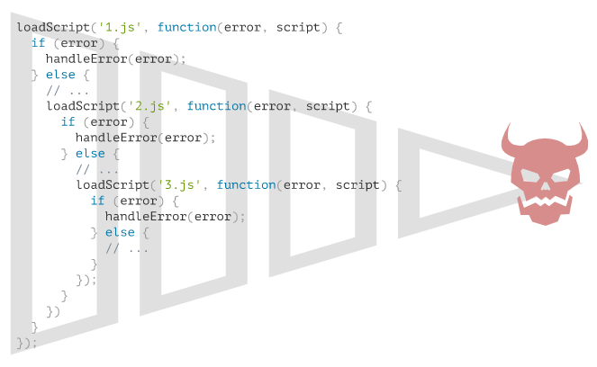

---
tags:
  - javascript
---

# 回调
在一些场景中需要等待另一个程序执行返回后才可以执行相应的操作，如需要等待脚本加载完成后才可以对其中的函数进行调用，JavaScript 主机 host 提供的许多函数或事件监听器实现这种计划的异步行为 asynchronous actions，如函数 `setTimeout`（根据给定的时间延后执行）、事件 `onload`（资源加载完以后执行给定的操作）、`onerror`（资源加载发生错误执行给定的操作）等。

异步执行某项功能的函数应该提供一个 callback 参数，一般传递的是匿名函数用于在相应事件完成时调用，该 callback 回调函数会使用 JavaScript 提供的一些函数或事件监听器来控制何时执行。这种函数的编写风格称为 **「基于回调」的异步编程风格**。

```js
// callback 接受需要异步执行的代码
function loadScript(src, callback) {
  let script = document.createElement('script');
  script.src = src;
  script.onload = () => callback(script);   // 脚本加载完以后执行 callback 中的代码
  document.head.append(script);
}

// 输入一段脚本，并在脚本加载完以后执行 callback 操作
loadScript('https://cdnjs.cloudflare.com/ajax/libs/lodash.js/3.2.0/lodash.js', script => {
  alert(`Cool, the script ${script.src} is loaded`);
  alert( _ ); // 所加载的脚本中声明的函数
});
```


## 处理 error
在函数主体执行时可能出现错误，可以在 callback 回调函数中设置多个参数，并针对不同的情况传递不同的参数执行相应的处理，约定 callback 函数第一个参数为 `error` 而保留的，一旦出现 `error` 就执行 `callback(errArgs)` 即传递与错误相关的参数执行相应的操作；第二个参数（或下几个参数，如果需要的话）用于主体代码执行成功的结果，此时调用方式是 `callback(null, result1, result2…)` 第一个参数为空，即错误相关的操作不执行，而执行成功后的异步行为。通过单一的 `callback` 函数可以同时具有报告 `error` 和传递返回结果的作用，这种编程风格被称为 **「Error 优先回调」error-first callback 风格**。

```js
// 改进上述示例
function loadScript(src, callback(error, script) {
  let script = document.createElement('script');
  script.src = src;

  script.onload = () => callback(null, script);
  script.onerror = () => callback(new Error(`Script load error for ${src}`));

  document.head.append(script);
}
```

## 嵌套回调
如果需要连续执行多步「异步」操作，可以在回调函数中再进行嵌套函数（或回调），嵌套函数也含有 callback 用于异步执行其他功能，但过度的嵌套使代码层次变得更深，维护难度也随之增加，形成称为「回调地狱」或「厄运金字塔」pyramid of doom 结构。

虽然可以将 callback 回调函数编写为独立的顶层函数并通过函数名来引用，但是这会造成可读性很差，阅读代码时需要在各个代码块之间跳转，而且回调函数一般使用匿名函数是由于这些函数都只使用一次（一般不会行为链之外重用它们），如果将它们作为独立函数声明会让命名空间有点混乱。



:bulb: 在 ES6 中推出的 [`Promise` 对象](./promise.md)使得对于异步行为的控制更简单，而且可以使用 `Promise` 对象解决异步回调（链）产生的过渡嵌套问题。