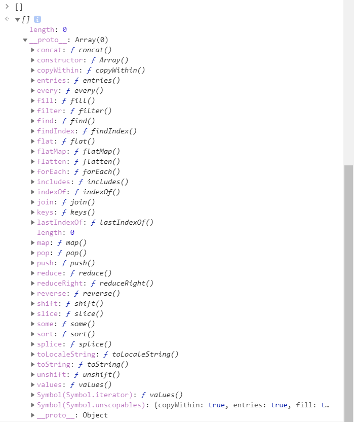
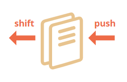
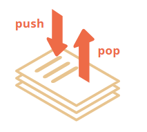
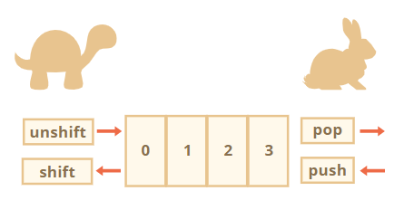

---
tags:
  - javascript
---

# 数组
[数组](https://developer.mozilla.org/zh-CN/docs/Web/JavaScript/Reference/Global_Objects/Array)是一种特殊的数据结构，适用于存储和管理有序的数据项。数组与对象类似，各个元素使用逗号 `,` 分隔，但这些值都是**有顺序**的，并用方括号 `[]` 包括。

```javascript
// 字面量表示法
// 创建一个空数组
let arr = [];

// 构造函数法
// 也可以使用数组构造函数的形式
let arr = new Array();
```

* 数组各个元素的数据类型可以不相同，因此数组可以存储任何类型的元素，如果数组作为值还可以形成**嵌套数组**
    ```js
    // 混合值
    let arr = [
        'Apple',
        { name: 'John' },
        true,
        function() { alert('hello'); } ,
    ];

    // 获取索引为 1 的对象然后显示它的 name
    alert( arr[1].name ); // John

    // 获取索引为 3 的函数并执行
    arr[3](); // hello
    ```
* 数组中的元素是有序的，从 `0` 开始标记，数组长度是可变的

:bulb: 推荐数组元素最后一个也添加 `,` 逗号，因为这种方式使得插入/移除项变得更加简单。

:warning: 数组可以使用语法 `new Array([number])`（表示参数 `number` 是可选的）创建，但很少被使用，因为方括号 `[]` 更短更简洁。而且这种语法还存在一些诡异的特性，**如果为构造函数传递一个参数（数值）会创建一个 指定了长度，却没有任何项 的数组；而如果为构造函数传递多个参数（可以是非数值），就创建一个以传递参数为元素的数组**。为了避免这种乌龙事件，我们通常都是使用方括号的，除非我们清楚地知道自己正在做什么。

```js
let arr = new Array(2);
alert( arr[0] ); // undefined！没有元素。
alert( arr.length ); // length 2
```

:bulb: 数组的数据类型实际是**对象**，使用方括号 `arr[index]` 来访问数组的元素实际上是来自于对象的语法。它其实与 `obj[key]` 相同，其中 `arr` 是对象，而数字用作为 key 键。因此数组行为和对象一样，它有多种（内置）[属性和方法](https://developer.mozilla.org/zh-CN/docs/Web/JavaScript/Reference/Global_Objects/Array) ，可以在 JavaScript 控制台中输入 `[]` 查看所有可用的[数组方法列表]

。

:warning: 数组是对象，因此赋值复制的只是数组内存的**引用**，通过其中一个「副本」对数组进行修改会影响其他「副本」的值

```js
let fruits = ["Banana"]
let arr = fruits; // 通过引用复制 (两个变量引用的是相同的数组)

alert( arr === fruits ); // true
arr.push("Pear"); // 通过引用修改数组
alert( fruits ); // Banana, Pear，现在有 2 个元素
```

:bulb: 数组是对象，因此我们可以像对象一样为其添加任何属性，但这可能会使得JavaScript 引擎针对这一种特殊的数据结构的优化失效（JavaScript 引擎尝试把这些元素一个接一个地存储在连续的内存区域，并进行一些其它的优化以使数组运行得非常快），因此严格地按照 **有序数据** 这样的结构来使用数组。

:warning: 数组误用的几种方式
- 添加一个非数字的属性，如 `arr.test = 5`
- 制造空洞，如添加 `arr[0]`，然后添加 `arr[1000]`（它们中间什么都没有）
- 以倒序填充数组，如 `arr[1000]`，`arr[999]`

## 判断数据类型
数组数据类型属于 object 对象（不构成单独的数据类型），所以函数 `typeof()` 不能帮助从数组中区分出普通对象 。可以使用方法 `Array.isArray(value)` 判读数据是否为一个数组，如果 `value` 是一个数组，则返回 `true`；否则返回 `false`

```javascript
alert(typeof {});   // object
alert(typeof []);   // object

alert(Array.isArray({}));   // false
alert(Array.isArray([]));   // true
```

## 索引
使用索引访问数组的元素，索引从 `0` 开始，如果访问不存在的索引处的元素，系统将返回 `undefined`。

:bulb: 对于嵌套数组，访问时使用链式索引，如访问二维数组的第二行第二个元素 `array2[1][1]`

```js
// 遍历嵌套数组的元素
let donutBox = [
  ["glazed", "chocolate glazed", "cinnamon"],
  ["powdered", "sprinkled", "glazed cruller"],
  ["chocolate cruller", "Boston creme", "creme de leche"]
];

// 在控制台输出数组中每个元素
// 外侧的循环会访问每行内容，内部循环访问每列内容
for (let row = 0; row < donutBox.length; row++) {
// donutBox.length 指的是甜甜圈(donuts)的行数
  for (let column = 0; column < donutBox[row].length; column++) {
  // donutBox[row].length 指的是当前被循环的甜甜圈(donut)数组的长度
    console.log(donutBox[row][column]);
  }
}
```

:warning: 数组默认**不**支持负数作为索引值，可使用 `array.length - n` 的方法来访问倒数第 `n` 个元素

## 修改数组
通过为特定索引/位置赋予新的值来修改数组。

```js
// 修改数组 array 第 n 个元素值为 newValue
array[n] = newValue;
```

可以通过赋值的方式为数组添加新的元素

```js
let fruits = ["Apple", "Orange", "Plum"];
fruits[3] = 'Lemon'; // 现在数组变成 ["Apple", "Orange", "Pear", "Lemon"]
```

## 遍历元素
遍历是结合循环和索引访问数组中所有元素，以对数组中每个元素进行编辑。有多种方法可以实现遍历，如一般的 for 循环，数组特有的方法 `arr.forEach(callback)`、方法 `arr.map(callback)`

### for 循环结构

```js
let donuts = ["jelly donut", "chocolate donut", "glazed donut"];

// 迭代参数 i 作为数组的索引
for (let i = 0; i < donuts.length; i++) {
    donuts[i] += " hole";
    donuts[i] = donuts[i].toUpperCase();
}   // ["JELLY DONUT HOLE", "CHOCOLATE DONUT HOLE", "GLAZED DONUT HOLE"]
```

:bulb: 类似地，还可以使用 for-in 循环结构（获取索引），还有 for-of 循环结构（直接获取元素）

:warning: for-in 循环结构适用于普通对象，并且做了对应的优化，但是不适用于数组，因此速度要慢 10-100 倍。此外在浏览器和其它环境中有一种称为「类数组」的对象，它们 **看似是数组**，即它们有 `length` 和索引属性，但是也可能有其它的非数字的属性和方法（这些属性和方法在遍历时通常不希望被访问），使用 for-in 结构循环会把它们都列出来。因此应该避免使用 for-in 循环结构来处理数组。

### forEach()
**方法 `forEach(callback(currentValue, [index], [array]), [thisArg])`** 可依次循环访问数组中每个元素（**不需要明确指定索引**），并对每个元素执行一次回调函数的处理。

:bulb: 回调函数 `callback` 可接收三个参数 `currentValue`、`index`、`array`
    * `currentValue` 是数组中正在处理的当前元素
    * `index`（可选） 是数组中正在处理的当前元素的索引
    * `array`（可选） 是 `forEach()` 方法正在操作的数组

```js
let donuts = ["jelly donut", "chocolate donut", "glazed donut"];

// 回调函数的形参 donut 表示遍历中各元素
donuts.forEach(function(donut) {
  donut += " hole";
  donut = donut.toUpperCase();
  console.log(donut);
});   // ["JELLY DONUT HOLE", "CHOCOLATE DONUT HOLE", "GLAZED DONUT HOLE"]

["Bilbo", "Gandalf", "Nazgul"].forEach((item, index, array) => {
  alert(`${item} is at index ${index} in ${array}`);
});
```

:warning: 该方法返回值为 `undefined`

:bulb: 由于方法 `arr.forEach()` 始终返回 `undefined`，如果需要将修改后的元素返回到原数组中，则需要在回调函数中进行赋值修改数组

```j
let donuts = ["jelly donut", "chocolate donut", "glazed donut"];

donuts.forEach(function(donut, index) {
  donut += " hole";
  donut = donut.toUpperCase();
  donuts[index] = donut；   // 将修改后的元素存入原数组中
});

console.log(donuts);   // ["JELLY DONUT HOLE", "CHOCOLATE DONUT HOLE", "GLAZED DONUT HOLE"]
```

:bulb: 如果需要将修改后的结果赋值回数组进行修改，可以使用方法 `arr.map(callback)`

## 常用属性
### length
属性 `length` 返回数组的长度（元素的数量）。当我们修改数组的时候，属性 `length` 会自动更新。

:warning: 准确来说属性 `length` 实际上不是数组里元素的个数，而是最大的数字索引值加一。

```js
let fruits = [];
fruits[123] = "Apple";

alert( fruits.length ); // 124，一个数组只有一个元素，但是这个元素的索引值很大，那么这个数组的 length 也会很大
```

:bulb: `length` 属性是可写的，如果我们减少它，数组就会被截断，且该过程是不可逆的，利用该特性可以**快速清空数组 `arr.length = 0`**

```js
let arr = [1, 2, 3, 4, 5];

arr.length = 2; // 截断到只剩 2 个元素
alert( arr ); // [1, 2]

arr.length = 5; // 又把 length 加回来
alert( arr[3] ); // undefined：被截断的那些数值并没有回来
```

## 常用方法
### 添加/移除数组元素
数组可以作为 [队列 queue](https://en.wikipedia.org/wiki/Queue_(abstract_data_type)) 使用

> 队列是计算机科学中的一种数据结构类型，指的是先进先出（FIFO, First-In-First-Out）的线性表。队列的应用在实践中经常会碰到，如需要在屏幕上显示消息队列。

队列中元素的添加和删除遵从以下原则：



* 在末端（称为rear）进行插入操作，如数组的方法 `push()`
* 在前端（称为front）进行删除操作，如数组的方法 `shift()`，这样整个队列往前移，这样原先排第二的元素现在排在了第一

此外数组还可以作为 [栈 stack](https://en.wikipedia.org/wiki/Stack_(abstract_data_type)) 使用

> 栈/堆叠/堆栈是计算机科学中一种数据结构类型，只允许在有序的线性数据集合的一端（称为堆栈顶端 top）进行加入数据 push 和移除数据 pop 的运算，即遵循后进先出（LIFO, Last In First Out）的运作原理。栈通常被被形容成一叠卡片：要么在最上面添加卡片，要么从最上面拿走卡片：

栈中的元素的添加和删除遵循以下原则：



* 在末端添加一个元素，如数组的方法 `push()`
* 从末端取出一个元素，如数组的方法 `pop()`

:bulb: JavaScript 中的数组既可以用作队列，也可以用作栈，即允许你从首端/末端来添加/删除元素，允许这样的操作的数据结构被称为 [双端队列（deque）](https://en.wikipedia.org/wiki/Double-ended_queue)。数组还支持更灵活的从中间特定位置进行插入操作，如方法 `splice()`。

#### push()
方法 `arr.push(value)` 向数组末尾处追加元素，并返回数组的长度。

```js
let donuts = ["glazed", "chocolate frosted", "Boston creme", "glazed cruller", "cinnamon sugar", "sprinkled"];
donuts.push("powdered");
donuts.length   // 7
```

#### unshift()
方法 `arr.unshift(value)` 向数组开头添加元素，并返回数组的长度。

```js
let fruits = ["Orange", "Pear"];
fruits.unshift('Apple');
alert( fruits ); // Apple, Orange, Pear
```

:bulb: 方法 `push()` 和 `unshift()` 允许一次添加多个元素

```js
let fruits = ["Apple"];

fruits.push("Orange", "Peach");
fruits.unshift("Pineapple", "Lemon");

alert( fruits );   // ["Pineapple", "Lemon", "Apple", "Orange", "Peach"]
```

#### shift()
方法 `shift()` 移除数组的第一个元素，即索引为 `0` 的元素，并返回被移除的元素。

#### pop()
方法 `pop()` 移除数组最后一个元素，并返回已经删除的元素，以备你仍需要使用该元素。

```js
let donuts = ["glazed", "strawberry frosted", "powdered", "Boston creme"];
donuts.pop();   // "Boston creme"
```

:bulb: 作用域数组末端的操作[性能更佳](https://zh.javascript.info/array#xing-neng)，即 `push` 和 `pop` 方法运行速度比较快，而方法 `shift` 和 `unshift` 比较慢。因为移除/添加索引为 `0` 位置的元素后，原来在其它位置的元素需要被重新编号。



#### splice()
方法 `arr.splice(start, [deleteCount], [item1, item2, ...])` 能够以多种方式操纵数组，可以说是处理数组的瑞士军刀，包括删除、添加、修改/替换数组的元素，并返回由被删除的元素组成的一个数组，如果没有删除元素则返回空数组。

* `start​` 指定修改的开始位置：如果超出了数组的长度，则从数组末尾开始添加新元素 `item1`、`item2` 等；如果是负值，则表示从数组末位开始计算插入元素的定位；如果负数的绝对值大于数组的长度，则表示开始位置为第 `0` 位。
* `deleteCount`（可选）是一个整数，表示要从数组的 `start` 位置开始（**含第 `start` 位**）移除的元素数量
    * 如果 `deleteCount` 被省略了或大于 `start` 之后的元素的总数，则从 `start` 后面的元素都将被删除。
    * 如果 `deleteCount` 是 `0` 或者负数，则不移除元素，只插入新元素。
* `item1, item2, ...` （可选）从 `start` 位置开始插入到数组中；如果不指定，则只删除数组元素。

```js
// 删除第二个元素
let arr = ["I", "study", "JavaScript"];
arr.splice(1, 1); // 从索引 1 开始删除 1 个元素
alert( arr ); // ["I", "JavaScript"]

// 删除部分元素并插入新的元素
let donuts = ["cookies", "cinnamon sugar", "creme de leche"];
donuts.splice(-2, 0, "chocolate frosted", "glazed");   // ["cookies", "chocolate frosted", "glazed", "cinnamon sugar", "creme de leche"]

// 向数组的末尾处添加元素
let rainbow = ['Red', 'Orange', 'Yellow', 'Blue'];
rainbow.splice(-1, 1, rainbow[rainbow.length-1], "Purple");   // ['Red', 'Orange', 'Yellow', 'Blue', 'Purple']，相当于方法 arr.push()
```

#### slice()
方法 `slice(begin, [end])` 基于索引对数组进行切片，该方法与字符串类似，:warning: 返回一个新的数组对象，原始数组不会被改变。

* 参数 `begin`（可选）：从该索引（包含）开始提取原数组元素。如果为负数，如 `slice(-2)` ，表示原数组中的倒数第二个元素开始提取至到最后一个元素（包含最后一个元素）。
* 参数 `end`（可选）：在该索引 **（不包含）** 处结束提取原数组元素。如果 `end` 被省略或大于数组的长度，则会一直提取到原数组末尾；可以是负数，在这种情况下，从末尾计算索引。。

:bulb: 不带参数地调用该方法 `arr.slice()`  或 `arr.slice(0)` 创建一个数组副本，以进行不影响原始数组的进一步转换。

#### concat()
方法 `arr.concat(arg1, arg2...)` 创建一个新数组，其中元素包含原数组 `arr` 和传递进入的其他数组和其他项的值，相当于将数组进行整合。

```js
let arr = [1, 2];
// create an array from: arr and [3,4], then add values 5 and 6
alert( arr.concat([3, 4], 5, 6) ); // 1,2,3,4,5,6
```

:bulb: 通常它只复制数组中的元素。其他对象，即使类数组的对象，仍然会被作为一个整体添加（引用的方式）；但如果类似数组的对象具有 `Symbol.isConcatSpreadable` 属性，那么它就会被当作一个数组来处理，即对象中的数字作为关键字 `key` 的属性将会将被整合。

```js
let arr = [1, 2];

let arrayLike1 = {
  0: "something",
  length: 1
};

alert( arr.concat(arrayLike1) ); // 1,2,[object Object]

let arrayLike2 = {
  0: "something",
  1: "else",
  [Symbol.isConcatSpreadable]: true,
  length: 2
};

alert( arr.concat(arrayLike2) ); // 1,2,something,else
```

:bulb: 使用空数组和 `concat` 进行数组拷贝

```js
newArr = [].concat(arr);
```

:bulb: 还可以使用 spread 语法进行浅拷贝

```js
let arr = [1, 2];
let arr2 = [...arr];
arr.push(3);
console.log(arr2);   // [1, 2]，在 arr 上进行修改并不影响 arr2
```

### 在数组中搜索
#### indexOf()/lastIndexOf()/includes()
数组和字符串类似，有 [arr.indexOf](https://developer.mozilla.org/zh/docs/Web/JavaScript/Reference/Global_Objects/Array/indexOf)、[arr.lastIndexOf](https://developer.mozilla.org/zh/docs/Web/JavaScript/Reference/Global_Objects/Array/lastIndexOf) 和 [arr.includes](https://developer.mozilla.org/zh/docs/Web/JavaScript/Reference/Global_Objects/Array/includes) 方法对元素进行搜索。

- 方法 `arr.indexOf(item, [from])` 从索引 `from` （默认为 `0`）开始搜索 `item`，如果找到则返回**第一个找到的元素**的索引，**否则返回 `-1`**。
- 方法 `arr.lastIndexOf(item, [from])` 从右向左搜索，即从数组的末尾开始查找。
- 方法 `arr.includes(item, [from])` 从索引 `from` （默认为 `0`）开始搜索 `item`，如果找到则返回 `true`；如果没找到，则返回 `false`。

:bulb: 如果只想检查是否包含某个元素，并且不想知道确切的索引，方法 `arr.includes()` 是首选。

:bulb: 以上方法使用严格相等 `===` 比较，但 `include()` 可以正确处理 `NaN` 情况（一般 `NaN` 无法通过比较进行匹配，因为[它与自身也不相等](./number类型.md#数字特殊值)）

```js
const arr = [NaN];
alert( arr.indexOf(NaN) );   // -1（应该为 0，但是严格相等 === equality 比较对 NaN 无效）
alert( arr.includes(NaN) );   // true（这个结果是对的）
```

#### find() 和 findIndex()
方法 `arr.find(function(item, index, array))` 可以寻找对象数组中满足特定条件的对象，因为它接受回调函数可进行较复杂的匹配规则设置。依次对数组中的每个元素执行回调函数操作，如果判断条件为 `true` 就停止搜索，并返回当前元素；如果没有搜索到，该方法就会返回 `undefined`。

回调函数可设置三个参数：
- `item` 当前元素
- `index` 时它的索引
- `array` 是数组本身。

```js
let users = [
  {id: 1, name: "John"},
  {id: 2, name: "Pete"},
  {id: 3, name: "Mary"}
];

let user = users.find(item => item.id == 1);

alert(user.name); // John
```

:warning: `find()` 方法搜索的是使函数返回 `true` 的**第一个（单个）元素**。在现实生活中，对象数组（数组元素是对象类型）是很常见的，所以 `find` 方法非常有用。

方法 `arr.findIndex()` 和方法 `find()` 类似，但是它返回的则是元素的索引（而非元素本身），而未找到任何内容时返回 `-1`。

#### filter()
方法 `arr.filter(function(item, index, array))` 用法与 `arr.find()` 类似，但是它可以过滤匹配数组中**所有**符合条件的元素，当回调函数匹配条件为 `true` 时当前的元素就会被 `push` 到结果数组中，再继续迭代，最后返回所有匹配的元素组成的新数组；如果什么都没找到，则返回空数组

```js
let users = [
  {id: 1, name: "John"},
  {id: 2, name: "Pete"},
  {id: 3, name: "Mary"}
];

// 返回前两个用户的数组
let someUsers = users.filter(item => item.id < 3);
alert(someUsers.length); // 2
```

### 转换数组
#### map()
**方法 `arr.map(function(item, index, array))`** 对数组中每个元素执行回调函数处理，并返回结果数组。相当于将数组每个元素按照特定规则进行转换。

:bulb: 回调函数可以传递三个参数：
- `item` 当前元素
- `index` 时它的索引
- `array` 是数组本身。

```js
let donuts = ["jelly donut", "chocolate donut", "glazed donut"];

// 返回的新数组赋予给变量 improvedDonuts
let improvedDonuts = donuts.map(function(donut) {
  donut += " hole";
  donut = donut.toUpperCase();
  return donut;
});   // ["JELLY DONUT HOLE", "CHOCOLATE DONUT HOLE", "GLAZED DONUT HOLE"]
```

#### every() 和 some()
方法 `arr.some(fn)` 和 `arr.every(fn)` 检查数组元素并返回一个布尔值，与 `map` 类似，对数组的每个元素调用回调函数 `fn`，如果任何/所有结果为 `true`，则返回 `true`，否则返回 `false`。

```js
const people = [
  {
    name: '小明',
    money: 500
  },
  {
    name: '漂亮阿姨',
    money: 3000
  },
  {
    name: '杰倫',
    money: 60000
  },
  {
    name: '老媽',
    money: Infinity
  }
];


// every（所有元素处理结果都为 true，最终返回才是 true）
let ans = people.every(function(item, index) {
  return item.money > 1000;
});

console.log(ans);   // false，因为 小明 只有 500

// some（部分元素的处理结果为 true，最终返回就是 true）
let ans = people.some(function (item, index) {
  return item.money > 10000;
});

console.log(ans);   // true
```

#### sort()
方法 `arr.sort([compareFunction])` 对数组的元素进行**原位 in-place** 排序（升序），并返回数组（原位是指在此数组内，而非生成一个新数组）。

```js
let arr = [ 1, 2, 15 ];

// 该方法重新排列 arr 的内容
arr.sort();

// 默认将元素转换为字符串再进行排序
alert( arr );  // 1, 15, 2
```

:bulb: 它还返回排序后的数组，但是返回值通常会被忽略，因为修改了 `arr` 本身。

:warning: **默认将元素转换为字符串再进行排序**（除非传递了比较函数），按照各个字符的 Unicode 位点进行排序，可能造成数字次序排序问题。因此进行数字排序时应该使用比较函数

:bulb: 对于许多字母最好使用方法 `char1.localeCompare(char2)` 根据不同语言适用习惯对字母进行排序

```js
alert( countries.sort( (a, b) => a.localeCompare(b) ) ); // Andorra,Österreich,Vietnam（对的！）
```

提供 `compareFunction` 比较函数可以修改元素的比较规则（默认按字符串进行排序），数组的元素就会按照比较函数的**返回值的正负数**来排序。如 `a` 和 `b` 是两个将要被比较的元素，比较函数返回的不同结果会使它们的排序不同

* 如果 `compareFunction(a, b)` 返回值正数表示 `a` 大于 `b`，则 `a` 会被排列到 `b` 之后
* 如果 `compareFunction(a, b)` 返回值等于 `0` ，则 `a` 和 `b` 的相对位置不变
* 如果 `compareFunction(a, b)` 返回值负数表示 `a` 小于 `b`，则 `a` 会被排列到 `b` 之前

```js
let arr = [ 1, 2, 15 ];

// 显式规定返回值
function compareNumeric(a, b) {
  if (a > b) return 1;
  if (a == b) return 0;
  if (a < b) return -1;
}

arr.sort(compareNumeric);   // [1, 2, 15]

// 优化版
arr.sort(function(a, b) { return a - b; });   // 1, 2, 15

// 箭头函数优化版
arr.sort( (a, b) => a - b );   // 1, 2, 15
```

#### reverse()
方法 `reverse()` 返回反向的数组，即数组的第一个元素会变成最后一个，数组的最后一个元素变成第一个。

```js
let arr = [1, 2, 3, 4, 5];
arr.reverse();

alert( arr ); // 5,4,3,2,1
```

#### join()
方法 `arr.join([glue])` 用指定的字符 `glue`（默认为逗号 `,`）将数组（或一个类数组对象）的所有元素「粘合」成一个字符串，并返回这个字符串。

:warning: 如果 `separator` 是空字符串 `""` 则所有元素之间都没有任何字符。

:bulb: 该方法的「逆操作」是[字符串的方法 `str.split([seperate])`](./string类型.md#split()) 可按照指定的分隔符（默认为逗号 `,`）将一个字符串分割成子字符串，并返回一个存储这些子字符串的数组。

#### reduce()/reduceRight()
方法 `arr.reduce(function(accumulator, item, index, array), [initial])` 类似于方法 `map()` 为数组的每个元素执行回调函数处理，但它提供了参数 `accumulator` 作为一个存储处理结果变量，将每次迭代的返回值覆盖存储（类似于累加器），可以方便地将当前迭代结果「搬运」carry on 到下一个调用，最后就可以得到所有迭代的「叠加」结果。

可以传递四个参数：
- `accumulator` 上一个函数调用的结果，第一次迭代前等于该方法的第二个参数 `initial`（如果提供了 `initial` 的话）
- `item` 当前的数组元素。
- `index` 当前索引。
- `arr` 数组本身。

```js
// 数组元素累加求和
let arr = [1, 2, 3, 4, 5];

let result = arr.reduce((sum, current) => sum + current, 0);
alert(result); // 15

// 按属性将对象分类
let users = [
  {id: 'john', name: "John Smith", age: 20},
  {id: 'ann', name: "Ann Smith", age: 24},
  {id: 'pete', name: "Pete Peterson", age: 31},
];

let usersById = groupById(users);

function groupById(array) {
  return array.reduce((obj, value) => {
    obj[value.id] = value;
    return obj;
  }, {})
}

/*
调用函数后，我们应该得到：

usersById = {
  john: {id: 'john', name: "John Smith", age: 20}
  ann: {id: 'ann', name: "Ann Smith", age: 24},
  pete: {id: 'pete', name: "Pete Peterson", age: 31},
}
*/
```

:bulb: 如果没有初始值 `initial` 会将数组的第一个元素作为初始值，并从第二个元素开始迭代。:warning: 如果数组为空，那么在没有初始值的情况下调用该方法会导致错误。

:bulb: 此外还可以将方法 `arr.reduce()` 用作同时保留上一个值和读取当前值的函数，可以用于获取数组中最大/最小值

```js
const people = [
  {
    name: '小明',
    money: 500
  },
  {
    name: '杰倫',
    money: 60000
  },
  {
    name: '漂亮阿姨',
    money: 3000
  },

];

let newNumber = people.reduce(function(pre, item, index) {
  return Math.max(pre, item.money);
}, 0)

console.log(newNumber);   // 60000
```

方法 `arr.reduceRight()` 和方法 `arr.reduce()` 的功能一样，只是遍历为从右到左。

## 数组的类型转换
数组可以隐式转换为字符串，它有自己的 `toString` 规则，即返回以逗号 `,` 隔开各元素的字符串。

```js
let arr = [1, 2, 3];
alert( String(arr) === '1,2,3' ); // true

alert( [] + 1 );    // "1"
alert( [1] + 1 );   // "11"
alert( [1,2] + 1 );   // "1,21"
```

:bulb: 数组没有 `Symbol.toPrimitive`，也没有 `valueOf`，它们只能执行 `toString` 进行转换

## thisArg

几乎所有可以传递回调函数的数组方法，如方法 `arr.find(callback)`，`arr.filter(callback)`，`arr.map(callback)`，:warning: 除了方法 `sort()` 是一个特例以外，都接受一个可选的（放在最后位置）参数 `thisArg` 用于传递上下文 passes the context 以指定回调函数中 `this` 指代的对象。

```js
let army = {
  minAge: 18,
  maxAge: 27,
  canJoin(user) {
    return user.age >= this.minAge && user.age < this.maxAge;
  }
};

let users = [
  {age: 16},
  {age: 20},
  {age: 23},
  {age: 30}
];

// 找到 army.canJoin 返回 true 的 user
let soldiers = users.filter(army.canJoin, army);

alert(soldiers.length); // 2
alert(soldiers[0].age); // 20
alert(soldiers[1].age); // 23
```

示例中我们使用了 `users.filter(army.canJoin)`，那么 `army.canJoin` 将被作为独立函数调用，并且这时 `this=undefined`，从而会导致即时错误。

可以用 `users.filter(user => army.canJoin(user))` 替换对 `users.filter(army.canJoin, army)` 的调用。前者的使用频率更高，因为对于大多数人来说，它更容易理解。

## 对象转换为数组
JavaScript 有一个全局方法 `Array.from(obj)` 可以接受一个**可迭代或类数组的值/对象**，并从中提取元素生成一个真正的数组，这样就可以对其调用数组特有的方法。

:bulb: 可迭代 iterable 和类数组 array-like 是两个常见的概念，一个对象可能会是可迭代对象或类数组对象，或两者兼有。

- **可迭代 Iterable** 是实现了方法 `Symbol.iterator` 方法的对象（而方法 `Symbol.iterator` 中有方法 `next()` 定义了迭代的规则），在 JavaScript 的内置对象有不少可迭代对象，如数组 `Array`、映射 `Map`、集合 `Set`
-  **类数组 Array-like** 是有索引和 `length` 属性的对象，它们看起来很像数组。:bulb: 字符串是可迭代的类数组（虽然它不是对象类型），循环结构 for-of 对它们有效，它们有数值索引和 `length` 属性。

```js
// 类数组对象
let arrayLike = {
  0: "Hello",
  1: "World",
  length: 2
};

let arr = Array.from(arrayLike);
alert(arr.pop()); // World（数组方法 pop 有效）

// 可迭代对象
let range = {
  from: 1,
  to: 5
};

// 添加 Symbol.iterator 迭代器
range[Symbol.iterator] = function() {
  // 它返回迭代器对象 iterator object
  return {
    current: this.from,
    last: this.to,
    // 其中包含方法 next() 指定循环迭代使用的值 value
    next() {
      if (this.current <= this.last) {
        return { done: false, value: this.current++ };
      } else {
        return { done: true };
      }
    }
  };
};

let arr = Array.from(range);
alert(arr); // 1,2,3,4,5 （数组的 toString 转化方法生效）
```

函数 `Array.from(obj, [mapfn], [thisArg])` 可选的第二个参数 `mapFn` 可以传递回调函数，该函数会在对象中的元素被添加到数组前，应用于每个元素，此外最后一个可选参数 `thisArg` 允许我们为该函数设置 `this` 指向的对象。

```js
// range 来自上述例子

// 求每个数的平方再将结构组成一个数组
let arr = Array.from(range, num => num * num);

alert(arr); // 1,4,9,16,25
```

:bulb: 类似地，如果需要将**以键值对为元素构成的数组**转换为对象，可以使用[方法 `Object.fromEntries(arr)`](./对象.md#数组转换为对象)

# 数组方法备忘单
以下列出了数组常用的方法。完整列表请参阅 [手册](https://developer.mozilla.org/zh/docs/Web/JavaScript/Reference/Global_Objects/Array)。

- 添加/删除元素：
    - `push(items)` 向数组尾端添加元素
    - `pop()` 从数组尾端提取（并移除）一个元素
    - `shift()` 从数组首端提取（并移除）一个元素
    - `unshift(items)`向数组首端添加元素
    - `splice(pos, deleteCount, items)` 从 `index` 开始删除 `deleteCount` 个元素，并在当前位置插入 `items`
    - `slice(start, end)` 创建一个新数组，将从位置 `start` 到位置 `end`（不包括）的元素复制进去
    - `concat(items)` 返回一个新数组，复制当前数组的所有元素，并向其后添加 `items`。如果 `items` 中有数组就取其元素。

- 搜索元素：
    - `indexOf/lastIndexOf(item, pos)` 从位置 `pos` 开始搜索 `item`，搜索到则返回该项的索引，否则返回 `-1`
    - `includes(value)` 如果数组有 `value`，则返回 `true`，否则返回 `false`
    - `find/filter(func)` 通过 `func` 过滤元素，返回使 `func` 返回 `true` 的第一个值/所有值
    - `findIndex` 和 `find` 类似，但返回索引而不是值。

- 遍历元素：
    - `forEach(func)` 对每个元素都调用 `func`，不返回任何内容（返回 `undefined`）

- 转换数组：
    - `map(func)` 根据对每个元素调用 `func` 的结果创建一个新数组
    - `sort(func)` 对数组进行原位 in-place 排序，然后返回它
    - `reverse()` 原位 in-place 反转数组，然后返回它
    - `split/join` 将字符串分割为数组/将数组元素进行粘合为字符串并返回
    - `reduce(func, initial)` 通过对每个元素调用 `func` 计算数组上的单个值，并在调用之间传递中间结果

- 其他：
    - `Array.isArray(arr)` 检查 `arr` 是否是一个数组

:warning: 方法 `sort`，`reverse`，`splice` 修改的是数组本身。

这些是最常用的方法，它们覆盖 99％ 的用例。但是还有其他几个：

- `arr.some(fn)`/`arr.every(fn)` 检查数组元素并返回一个布尔值，与 `map` 类似，对数组的每个元素调用回调函数 `fn`，如果任何/所有结果为 `true`，则返回 `true`，否则返回 `false`。
- `arr.fill(value, start, end)` 从索引 `start` 到 `end`，用重复的 `value` 填充数组
- `arr.copyWithin(target, start, end)` 将从位置 `start` 到 `end` 的所有元素浅拷贝到 **自身** 的 `target` 位置（覆盖现有元素），并返回修改后的数组，不会改变原数组的长度。
