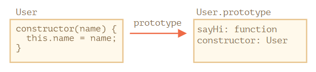
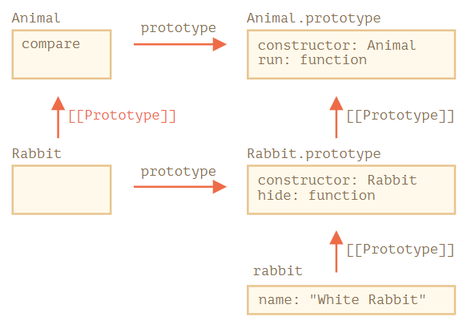
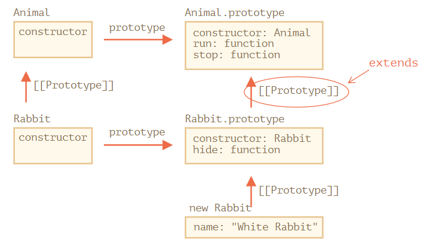
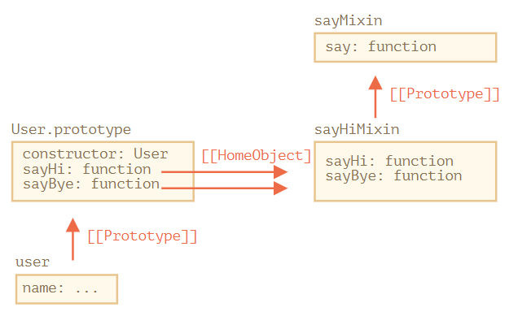

---
tags:
  - javascript
---

# 类
> 在面向对象的编程中，class 是用于创建对象的可扩展的程序代码模版，它为对象提供了状态（成员变量）的初始值和行为（成员函数或方法）的实现。
> ——*[类 (计算机科学) - 维基百科，自由的百科全书](https://zh.wikipedia.org/wiki/类_(计算机科学))*

在日常开发中需要创建许多类似的对象，可以使用[构造器和操作符 `new`](./对象.md#构造函数) 实现这种需求，构造函数创建实例遵循的规则：

* 按照惯例构造函数名以大写字母开头
* 构造函数使用 `new` 关键字被调用，通过传递参数定制化每个新对象实例
* 对象「继承」的方法被放在构造函数的原型对象上，即 `ClassName.prototype`

在现代 JavaScript 中（ES6）引入一个更高级的类 class 构造方式，新增的多个关键字，如 `class`、`super` 和 `extends` 等，在底层封装了用于构造类的多种函数，使类的创建更方便：

* 构造函数和相应的原型（作为方法容器）都在关键字 `class` 代码块中（但实际上出现在类定义中的方法仍是放在类的构造函数 `constructor(para) {}` 的原型对象上）
* 构造函数使用关键字 `constructor` 区别标注出来，也是使用关键字 `new` 创建新对象（实例化），此时方法 `constructor([paraments])` 会自动运行

```js
class MyClass {
  // class 方法
  constructor() { ... }
  method1() { ... }
  method2() { ... }
  method3() { ... }
  ...
}
```

:bulb: 类实际是一种构造函数，其代码来自于 `constructor` 方法，而类的方法存储于该方法的原型中。

```js
class User {
  constructor(name) {
    this.name = name;
  }
  sayHi() {
    alert(this.name);
  }
}

// 用法：
let user = new User("John");
user.sayHi();
```



:warning: 在 `class` 声明内**不是**用逗号来区分属性或方法，因为关键字 `class`  声明的是函数（不是「传统」意义上的对象的父类，如果在函数添加逗号，将出现 `SyntaxError：unexpected token`），而应该像在函数中使用分号分隔（且代码块之间不需要分隔）。

类除了方法外，还可以设置属性（Class 字段以及 getters/setters 方法创建的访问器属性），而属性名也支持计算属性 computed properties，这些都和对象相似。

```js
class User {
  name = "Anonymous";   // 设置类字段
  sayHi() {
    alert(`Hello, ${this.name}!`);
  }
}

new User().sayHi();

alert(User.prototype.sayHi); // 被放在 User.prototype 中
alert(User.prototype.name); // undefined，没有被放在 User.prototype 中
```

:warning: 类字段（field）是最近才添加到语言中的，旧的浏览器可能需要 polyfill。

```js
class User {
  constructor(name) {
    // 设置调用 setter
    this.name = name;
  }

  // getter & setter
  get name() {
    return this._name;
  }

  set name(value) {
    if (value.length < 4) {
      alert("Name is too short.");
      return;
    }
    this._name = value;
  }
}

let user = new User("John");
alert(user.name); // John
user = new User(""); // Name is too short.

// 计算属性名称
class User {
  ['say' + 'Hi']() {
    alert("Hello");
  }
}

new User().sayHi();   // Hello
```

:bulb: 类的方法 methods、getters 和 settors 都被写入了类（构造函数）原型中，但 Class 字段（类属性）则是在类构造函数中，即实例化后设置在单个对象上的，可以利用该特点解决对象方法单独调用产生的 `this` 丢失问题（通过该属性设置方法，方法中的关键字 `this` 就会与对象绑定，详细见下一段）

:bulb: 在 JavaScript 中的函数/对象方法中具有动态的 `this`，它取决于调用上下文。当一个对象方法单独被传递到某处或者在另一个上下文中被调用（这在浏览器环境中常需要将一个方法设置为事件监听器的回调函数），导致 `this` 不再是相应对象的引用时被称为「丢失」 `this`。一般采用两种方法解决

* 传递一个[包装函数](./函数.md#装饰者模式)，如 `setTimeout(() => button.click(), 1000)`。
* [将方法绑定到对象](./函数.md#函数绑定)，如 `func = obj.func.bind(this)` 对于类实例化创建的对象，可以使用类字段为这一种解决方案提供了更优雅的语法

    ```js
    class Button {
      constructor(value) {
        this.value = value;
      }
      click = () => {
        alert(this.value);
      }
      // 类字段 click = () => {...} 在每个 Button 对象上创建一个独立的函数，并将 this 绑定到该对象上。
      // 然后可以将 button.click 传递到任何地方，并且它会被以正确的 this 进行调用。
    }

    let button = new Button("hello");
    setTimeout(button.click, 1000); // hello
    ```

ES6 中新的语法创建类的优势

* 创建函数要编写的代码少了
* 使用关键字 `constructor` 清晰地定义了构造函数
* 类需要的所有代码都包含在类声明中，使用关键字 `class` 全部都包含起来，而不用在一个位置编写构造函数，然后向原型一个一个地添加方法

:warning: 但是 JavaScript 依然不是一门原生支持类的语言，只是通过使用构建函数（实例化）和原型（方法容器）来模拟类的功能。ES6 类的关键字 `class` 只是一个提供了语法糖，原型继承实际上在底层被隐藏起来了。`class` 是原型继承的抽象形式，即 JavaScript 类实际上仍使用**原型**实现继承的功能。

```js
// 两种方法构建类的区别
// 基于 ES5 标准通过构造函数创建「类」 Plane
function Plane(numEngines) {
  this.numEngines = numEngines;
  this.enginesActive = false;
}

// 在构造函数的原型上设置方法
Plane.prototype.startEngines = function () {
  console.log('starting engines...');
  this.enginesActive = true;
};

// 实例化 Plane 类
const jamesPlane = new Plane(4);
jamesPlane.startEngines();

/*---------- 分割线 ----------*/

// 基于 ES6 标准创建「类」 Plane
class Plane {
  // 构造函数
  constructor(numEngines) {
    this.numEngines = numEngines;
    this.enginesActive = false;
  }

  // 预设「类」方法
  startEngines() {
    console.log('starting engines…');
    this.enginesActive = true;
  }
}

// 实例化方式相同
const jamesPlane = new Plane(4);
jamesPlane.startEngines();
```

:bulb: 但在很多方面使用关键字 `class` 创建的类与使用构造器及其原型方法存在重大的差异

* 通过 `class` 创建的函数具有特殊的内部属性标记 `[[FunctionKind]]:"classConstructor"` 因此它与手动创建并不完全相同，不像普通函数，调用类构造器时必须要用 `new` 关键词

```js
class User {
  constructor() {}
}

alert(typeof User); // function
User(); // Error: Class constructor User cannot be invoked without 'new'
```

* 类方法不可枚举，类定义将 `"prototype"` 中的所有方法的 `enumerable` 标志设置为 `false`。这可以避免对一个对象调用循环结构 for-in 时遍历其原型的方法。

* 类总是使用 `use strict` 在类构造中的所有代码都将自动进入严格模式。

## 类表达式
类可以在一个表达式中被定义，然后被赋值、传递、返回等，与函数表达式类似。

```js
// 类表达式
let User = class {
  sayHi() {
    alert("Hello");
  }
};

// 返回类
function makeClass(phrase) {
  // 声明一个类并返回它
  return class {
    sayHi() {
      alert(phrase);
    };
  };
}

// 创建一个新的类
let User = makeClass("Hello");
// 使用关键字 new 实例化
new User().sayHi(); // Hello
```

:bulb: 类似于命名函数表达式 Named Function Expressions，类表达式可能也应该有一个名字，如果类表达式有名字，那么该名字仅在类内部可见

```js
// “命名类表达式（Named Class Expression）”
// (规范中没有这样的术语，但是它和命名函数表达式类似)
let User = class MyClass {
  sayHi() {
    alert(MyClass); // MyClass 这个名字仅在类内部可见
  }
};

new User().sayHi(); // 正常运行，显示 MyClass 中定义的内容

alert(MyClass); // error，MyClass 在外部不可见
```

## 静态方法
静态方法是在类中使用关键字 `static` 创建的方法，它赋值给类本身（而不是赋给其原型 `prototype`），被用于实现属于整个类的功能，与具体的类实例无关。

静态方法可以**直接访问**而不需要实例化，这实际上跟直接将方法作为类（函数对象）的属性赋值的作用相同。

```js
class User {
  // 静态方法
  static staticMethod() {
    alert(this === User);
  }
}

User.staticMethod();   // true，直接访问静态方法

/*---------- 分割线 ----------*/
// 等价用法
// 类（函数对象）属性
User.staticMethod = function() {
  alert(this === User);
};

User.staticMethod(); // true
```

:bulb: 静态方法中的关键字 `this` 指向类（构造器）本身，即可以在静态方法中使用 `new this` 实例化该类

```js
class Article {
  constructor(title, date) {
    this.title = title;
    this.date = date;
  }

  // 静态方法
  static createTodays() {
    // 记住 this = Article
    return new this("Today's digest", new Date());   // 返回该类的实例
  }
}

let article = Article.createTodays();
alert( article.title );   // Today's digest
```

## 静态属性
静态属性使用关键字 `static` 创建，被用于存储类级别的数据，而不是绑定到实例。相当于给类（函数对象）本身赋值。

```js
class Article {
  static publisher = "Ben";
}

alert( Article.publisher );   // Ben

/*---------- 分割线 ----------*/
// 等价用法
Article.publisher = "Ben";
```

:bulb: 静态方法和静态属性也是可以被继承的，由于子类通过关键字 `extends` 创建了两个 `[[Prototype]]`

* 子类构造器原型继承自父类构造器
* 子类的原型继承自父类的原型



```js
class Animal {
  static planet = "Earth";   // 父类静态属性

  constructor(name, speed) {
    this.speed = speed;
    this.name = name;
  }

  run(speed = 0) {
    this.speed += speed;
    alert(`${this.name} runs with speed ${this.speed}.`);
  }

  // 父类静态方法
  static compare(animalA, animalB) {
    return animalA.speed - animalB.speed;
  }

}

// 继承于父类 Animal
class Rabbit extends Animal {
  hide() {
    alert(`${this.name} hides!`);
  }
}

let rabbits = [
  new Rabbit("White Rabbit", 10),
  new Rabbit("Black Rabbit", 5)
];

rabbits.sort(Rabbit.compare);   // 可以使用父类的静态方法

rabbits[0].run(); // Black Rabbit runs with speed 5.

alert(Rabbit.planet); // Earth，可以使用父类的静态属性
```

## 私有和受保护的字段
面向对象编程（OOP）而言，内部接口与外部接口的划分被称为 [封装](https://zh.wikipedia.org/wiki/封裝_(物件導向程式設計))，可以保护用户并隐藏复杂性。在 JavaScript 中提供了受保护的字段（以  `_` 开头）以及私有字段（以 `#` 开头）来实现对内部接口的「封装」。

- **内部接口** 可以通过该类的其他方法访问，但不能从外部访问的方法和属性。
- **外部接口** 也可以从类的外部访问的方法和属性。

在 JavaScript 中，有两种类型的对象字段（属性和方法）：
- 公共的：可从任何地方访问。它们构成了外部接口。到目前为止，我们只使用了公共的属性和方法。
- 私有的：只能从类的内部访问。这些用于内部接口。

受保护的字段不是在 Javascript 语言级别中实现的，而是程序员之间有一个众所周知的约定，即**受保护的属性通常以下划线 `_` 作为前缀**，它们不应该从外部访问。

```js
class CoffeeMachine {
  _waterAmount = 0;

  set waterAmount(value) {
    if (value < 0) throw new Error("Negative water");
    this._waterAmount = value;
  }

  get waterAmount() {
    return this._waterAmount;
  }

  constructor(power) {
    this._power = power;
  }

}

// 创建咖啡机
let coffeeMachine = new CoffeeMachine(100);

// 加水
coffeeMachine.waterAmount = -10; // Error: Negative water，通过 getter/setter 对内部的属性 _waterAmout 进行访问
```

**私有属性和方法应该以 `#` 开头**，它们只在类的内部可被访问，该语法是 JavaScript 中的规范中，它为私有属性和方法提供语言级支持。

```js
class CoffeeMachine {
  #waterLimit = 200;

  #checkWater(value) {
    if (value < 0) throw new Error("Negative water");
    if (value > this.#waterLimit) throw new Error("Too much water");
  }

}

let coffeeMachine = new CoffeeMachine();

// 不能从类的外部访问类的私有属性和方法
coffeeMachine.#checkWater(); // Error
coffeeMachine.#waterLimit = 1000; // Error
```

:bulb: 私有字段与公共字段不会发生冲突，可以同时拥有私有的和公共的同名字段。

```js
// 使 waterAmount 成为 #waterAmount 的一个访问器
class CoffeeMachine {

  #waterAmount = 0;

  get waterAmount() {
    return this.#waterAmount;
  }

  set waterAmount(value) {
    if (value < 0) throw new Error("Negative water");
    this.#waterAmount = value;
  }
}

let machine = new CoffeeMachine();

machine.waterAmount = 100;
alert(machine.#waterAmount); // Error
```

:warning: 私有字段不能通过 `this[#property]` 在类中进行访问，而且[无法继承](https://zh.javascript.info/private-protected-properties-methods#si-you-de-waterlimit)

## 子类
参考
* [理解 es6 class 中 constructor 方法 和 super 的作用](https://www.jianshu.com/p/fc79756b1dc0)
* [类继承](https://zh.javascript.info/class-inheritance)

类继承是一个类扩展另一个类的一种方式，可以在现有功能之上创建新功能，也称为子类继承于父类。

在 ES5 标准中子类继承父类需要同时设置构造函数和方法容器
* 在子类的构造函数中需要引用父类函数以将父类的属性都继承下来，:warning: 但是需要使用方法 `call()` 「重置」父类的构造函数中的 `this` 指向为子类实例
* 使用函数 `Object.create(parentClassName.prototype)` 继承父类方法容器，:warning: 记得由于继承而造成了 `constructor` 覆盖，需要重新建立该属性绑定回子类的构造函数

```js
// 父类构造函数
function Tree(size, leaves) {
  this.size = size || 10;
  this.leaves = leaves || {spring: 'green', summer: 'green', fall: 'orange', winter: null};
  this.leafColor;
}

// 父类的原型（方法容器）
Tree.prototype.changeSeason = function(season) {
  this.leafColor = this.leaves[season];
  if (season === 'spring') {
    this.size += 1;
  }
}

// 子类构造函数
function Maple (syrupQty, size, leaves) {
  Tree.call(this, size, leaves);   // 引用（继承）父类
  this.syrupQty = syrupQty || 15;   // 子类特有的属性
}

// 子类的原型（方法容器）继承自父类的原型
Maple.prototype = Object.create(Tree.prototype);
Maple.prototype.constructor = Maple;   // 重新设置原型的 constructor 属性，绑定会子类的构造函数

// 子类的原型添加特有的方法
Maple.prototype.changeSeason = function(season) {
  Tree.prototype.changeSeason.call(this, season);
  if (season === 'spring') {
    this.syrupQty += 1;
  }
}

Maple.prototype.gatherSyrup = function() {
  this.syrupQty -= 3;
}

// 实例化子类
let myMaple = new Maple(15, 5);
myMaple.changeSeason('fall');
myMaple.gatherSyrup();
myMaple.changeSeason('spring');
```

在 ES6 中使用关键字 `extends`标注继承的父类，使代码少了很多（实际上在底层也是通过函数和原型之间的连接）

在声明子类时使用关键字 `extends` ，该关键字实际上是设置了两个原型
* 在构造函数的 `"prototype"` 之间设置原型（为了获取实例方法）。
* 在构造函数之间会设置原型（为了获取静态方法）。



```js
// 父类
class Animal {
  constructor(name) {
    this.speed = 0;
    this.name = name;
  }
  run(speed) {
    this.speed = speed;
    alert(`${this.name} runs with speed ${this.speed}.`);
  }
  stop() {
    this.speed = 0;
    alert(`${this.name} stands still.`);
  }
}

// 子类继承自父类
class Rabbit extends Animal {
  hide() {
    alert(`${this.name} hides!`);
  }
}

let rabbit = new Rabbit("White Rabbit");

rabbit.run(5); // White Rabbit runs with speed 5.
rabbit.hide(); // White Rabbit hides!
```

:bulb: 在 `extends` 后不仅允许指定一个类，还允许任意表达式。

```js
// 基于一个函数（返回类）创建子类
function f(phrase) {
  return class {
    sayHi() { alert(phrase) }
  }
}

class User extends f("Hello") {}   // 通过返回的类创建子类
new User().sayHi();   // Hello，实例化子类并运行其中的方法
```

:bulb: 如果需要在子类中重写父类的方法或构造函数，需要使用关键字 `super`（可以作为对象也可以是方法）

### 重写构造函数
**在子类中重写构造函数 `constructor` 时**需要先执行 `super([paraments])` 以调用父类的构造函数，:warning: 而且需要在子类中使用 `this` **之前**，必须先调用超级类 `super`。

这是由于在 JavaScript 中继承类（派生构造器 derived constructor）的构造函数与其他构造函数是有区别的，派生构造器具有特殊的内部属性 `[[ConstructorKind]]:"derived"` 该标签会影响它的 `new` 行为：
- 当通过 `new` 执行一个常规的构造函数时，它将创建一个空对象 `{}` 并将这个空对象赋值给 `this`
- 但是当继承的 constructor （子类构造函数）执行时，它不会执行此操作，它期望父类的 `constructor` 来完成这项工作，因此派生的 `constructor` 必须调用 `super` 才能执行其父类（非派生的）的 constructor，否则 `this` 指向的对象将不会被创建，并且会收到一个报错。

```js
// 父类
class Animal {
  constructor(name) {
    this.speed = 0;
    this.name = name;
  }
}

// 子类
class Rabbit extends Animal {
  // 重写构造函数
  constructor(name, earLength) {
    super(name);   // 先执行 super() 以创建 this 指代的对象
    this.earLength = earLength;
  }
}

let rabbit = new Rabbit("White Rabbit", 10);
alert(rabbit.name); // White Rabbit
alert(rabbit.earLength); // 10
```

:bulb: 在构造函数中 `super()` 函数表示（继承）父类的构造函数，以创建一个对象，但返回的是子类的实例，即 `super` 方法内部的 `this` 指的是子类对象，因此 `super()` 在构造函数中相当于 `parentClassName.call(this, [paraments])`

### 重写方法
如果在子类设置了同名的方法，根据原型链的工作原理，该方法会完全覆盖掉父类的同名方法；但如果希望**基于父类方法进行修改/拓展时**需要使用 `super.functionOnParent([paraments])` 先调用父类上相应的方法。

此时作为对象的 `super` 指向父类的原型对象（即 `parent.prototype`），通过 `super` 调用父类的方法时并没有使用 `this`，而是 [使用一个特殊的**内部属性 `[[HomeObject]]`**](https://zh.javascript.info/class-inheritance#shen-ru-nei-bu-tan-jiu-he-homeobject)（当一个函数被定义为类或者对象方法时，它的 `[[HomeObject]]` 属性就成为了该对象，而且该属性不能被更改，不行关键字 `this` 可随上下文改变），因此这些方法的引用不必担心丢失 `this` 问题。

:warning: `[[HomeObject]]` 是为类和普通对象中的方法定义的。但是对于对象而言，方法必须确切指定为 `method()`，而不是 `"method: function()"`。正是由于内部属性 `[[HomeObject]]` 不可动态改变，因此当类方法作为函数被单独引用时，需要警惕引起的对象指代错误。

```js
// 父类
class Animal {
  constructor(name) {
    this.speed = 0;
    this.name = name;
  }
  run(speed) {
    this.speed = speed;
    alert(`${this.name} runs with speed ${this.speed}.`);
  }
  stop() {
    this.speed = 0;
    alert(`${this.name} stands still.`);
  }
}

// 子类
class Rabbit extends Animal {
  hide() {
    alert(`${this.name} hides!`);
  }
  // 重写方法
  stop() {
    super.stop(); // 调用父类的 stop
    this.hide(); // 然后 hide
  }
}

let rabbit = new Rabbit("White Rabbit");

rabbit.run(5); // White Rabbit 以速度 5 奔跑
rabbit.stop(); // White Rabbit 停止了。White rabbit hide 了
```

:bulb: 箭头函数没有 `super` 它会从外部函数获取，类似于 `this` 会从外部上下文中获取所指代的对象。

## 扩展内建类
JavaScript 内建的类，如 `Array`、`Map`、`Set` 等也都是可以继承/扩展 extendable 的，而且在派生类上，当调用实例对象的方法会返回相应的对象时，如数组的方法 `filter()`、方法 `slice()` 等，会**自动返回派生类**的实例（而不是父类的实例），因此返回的对象可以拥有拓展的方法。

```js
// 继承自原生类 Array 的子类 PowerArray
class PowerArray extends Array {
  // 给 PowerArray 新增了一个方法
  isEmpty() {
    return this.length === 0;
  }
}

// 实例化子类
let arr = new PowerArray(1, 2, 5, 10, 50);
alert(arr.isEmpty()); // false

let filteredArr = arr.filter(item => item >= 10);   // 具有父类（原生类）方法 filter，返回的对象是子类的一个实例
alert(filteredArr); // 10, 50
alert(filteredArr.isEmpty()); // false，返回的对象是子类的一个实例，因此可以调用子类特有的方法
```

:bulb: 这是由于[内建类中 `Symbol.species` 属性的作用](https://elephantme.github.io/2017/08/02/es6-class/#Symbol-species属性)，当内建类的方法返回对象实例时将使用这个特殊的静态 getter `Symbol.species` 作为 constructor，许多内建类都已定义了 `Symbol.species` 属性，派生类继承该属性所以也会在调用特定方法时也可以返回派生类相应的对象实例，如果对该属性进行覆盖可以改变该行为。

```js
class PowerArray extends Array {
  isEmpty() {
    return this.length === 0;
  }

  // 内建方法将使用这个作为 constructor
  // 覆盖了原有父类的方法
  static get [Symbol.species]() {
    return Array;   // 始终返回父类 Array 的实例，而不是默认的该子类的实例
  }
}

let arr = new PowerArray(1, 2, 5, 10, 50);
alert(arr.isEmpty()); // false

// filter 使用 arr.constructor[Symbol.species] 作为 constructor 创建新数组
let filteredArr = arr.filter(item => item >= 10);

// filteredArr 不是 PowerArray，而是 Array
alert(filteredArr.isEmpty()); // Error: filteredArr.isEmpty is not a function
```

:warning: 一般类继承使用关键字 `extends` 会设置两个原型，**但内建类的继承并不会在构造函数之间设置原型**，因此对于内建类的静态方法，如 `Object.keys`、`Array.isArray` 等，并不会继承，这是扩展内建类和一般类继承的区别。

如 `Array` 和 `Data` 都继承自 `Object`，它们的实例只继承了都有来自 `Object.prototype` 的方法。但 `Array.[[Prototype]]` 并不指向 `Object`，所以它们没有如 `Array.keys()`（或 `Data.keys()`）这些静态方法。


## 类检查
操作符 `instanceof` 用于检查一个对象是否属于某个特定的 `class`，适用于继承的父类检查。

```js
obj instanceof Class
```

如果 `obj` 隶属于 `Class` 类（或 `Class` 类的衍生类），则返回 `true`。

```js
class Rabbit {}
let rabbit = new Rabbit();

// rabbit 是 Rabbit class 的对象吗？
alert( rabbit instanceof Rabbit ); // true
```

:bulb: 该操作符适用于构造函数及内建类，如 `Array` 等情况。

```js
// 适用于构造函数（不是 class）
function Rabbit() {}
alert( new Rabbit() instanceof Rabbit ); // true

// 适用于内建类，如数组 Array
let arr = [1, 2, 3];
alert( arr instanceof Array ); // true
alert( arr instanceof Object ); // true，由于 Array 继承自 Object
```

实际上 `instanceof` 在检查中是**基于原型链**进行匹配的，而且还可以通过静态方法 `Symbol.hasInstance` 进行自定义匹配逻辑。

`obj instanceof Class` 算法的执行过程如下

1. 如果有静态方法 `Symbol.hasInstance` 那就直接调用这个方法，基于自定义的规则检查返回结果

    ```js
    // 自定义 instanceOf 检查规则

    class Animal {
      static [Symbol.hasInstance](obj) {
        if (obj.canEat) return true;   // 假设具有 canEat 属性的都是 animal
      }
    }

    let obj = { canEat: true };
    alert(obj instanceof Animal); // true，方法 Animal[Symbol.hasInstance](obj) 被调用
    ```

2. 大多数 class 没有 `Symbol.hasInstance`，标准的逻辑是检查 `Class.prototype` 是否等于 `obj` 的原型链中的原型之一。

    ```js
    obj.__proto__ === Class.prototype?
    obj.__proto__.__proto__ === Class.prototype?
    obj.__proto__.__proto__.__proto__ === Class.prototype?
    ...
    // 如果任意一个的答案为 true，则返回 true
    // 否则，如果我们已经检查到了原型链的尾端，则返回 false
    ```

:warning: 实际上 `obj instanceof Class` 只检查 `Class.prototype` 是否于 `obj` 原型链中的原型之一相等，而不检查类的  `constructor` 自身的，因此可以修改原型而造成一些有趣的结果。

```js
function Rabbit() {}
let rabbit = new Rabbit();

// 修改了 prototype
Rabbit.prototype = {};

// 再也不是 rabbit 了！
alert( rabbit instanceof Rabbit ); // false
```

:bulb: 一个方法 [objA.isPrototypeOf(objB)](https://developer.mozilla.org/zh/docs/Web/JavaScript/Reference/Global_Objects/object/isPrototypeOf) 可以实现类似的检查功能，如果 `objA` 处在 `objB` 的原型链中，则返回 `true`。所以可将 `obj instanceof Class` 检查改为 `Class.prototype.isPrototypeOf(obj)`

:bulb: 除了可以检查类和对象关系，类似于以实数据类型的 `typeof`，还可以使用[对象的内置方法 `Object.prototype.toString`](https://zh.javascript.info/instanceof#fu-li-shi-yong-objectprototypetostring-fang-fa-lai-jie-shi-lei-xing)，即方法 `toString` 返回以内建对象的「类型」，甚至通过特殊的对象属性 `Symbol.toStringTag` 自定义对象 `toString` 方法的行为。

|   方法/操作符    |                                           用于                                            |   返回值    |
| :-------------------: | :-----------------------------------------------------------------------------------------: | :------------: |
|     `typeof`     |                                     原始数据类型                                      | `string`  |
| `{}.toString` | 原始数据类型，内建对象，包含 `Symbol.toStringTag` 属性的对象 | `string`  |
|  `instanceof`  |                                           对象                                            | true/false  |

## Mixin 模式
一些其它编程语言允许多重继承，但 JavaScript 不支持多重继承，每个类只可以扩展另外一个类（即每个对象只能有一个 `[[Prototype]]`），但我们可以使用 mixin（一种通过添加多种行为丰富功能的模式）来扩充类的方法。Mixin 是一个通用的面向对象编程术语，表示提供了实现特定行为的方法（集合），我们一般不单独使用这些方法，而是将其添加到类中（通过拷贝而不是继承），以拓展类的可用方法。

```js
// mixin
let sayHiMixin = {
  sayHi() {
    alert(`Hello ${this.name}`);
  },
  sayBye() {
    alert(`Bye ${this.name}`);
  }
};

// 类
class User {
  constructor(name) {
    this.name = name;
  }
}

// 拷贝方法
Object.assign(User.prototype, sayHiMixin);   // 将 mixin 中多种方法添加到类（原型）中

// 现在 User 可以打招呼了
new User("Dude").sayHi(); // Hello Dude!
```

:bulb: Mixin 可以在自己内部使用继承，虽然方法是通过拷贝的方法添加到类的原型上，但是在 mixin 中的继承（方法）使用关键字 `super` 即可避免关键字 `this` 丢失



```js
let sayMixin = {
  say(phrase) {
    alert(phrase);
  }
};

let sayHiMixin = {
  __proto__: sayMixin, // (或者，我们可以在这儿使用 Object.create 来设置原型)

  sayHi() {
    // 调用父类方法
    super.say(`Hello ${this.name}`); // (*)
  },
  sayBye() {
    super.say(`Bye ${this.name}`); // (*)
  }
};

class User {
  constructor(name) {
    this.name = name;
  }
}

// 拷贝方法
Object.assign(User.prototype, sayHiMixin);

// 现在 User 可以打招呼了
new User("Dude").sayHi(); // Hello Dude!
```

方法 `sayHi` 和 `sayBye` 最初是在 `sayHiMixin` 中创建的，因此即使复制了它们，但是它们的 `[[HomeObject]]` 内部属性仍引用的是 `sayHiMixin`，意味着调用这些方法时搜索的是 `sayHiMixin.[[Prototype]]`，而不是 `User.[[Prototype]]`。