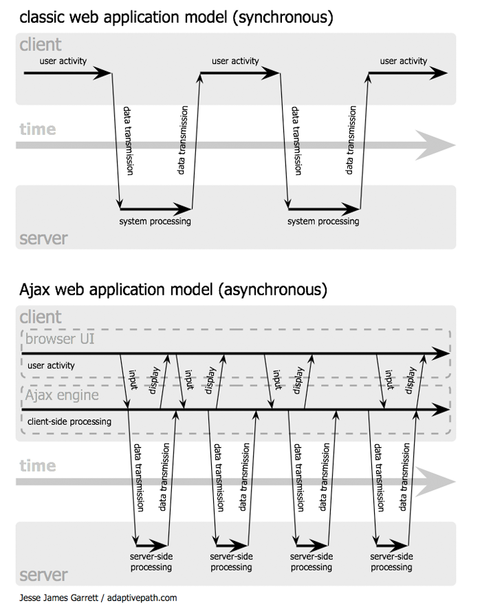
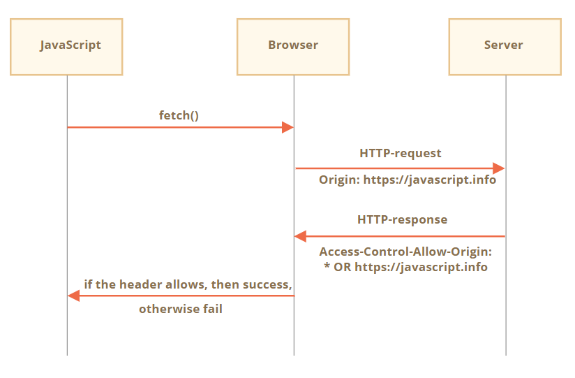
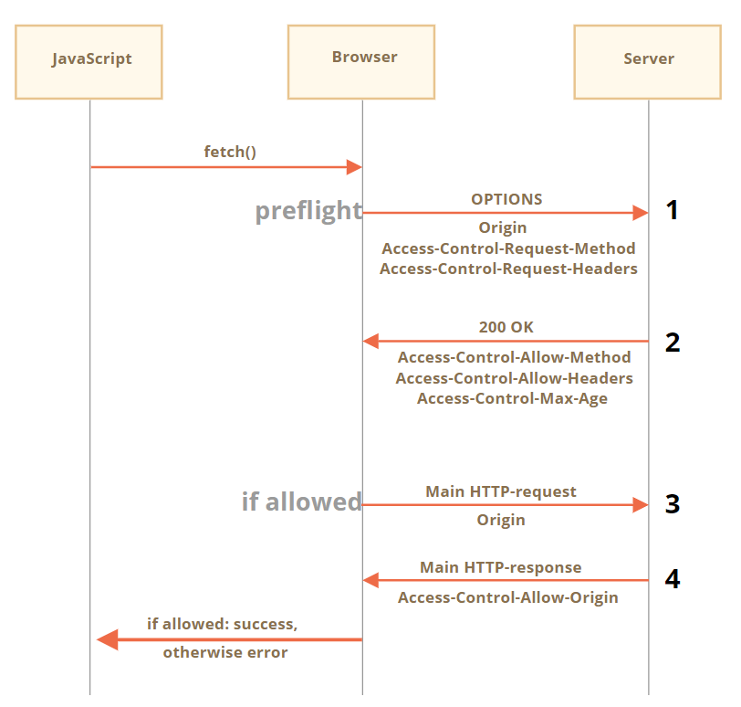

# Ajax
参考：[Ajax：Web应用的一种新方法](http://codemany.com/blog/ajax-new-approach-web-applications/)

Ajax，Asynchronous JavaScript And XML，即异步的 JavaScript 与 XML 技术，该概念是在 2005 年 [Jesse James Garrett 发明的](https://web.archive.org/web/20080702075113/http://www.adaptivepath.com/ideas/essays/archives/000385.php)。

该技术核心概念是异步请求数据，即在客户端发出数据请求后，不需要等待请求返回，借助 Ajax引擎可以继续进行其他任务处理，待请求返回后再进行异步处理，该过程不用一次次重新加载整个页面，而只需要根据响应更新特定区域的数据。

Ajax 技术包括：

- 使用 XHTML 和 CSS 的 [standards-based presentation](http://adaptivepath.org/publications/essays/archives/000266.php)；
- 使用 [Document Object Model](http://www.scottandrew.com/weblog/articles/dom_1) 的动态显示和交互；
- 使用 [XML 和 XSLT](http://www-106.ibm.com/developerworks/xml/library/x-xslt/?article=xr) 的数据交换和操控；
- 使用 [XMLHttpRequest](http://www.xml.com/pub/a/2005/02/09/xml-http-request.html) 的异步数据检索；
- [JavaScript](http://www.crockford.com/javascript/javascript.html) 将所有这些绑定在一起。



其中 Ajax 技术核心是发送异步数据请求，可以通过多种方式实现：
* 使用 JavaScript 内置的 XMLHttpRequest 构造函数（创建 XMLHttpRequest/XHR 对象）生成异步请求
* 使用 jQuery 生成异步请求
* 使用 fetch API 生成异步请求

## XMLHttpRequest
参考：
* [XMLHttpRequest | 现代 JavaScript 教程](https://zh.javascript.info/xmlhttprequest)
* [使用 XMLHttpRequest - Web API 接口参考 | MDN](https://developer.mozilla.org/zh-CN/docs/Web/API/XMLHttpRequest/Using_XMLHttpRequest)
* [XMLHttpRequest Standard | WHATWG 规范](https://xhr.spec.whatwg.org/)
* [XMLHttpRequest Level 1 | W3C 规范](https://www.w3.org/TR/XMLHttpRequest/)
* [XMLHttpRequest2 新技巧](https://www.html5rocks.com/zh/tutorials/file/xhr2/) | [英文](https://www.html5rocks.com/en/tutorials/file/xhr2/)

XMLHttpRequest（缩写为 XHR 或 xhr）可以用来向 API 请求任何类型的文件（例如 `txt` 纯文本文件、`HTML` 文件、`JSON` 文件、图片文件等）或数据，而不仅仅是XML，它甚至支持 HTTP 以外的协议（包括 file:// 和 FTP）。

:warning: 如今有一个更为现代的方法 `fetch` 发送异步网络请求，它的出现使得 `XMLHttpRequest` 在某种程度上被弃用。在现代 Web 开发中，出于以下三种原因，我们还在使用 `XMLHttpRequest`：

1. 历史原因：我们需要支持现有的使用了 `XMLHttpRequest` 的脚本。
2. 我们需要兼容旧浏览器，并且不想用 polyfill。
3. 我们需要做一些 `fetch` 目前无法做到的事情，如**跟踪上传进度**。

JavaScript 引擎提供了发出异步 HTTP 请求的方式，调用其内置的 **XMLHttpRequest 构造函数**创建 XHR 对象，以创建 Ajax 请求。

```js
let xhr = new XMLHttpRequest();
xhr.open('GET', '/my/url');
xhr.send();

xhr.onload = function() {
  if (xhr.status != 200) { // HTTP error?
    // 处理 error
    alert( 'Error: ' + xhr.status);
    return;
  }
  // 获取来自 xhr.response 的响应
};

xhr.onprogress = function(event) {
  // 报告下载进度
  alert(`Loaded ${event.loaded} of ${event.total}`);
};

xhr.onerror = function() {
  // 处理非 HTTP error（如网络中断）
};
```

XMLHttpRequest 发送网络请求步骤：

* XMLHttpRequest 有两种执行模式，同步 synchronous 和异步 asynchronous，异步模式发送请求需要 3 个步骤：

    1. 使用 `XMLHttpRequest` 构造函数创建 XHR 对象
        ```js
         let xhr = new XMLHttpRequest(); // 构造函数没有参数
        ```
    2. 使用 `open()` 方法初始化 XHR 对象
        ```js
        // 调用 .open 方法时并不会建立连接，仅仅设置当前请求的配置
        xhr.open(method, URL, [async, user, password])
        ```
        在创建 XHR 对象之后，通常调用 `.open()` 函数指定了请求的主要参数：
        * `method` 指代 HTTP 方法。通常是 `GET` 或者 `POST`
        * `URL` 指定要执行请求的 URL 字符串，或可以 URL 对象。
        * `async` 如果设置为 `false` 请求将会以同步的方式处理（默认为 `true` 即异步执行）
        * `user` 和 `password` 指定 HTTP 基本身份认证（可选）的登录名和密码

        :bulb: 使用 `xhr` 对象属性 `timeout` 设置超时限制，如果在给定时间内请求没有成功执行就会被取消，并且**触发 `timeout` 事件**。

        ```js
        xhr.timeout = 10000; // timeout 单位是 ms，此处即 10 秒
        ```

    3. 使用方法 `send()` 发送请求
        ```js
        // 建立连接，并发送请求到服务器
        xhr.send([body])
        ```
        可选参数 body 包含了请求主体 :
        * `GET` 没有请求体
        * `POST` 这类请求方式会用 `body` 来发送数据到服务器

* 然后就是监听响应事件，设置对成功/错误的响应的处理程序（:warning: 需要**在发出请求前**完成监听响应事件的设置）。常见的三个事件：
    - 事件 `load` 在请求结果已经返回时触发，:warning: 请求返回也包括像 `404` 这样的 HTTP 错误。通过 XHR 对象属性 `onload` 监听成功返回的事件，并设置相应的处理程序
    - 事件 `error` 在无法完成请求时触发，比如网络中断或者无效的 URL。通过 XHR 对象属性 `onerroe` 监听错误响应的事件，并设置无法实现请求的处理程序
    - 事件 `progress` 在下载期间定时触发，报告已经下载了多少。通过 XHR 对象属性 `onprogress` 来设置下载响应过程中执行的操作

* 最后如果请求成功，并获得响应消息，就需要对返回的响应体 `xhr.response` 作进一步分析。

### open() 方法
XHR 对象使用方法 `.open(method, URL)` 设置请求配置，有多个参数但是最重要的参数是前两个参数：

1. [HTTP 方法](https://developer.mozilla.org/zh-CN/docs/Web/HTTP)，主要是两种 `GET`检索数据或 `POST` 发送数据
2. 要发送请求的 URL

```js
// 向图片网站 Unsplash 发出首页异步请求，使用 GET 请求并提供相关 URL
asyncRequestObject.open('GET', 'https://unsplash.com');
```

:bulb: 可将 `false` 作为第三个参数使 XHR 请求变成**同步请求**。这将导致 JavaScript 引擎在执行 `send()` 后暂停并等待返回该请求，称为「阻止」，然后再继续。这做法完全与异步行为的目的相违背，同步请求会阻塞页面内的其他脚本执行，如果一个同步调用执行时间过长浏览器可能会建议关闭「挂起」hanging 的网页。:warning: 请勿如此设置你的 XHR 对象！要么将第三个参数设为 `true` 或留空（默认值变成 `true`）。

:warning: 该方法并没有实际地发送请求！它的作用只是做好准备，向 XHR 对象提供请求所需的信息。

:warning: 一般只能在将加载数据的**同一网域中**发出资源和数据请求，如要向 google.com 发出异步数据请求，浏览器需要位于 `google.com` 上，这称为 [同源策略](https://developer.mozilla.org/zh-CN/docs/Web/Security/Same-origin_policy)。这一限制是出于安全考虑，原因是 JavaScript 对网页上的太多信息具有控制权，它可以访问所有的 Cookie、能够判断密码（因为它可以追踪用户按的是哪个键）等。解决同源策略限制的方式是使用 [CORS, Cross-Origin Resource Sharing 跨域请求](https://developer.mozilla.org/zh-CN/docs/Web/HTTP/Access_control_CORS) ，这是必须在服务器上实现的技术，能让开发者规避同源策略限制并访问这些服务器上的信息。

#### POST
当我们需要发送大量数据时，如表单等，需要使用 `POST` 方法。

:bulb: 如果需要处理表单数据，可以[使用构造函数 `FormData([form])` 创建一个 HTML 表单数据对象](#FormData)，可以使用该对象提供的许多便捷方法。当以 FormData 对象作为 request body 时，即 `xhr.send(formData)`，则请求表头会含有  `Content-Type: multipart/form-data` 的 header。

```html
<form name="person">
  <input name="name" value="John">
  <input name="surname" value="Smith">
</form>

<script>
  // 从表单预填充 FormData
  let formData = new FormData(document.forms.person);

  // 附加一个字段
  formData.append("middle", "Lee");

  // 将其发送出去
  let xhr = new XMLHttpRequest();
  xhr.open("POST", "/article/xmlhttprequest/post/user");   // 使用 POST 方法
  xhr.send(formData);

  xhr.onload = () => alert(xhr.response);
</script>
```

### HTTP-header
HTTP-header 是客户端和服务器通讯时头部信息，对象 `xhr` 有三种方法设置/读取自定义的 header，以发送附加的信息。

:warning: [一些 header 是由浏览器专门管理设置的](http://www.w3.org/TR/XMLHttpRequest/#the-setrequestheader-method)，如 `Referer` 和 `Host`，为了用户安全和请求的正确性不允通过对象 `xhr` 的方法更改它们。

* 方法 `xhr.setRequestHeader(name, value)` 使用给定的 `name` 和 `value` 设置 request header，必须在 `open()` 之后、`send()` 之前调用该方法。

    ```js
    xhr.setRequestHeader('Content-Type', 'application/json');
    ```

    :warning: `XMLHttpRequest` 的一个特点是**不能撤销 `setRequestHeader`**，即一旦设置了 header 就无法撤销了，其他调用会向 header 中添加信息，但不会覆盖它。

    ```js
    xhr.setRequestHeader('X-Auth', '123');
    xhr.setRequestHeader('X-Auth', '456');

    // header 将是：
    // X-Auth: 123, 456
    ```

* 方法 `getResponseHeader(name)` 获取响应头中给定 `name` 的 header（`Set-Cookie` 和 `Set-Cookie2` 除外）。

    ```js
    xhr.getResponseHeader('Content-Type')
    ```

* 方法 `getAllResponseHeaders()` 返回除 `Set-Cookie` 和 `Set-Cookie2` 外响应头中所有 response header。

    ```js
    // header 以单行形式返回
    Cache-Control: max-age=31536000
    Content-Length: 4260
    Content-Type: image/png
    Date: Sat, 08 Sep 2012 16:53:16 GMT
    ```

    它们之间的换行符始终为 `"\r\n"`（不依赖于操作系统），而且`name` 和 `value` 之间总是以冒号后跟一个空格 `": "` 分隔，基于这些标准格式可以很容易将它们拆分为单个 header。

    ```js
    // 将所有的 header 拆分为对象 result 的各个属性
    let headers = xhr
      .getAllResponseHeaders()
      .split('\r\n')
      .reduce((result, current) => {
        let [name, value] = current.split(': ');
        result[name] = value;
        return result;
      }, {});

    // headers['Content-Type'] = 'image/png'
    ```

### send() 方法
要实际地发送请求，需要调用 XHR [方法 `.send()`](https://developer.mozilla.org/zh-CN/docs/Web/API/XMLHttpRequest/send)


虽然请求发出了，但如果不对响应事件作出监视，则请求成功或失败在都没有任何提示。为了监视事件可以设置 XHR 对象的 `onload` 属性或 `onerror` 属性。

#### 上传进度
事件 `progress` 仅在下载阶段触发，可以通过监听该事件追踪下载过程。而对于上传过程可以监听 `xhr.upload` 对象，上传过程中会在其上触发不同事件，通过监听这些事件可以追踪上传过程

- 事件 `loadstart` 在上传开始时触发
- 事件 `progress` **在上传期间定期触发**
- 事件 `abort` 在上传中止触发
- 事件 `error` 在非 HTTP 错误抛出时触发
- 事件 `load` 在上传成功完成时触发
- 事件 `timeout` （如果设置了 `timeout` 属性）在上传超时时触发。
- 事件 `loadend` 在上传完成时触发，无论成功还是 error。

```js
xhr.upload.onprogress = function(event) {
  // event.loaded 表示已上传字节数，event.total 表示总字节数
  alert(`Uploaded ${event.loaded} of ${event.total} bytes`);
};

xhr.upload.onload = function() {
  alert(`Upload finished successfully.`);
};

xhr.upload.onerror = function() {
  alert(`Error during the upload: ${xhr.status}`);
};
```

具体的实例演示可查看：[带有进度指示的文件上传](https://zh.javascript.info/xmlhttprequest#shang-chuan-jin-du)

#### 跨域请求
`XMLHttpRequest` 可以使用 CORS 策略进行[跨源请求](#跨源请求)，要启用它们可以将属性 `xhr.withCredentials` 设置为 `true`

```js
let xhr = new XMLHttpRequest();
xhr.withCredentials = true;

xhr.open('POST', 'http://anywhere.com/request');
// ...
```

### 中止请求
可以随时调用方法 `xhr.abort()` 终止请求，它会触发 `abort` 事件，且 `xhr.status` 变为 `0`

```js
xhr.abort(); // 终止请求
```

### 状态
对象 `xhr` 的状态 state 会随着它的处理进度变化而变化，可以通过属性 `xhr.readyState` 来了解当前状态。在[规范](https://xhr.spec.whatwg.org/#states) 中提到的对象 `xhr` 共有 5 个状态，分别用数值表示对应于一种状态，**当对象 `xhr` 状态发生变化时事件 `readystatechange` 就会被触发**

- `UNSENT = 0` 初始状态
- `OPENED = 1` 方法 `open()` 被调用
- `HEADERS_RECEIVED = 2` 接收到 response header
- `LOADING = 3` 响应正在被加载（接收到一个数据包）
- `DONE = 4` 请求完成

在实际的网络请求过程中，对象 `xhr` 状态以 `0` → `1` → `2` → `3` → … → `3` → `4` 的顺序转变，每当通过网络接收到一个数据包，就会重复一次状态 `3`。

:bulb: 可以通过监听事件 `readystatechange`来跟踪该过程。可能在非常老的代码中找到 `readystatechange` 这样的事件监听器，它的存在是有历史原因的，因为那时没有 `load` 以及其他事件，如今它已被 `load/error/progress` 事件处理程序所替代。

```js
xhr.onreadystatechange = function() {
  if (xhr.readyState == 3) {
    // 加载中
  }
  if (xhr.readyState == 4) {
    // 请求完成
  }
};
```

### 响应
一旦服务器返回响应，我们访问 `xhr` 对象的属性获取更详细的信息

* 属性 `status`HTTP 状态码（一个数字），如 `200`，`404`，`403` 等，如果出现**非 HTTP 错误**则为 `0`（如果是 HTTP 错误返回状态码是 `40*` 形式）。
* 属性 `statusText` HTTP 状态消息（一个字符串） 与状态码相对应，如 `200` 对应于 `OK`，`404` 对应于 `Not Found`，`403` 对应于 `Forbidden` 等。
* 属性 `response`（旧脚本可能用的是 `responseText`）服务器响应体 response body。

:warning: 请求返回像 `404` 这样的 HTTP 错误响应，虽然无法获取资源也算是访问成功，依然可以调用 XHR 对象属性 `onload` 设置的处理程序

#### 处理成功请求 onload
XHR 对象 [`onload` 属性](https://developer.mozilla.org/zh-CN/docs/Web/API/XMLHttpRequestEventTarget/onload)是请求成功完成时才调用的函数，通过该属性可以设置请求成功后的操作

```js
XMLHttpRequest.onload = callback; // callback 是请求成功完成时要执行的函数，
```

:bulb: 处理程序中的 `this` 指代 XHR 对象

```js
// 请求成功时将响应消息（如 HTML 文件）在终端打印出来
function handleSuccess() {
    // this 指代 XHR 对象
    // this.responseText 保存来自服务器的响应内容
    console.log(this.responseText);
}

asyncRequestObject.onload = handleSuccess; // 请求成功时执行 handleSuccess 函数
```

:warning: 使用 XHR 对象的 `.responseText` 属性以获取响应的文本，如网页的 HTML 文件。

#### 处理错误 onerror
XHR 对象 [`onerror` 属性](https://developer.mozilla.org/zh-CN/docs/Web/API/XMLHttpRequestEventTarget/onerror)是请求无法实现时才调用的函数，可以设置请求失败时执行的操作

```js
XMLHttpRequest.onerror = callback;
```

```js
function handleError () {
    console.log( '出现错误 😞' );
}

asyncRequestObject.onerror = handleError; // 请求失败时执行 handleError 函数
```

#### 响应类型
除了访问服务器获取网站的 HTML 文件之外，还可以获取其他格式的数据。可以使用 `xhr` 对象属性 `xhr.responseType` （预先，使用方法 `xhr.send()` 发送请求之前）设置响应格式，以便 JavaScript 对响应体进行合适的处理：

- `""`（默认） 响应格式为字符串，
- `"text"` 响应格式为字符串，
- `"arraybuffer"` 响应格式为 `ArrayBuffer`
- `"blob"` 响应格式为 `Blob`
- `"document"` 响应格式为 XML document（可以使用 XPath 和其他 XML 方法）
- `"json"` 响应格式为 JSON（自动解析）[JSON](./JSON.md) 是网络传输常见的数据格式

```js
let xhr = new XMLHttpRequest();
xhr.open('GET', '/article/xmlhttprequest/example/json');

// 预设返回数据类型
xhr.responseType = 'json';

xhr.send();

// 由于预设了返回的数据类型为 JSON，JavaScript 自动解析响应
xhr.onload = function() {
  let responseObj = xhr.response;
  alert(responseObj.message); // Hello, world!
};
```

也可以使用 JavaScript 内建的函数 `JSON.parse()` （手动）解析 JSON 数据并转换为 JavaScript 对象。

```js
function handleSuccess () {
   // 使用函数 JSON.parse() 将数据从 JSON 格式转换为 JavaScript 对象
   const data = JSON.parse( this.responseText );
   console.log( data );
}

asyncRequestObject.onload = handleSuccess;
```

:bulb: 在旧的脚本中，可能会看到 `xhr.responseText`，甚至会看到 `xhr.responseXML` 属性。它们是由于历史原因而存在的，以获取字符串或 XML 文档。如今应该通过属性 `xhr.responseType` 设置格式，然后就可以直接使用通用的属性 `xhr.response` 访问不同数据。

## fetch
参考： [使用 Fetch - Web API 接口参考 | MDN](https://developer.mozilla.org/zh-CN/docs/Web/API/Fetch_API/Using_Fetch)

现代通用的发送网络请求的方法是 Fetch，这是新的 JavaScript API 旨在让资源请求（通常是网络请求）简单很多，**其核心是基于 `promise` 处理异步请求**

```js
let promise = fetch(url, [options])
```

参数说明：
* **`url`** 要访问的 URL。
* **`options`** 可选参数，是一个称为 init 对象/配置对象，具有属性 `method`，`header` 等，用于设置 HTTP 请求的头部信息。


典型的 fetch 请求由两个 `await` 调用组成或以 `promise` 形式

```js
// 形式一：使用 await 关键字
let response = await fetch(url, options); // 解析 response header
let result = await response.json(); // 将 body 读取为 json

// 形式二：使用 promise 链式调用
fetch(url, options)
  .then(response => response.json())
  .then(result => /* process result */)
```

通过 Fetch 发送请求并处理响应的过程：

1. 创建 `fetch(url)` 函数并提供了 `url` 后浏览器会立即向服务器发送网络请求，（无论请求成功与否）并立即返回一个 [Promise 对象](../JavaScript/语法基础/promise.md)

2. 当服务器返回响应头 response header 时，`promise` 对象就使用内建的 [Response](https://fetch.spec.whatwg.org/#response-class) class 对象来对响应头进行解析，通过响应头来检查 HTTP 状态以确定请求是否成功（当前还没有响应体 response body）。
    * 如果 `fetch` 无法建立一个 HTTP 请求，如网络问题或是请求的网址不存在，就会抛出错误，即 `promise` 就会 reject
    * 如果请求成功 `promise` 就会 resolve，则可以访问 **`response` 对象的属性 `status`，属性值会在特定范围中，如 `200`**；如果 HTTP 状态码 200-299，则 `request` 对象的属性 `ok` 为 `true`

   :warning: 异常的 HTTP 状态，如响应头 `status` 为 `404` 或 `500` 也是请求成功的一种情况，所以不会导致出现 `error`

3. 基于 `promise` 对象的状态通过链式调用执行**方法 `then()` 或 `catch()`**，如果请求成功就会返回 `response` 对象，可基于 response body 的数据格式调用 `response` 对象的[不同方法](#处理程序)进行解析。

:bulb: 可访问 [caniuse](http://caniuse.com/#feat=fetch) 查看当前浏览器是否支持 Fetch API，如果你的浏览器不支持只需向你的项目中添加 [polyfill](https://github.com/github/fetch)

:warning: Fetch 请求依然需要遵守[同源策略](https://developer.mozilla.org/zh-CN/docs/Web/Security/Same-origin_policy)的限制，默认情况下只能对与加载数据在同一网域中的资源和数据发出请求。

### Request header
在函数 `fetch()` 的第二个参数（可选）配置对象的属性 `header` 中设置 HTTP 请求的头部信息

```js
fetch(url, {
    headers: {
      'key': value
    }
});
```

:bulb: 可以使用 Fetch API 提供的接口/构造函数 `Headers` 创建一个 HTTP 请求头，一般步骤是

1. 使用构造函数 `Header()` 创建新 `header` 对象
2. （以键值对的形式，类似于 Map）通过 `append()` 方法将信息添加到 `header` 对象中
3. 将该 `header` 对象作为（`fetch()` 函数的第二个参数）配置对象的属性 `headers` 的值

```js
const requestHeaders = new Headers();
requestHeaders.append('key', value);

fetch(url, {
    headers: requestHeaders
})
```

:warning: 有一些 header 对象的属性无法设置，这些 header 属性保证了 HTTP 的正确性和安全性，所以它们仅由浏览器控制，详见 [forbidden HTTP headers](https://fetch.spec.whatwg.org/#forbidden-header-name)

- `Accept-Charset`, `Accept-Encoding`
- `Access-Control-Request-Headers`
- `Access-Control-Request-Method`
- `Connection`
- `Content-Length`
- `Cookie`, `Cookie2`
- `Date`
- `DNT`
- `Expect`
- `Host`
- `Keep-Alive`
- `Origin`
- `Referer`
- `TE`
- `Trailer`
- `Transfer-Encoding`
- `Upgrade`
- `Via`
- `Proxy-*`
- `Sec-*`

#### Fetch API
fetch 提供[多种选项](https://zh.javascript.info/fetch-api)以更好地配置网络请求

```js
let promise = fetch(url, {
  method: "GET", // POST，PUT，DELETE，等。
  headers: {
    // 内容类型 header 值通常是自动设置的
    // 取决于 request body
    "Content-Type": "text/plain;charset=UTF-8"
  },
  body: undefined // string，FormData，Blob，BufferSource，或 URLSearchParams
  referrer: "about:client", // 或 "" 以不发送 Referer header，
  // 或者是当前源的 url
  referrerPolicy: "no-referrer-when-downgrade", // no-referrer，origin，same-origin...
  mode: "cors", // same-origin，no-cors
  credentials: "same-origin", // omit，include
  cache: "default", // no-store，reload，no-cache，force-cache，或 only-if-cached
  redirect: "follow", // manual，error
  integrity: "", // 一个 hash，像 "sha256-abcdef1234567890"
  keepalive: false, // true
  signal: undefined, // AbortController 来中止请求
  window: window // null
});
```

#### 更改 HTTP 方法
Fetch 请求的默认 HTTP 方法是 GET，可以通过 `fetch()` 的配置对象的属性 `method` 设置其他的 HTTP 方法

```js
// 使用 POST 方法
fetch('url', {
    method: 'POST'
});
```

如果使用 POST 发送网络请求，则需要提供 请求体 request body，通过 `fetch()` 的配置对象的属性 `body` 进行设置

**`body`** 属性值可以有多种数据类型，常见的格式如下：

- 字符串，一般以 JSON 格式进行编码（最常用）
- `FormData` 对象，以 `form/multipart` 形式发送数据
- `Blob`/`BufferSource` 发送二进制数据
- [URLSearchParams](https://zh.javascript.info/url) 以 `x-www-form-urlencoded` 编码形式发送数据（很少使用）

```js
// 以 JSON 形式发送 user 对象
let user = {
  name: 'John',
  surname: 'Smith'
};

let response = await fetch('/article/fetch/post/user', {
  method: 'POST',
  headers: {
    'Content-Type': 'application/json;charset=utf-8'
  },
  body: JSON.stringify(user)
});

let result = await response.json();
alert(result.message);   // User saved.
```

:bulb: 请注意如果请求的 `body` 是字符串，则 `Content-Type` 会默认设置为 `text/plain;charset=UTF-8`；但是当要发送 JSON 时，需要将 `headers` 的属性 `Content-Type` 设置为 `application/json`，因为这是 JSON 编码的数据的正确的 `Content-Type`。

#### FormData
在商业网站中最常见和实用的数据传输/请求就是表单数据，使用 [FormData](https://xhr.spec.whatwg.org/#interface-formdata) 对象可以提供帮助。

FormData 是 HTML 表单数据的对象，通过构造函数 `FormData()` 创建，可以提供 HTML 元素 `form` 作为其参数，这样 FormData 对象会自动捕抓其中的表单字段/控件。

```js
let formData = new FormData([form]);
```

:bulb: 向服务器传递 `FormData` 对象时，如使用方法`fetch()`（将其设置为函数 `fetch()` 的第二个参数配置对象的属性 `body` 值），它会被编码并发送出去（这个编码允许发送文件，因此 `<input type="file">` 字段也能被发送），并带有 `Content-Type: multipart/form-data`（因此不需要设置 `fetch()` 第二个参数对象的属性 `Content-Type`），这样从服务器角度来看，它就像是一个普通的表单提交。

```html
<form id="formElem">
  <input type="text" name="name" value="John">
  <input type="text" name="surname" value="Smith">
  <input type="submit">
</form>

<script>
  formElem.onsubmit = async (e) => {
    e.preventDefault();

    let response = await fetch('/article/formdata/post/user', {
      method: 'POST',
      body: new FormData(formElem)   // 发送表单 formElem
    });

    let result = await response.json();
    alert(result.message);
  };
</script>
```

可以使用以下方法修改 `FormData` 中的字段/控件

- `formData.append(name, value)` 添加具有给定 `name` 和 `value` 的表单字段，
- `formData.append(name, blob, fileName)` 添加一个文件类型字段（动态生成的二进制数据），相当于 `<input type="file">`，第三个参数 `fileName` 设置文件名（而不是表单字段名），它是用户文件系统中文件的名称
- `formData.delete(name)` 移除带有给定 `name` 的字段
- `formData.get(name)` 获取带有给定 `name` 的字段值
- `formData.has(name)` 如果存在带有给定 `name` 的字段，则返回 `true`，否则返回 `false`

:bulb: 从技术上来讲，一个表单可以包含多个具有相同 `name` 的字段，因此多次调用 `append` 将会添加多个具有相同名称的字段。

而类似于 `append` 的方法 `set` **移除所有具有给定 `name` 的字段，然后附加一个新字段**，因此它确保了只有一个具有这种 `name` 的字段

- `formData.set(name, value)`，
- `formData.set(name, blob, fileName)`。

:bulb: 可以使用 `for..of` 循环迭代 formData 字段

```js
let formData = new FormData();
formData.append('key1', 'value1');
formData.append('key2', 'value2');

// 通过解构获取 key/value 对
for(let [name, value] of formData) {
  alert(`${name} = ${value}`); // key1=value1，然后是 key2=value2
}
```

### 下载进度
通过方法 `fetch()` 发送的网络请求，支持使用 `response.body` 的方法跟踪下载进度，`response.body` 是 [`ReadableStream` 对象](https://streams.spec.whatwg.org/#rs-class)，类似于 与 `response.text()`，`response.json()` 和其他方法可读取响应体，但 `response.body` 可以通过方法，如 `read()` 逐块 chunk 读取并监控下载进度。

```js
// 创建一个流读取器 stream reader 读取响应体，代替 response.json() 以及其他方法
const reader = response.body.getReader();

// 在循环中接收响应块 response chunk，并读取每次接受块字节的大小，直到加载完成
while(true) {
  // 当最后一块下载完成时，done 值为 true
  // value 是块字节
  const {done, value} = await reader.read();

  if (done) {
    break;
  }

  console.log(`Received ${value.length} bytes`)
}
```

更详细地控制下载进度（并将响应块「复原」为响应体）的实例可查看 [Fetch：下载进度](https://zh.javascript.info/fetch-progress)

:bulb: 到目前为止方法 `fetch` 无法跟踪上传进度，可使用方法 `XMLHttpReques` 发送网络请求以监听上传进度

### 中止请求
方法 `fetch` 核心是基于 promise 处理网络请求，如果想中止网络请求，但在 JavaScript 通常并没有「中止」 promise 的概念，我们可以借用特殊的内建对象 AbortController 来实现。

内建对象 AbortController 可用于中止异步任务，包括 `fetch()` 发起的网络请求。使用构建函数 `AbortController` 创建控制器，该对象只有单一的方法 `abort()` 和单一属性 `signal`。

当控制器调用 `abort()` 方法时，事件 `abort` 就会在 `controller.signal` 上触发，同时 `controller.signal.aborted` 属性变为 `true`。因此可以在 `controller.signal` 上设置监听器来跟踪事件 `abort`，并执行相应的处理程序中止 `promise`；而方法 `fetch` 在内部集成了它，只要将 `controller.signal` 作为函数 `fetch()` 的第二个参数配置对象的属性 `signal` 的值即可实现监控。

中止方法 `fetch` 发起的网络请求步骤：

1. 创建一个控制器

    ```js
    let controller = new AbortController();
    ```

2. 将 `signal` 属性传递给 `fetch` 选项，它会监听 `signal` 上的事件 `abort`

    ```js
    let controller = new AbortController();
    fetch(url, {
      signal: controller.signal
    });
    ```

3. 调用 `controller.abort()` 来中止

    ```js
    controller.abort();
    ```

:bulb: 当一个异步程序被中止时，promise 就会变成 reject 状态并返回一个 `AbortError` 异常，我们可以捕抓该异常并对其进行处理。

```js
// 1 秒后中止
let controller = new AbortController();
setTimeout(() => controller.abort(), 1000);

try {
  let response = await fetch('/article/fetch-abort/demo/hang', {
    signal: controller.signal
  });
} catch(err) {
  if (err.name == 'AbortError') { // handle abort()
    alert("Aborted!");
  } else {
    throw err;
  }
}
```

:bulb: AbortController 是**可扩展**的，即控制器可以分配给多个 fetch 或其他异步任务（需要手动设置监听器来监听事件 `abort` 触发 promise 状态变成 reject），实现一次中止多个网络请求。

```js
let urls = [...];   // 要并行 fetch 的 url 列表
let controller = new AbortController();

let ourJob = new Promise((resolve, reject) => {   // 其他异步任务
  // ...
  controller.signal.addEventListener('abort', reject);   // 设置事件 abort 监听器
});

let fetchJobs = urls.map(url => fetch(url, {   // fetches
  signal: controller.signal
}));

// 等待完成所有异步任务任务和 fetch 发起的网络请求
let results = await Promise.all([...fetchJobs, ourJob]);

// 如果 controller.abort() 被从其他地方调用，
// 它将中止所有 fetch 和 ourJob
```

### 处理程序
Fetch 基于 Promise，当我们发出 Fetch 请求时，它将自动返回一个 promise 对象，我们可以对其进行监听响应，即通过链式调用为该 promise 对象设置方法 `then()` 或 `catch()`

当 Fetch 请求 `resolve` 时就会将 `Response` 对象作为 promise 对象的结果，同时会调用 `.then()` 方法执行处理程序；如果请求发生错误就会调用 `.catch()` 方法并执行处理程序。

```js
// 当响应的主体数据格式为 JSON 时，对响应对象调用方法 json()
fetch(url).then(function(response) {
    // response 为响应对象，从中提取响应（主体）数据
    return response.json();
});
```

:bulb: `Response` 对象上有多种基于 promise 的[方法](https://developer.mozilla.org/zh-CN/docs/Web/API/Fetch_API/Using_Fetch#Body)，每个方法对应处理[不同数据类型](https://davidwalsh.name/fetch)以访问 response body

* `response.json()` 将 response 解析为 JSON
* `response.text()` 读取 response，并以文本形式返回 response
* `response.blob()` 以 [Blob](https://zh.javascript.info/blob)（具有类型的二进制数据）形式返回，如图片文件
* `response.formData()` 以 `FormData` 对象的形式返回 response
* `response.arrayBuffer()` 以 [ArrayBuffer](https://zh.javascript.info/arraybuffer-binary-arrays)（低级别的二进制数据）形式返回 response

```js
// 使用 promise 链式调用获取 JSON 格式的 response body
fetch('https://api.github.com/repos/javascript-tutorial/en.javascript.info/commits')
  .then(response => response.json())
  .then(commits => alert(commits[0].author.login));

/*---------- 分割线 ----------*/
// 使用 awite 方法，获取 JSON 格式的 response body
let response = await fetch('https://api.github.com/repos/javascript-tutorial/en.javascript.info/commits');
let commits = await response.json(); // 读取 response body，并将其解析为 JSON
alert(commits[0].author.login);

/*---------- 分割线 ----------*/
// 使用方法 response.text() 获取纯文本格式的 response body
let response = await fetch('https://api.github.com/repos/javascript-tutorial/en.javascript.info/commits');
let text = await response.text(); // 将 response body 读取为文本
alert(text.slice(0, 80) + '...');   // 截取前80个字符
```

:warning: 只能选择一种读取 body 的方法，如使用了 `response.text()` 方法来获取 response，那么如果再用 `response.json()` 则不会生效，因为 body 内容已经被处理过了。

### Response header
使用响应对象属性 `response.headers` 访问 Response header 响应表头，它类似于 Map （但不是真正的 Map）具有类似的方法，即按键/名称 name 获取各个值 header，或使用循环结构迭代其中的元素。

```html
let response = await fetch('https://api.github.com/repos/javascript-tutorial/en.javascript.info/commits');

// 获取一个 header
alert(response.headers.get('Content-Type')); // application/json; charset=utf-8

// 迭代所有 header
for (let [key, value] of response.headers) {
  alert(`${key} = ${value}`);
}
```

## 跨源请求
Cross-Origin Resource Sharing，CORS 跨源资源共享是指那些发送到其他域（即使是子域）、协议或端口的请求，需要远程服务器必须提供表示允许获取的 header `Access-Control-Allow-Origin`。

:bulb: 这里的源 origin 包括域 domain/端口 port/协议 protocol 的组合，只要网络请求中其中之一与目前加载数据来源不同就是**跨源**。起初出于安全考虑跨源请求 CORS 是被禁止的，为了保护互联网以免受黑客攻击，如位于 https://facebook.com 的脚本无法读取位于 https://gmail.com 的用户邮箱的内容。但为了资源互通流动需要在必要时打破这种限制，经过长时间的讨论跨源请求被允许了，但是任何新功能都需要服务器明确允许，即服务器必须提供表示允许获取的 header `Access-Control-Allow-Origin`

有两种类型的跨域请求：简单的请求和所有其他请求。**本质区别在于，可以使用 `<form>` 或 `<script>` 进行「简单请求」，而无需任何其他特殊方法。**

### 简单请求
一个 [简单的请求](http://www.w3.org/TR/cors/#terminology) 是指满足以下两个条件的请求

* [简单的方法](http://www.w3.org/TR/cors/#simple-method) `GET`，`POST` 或 `HEAD`
* [简单的 header](http://www.w3.org/TR/cors/#simple-header) 仅允许自定义下列 header：
    - `Accept`，
    - `Accept-Language`，
    - `Content-Language`，
    - `Content-Type` 的值为 `application/x-www-form-urlencoded`，`multipart/form-data` 或 `text/plain`。

如果一个请求是跨源的，浏览器始终会向 HTTP 请求添加 `Origin` header，它包含了确切的源 domain/protocol/port 但没有路径。

```js
// 从 https://javascript.info/page 请求 https://anywhere.com/request 的 header
GET /request
Host: anywhere.com
Origin: https://javascript.info
...
```

然后服务器接收到该请求时可以检查 `Origin`，如果同意接受这样的请求，就会在响应中添加一个特殊的 header `Access-Control-Allow-Origin`，该 header 包含了允许的源（在我们的示例中是 `https://javascript.info`）或者一个星号 `*`，然后响应成功，否则报错。

```js
// 带有服务器许可的响应
200 OK
Content-Type:text/html; charset=UTF-8
Access-Control-Allow-Origin: https://javascript.info
```

对于跨源请求，默认情况下 JavaScript 只能访问「简单」response header，访问任何其他 response header 都将导致 `error`

- `Cache-Control`
- `Content-Language`
- `Content-Type`
- `Expires`
- `Last-Modified`
- `Pragma`

:warning: 上述列表中没有 `Content-Length` header，它包含完整的响应长度用于跟踪下载进度百分比。要授予 JavaScript 对任何其他 response header 的访问权限，服务器必须发送 `Access-Control-Expose-Headers` 的 header，它包含一个以逗号分隔的应该被设置为可访问的非简单 header 名称列表。

浏览器扮演受被信任的中间人的角色，决定是否允许跨源请求的发送：

* 它确保发送的跨源请求带有正确的 `Origin`
* 它检查响应中的许可 `Access-Control-Allow-Origin` 是否存在，如果存在则允许 JavaScript 访问响应，否则将失败并报错



### 非简单请求
除了满足简单请求限制的两种条件的请求以外，任何其他请求都被认为是「非简单请求」，如具有 `PUT` 方法或 `API-Key` HTTP-header 的请求。

之前没有人能够设想网页能发出这些复杂的非简单请求，因此当我们尝试发送一个非简单请求时，**浏览器会发送一个特殊的「预检」preflight 请求到服务器**，以询问服务器是否接受此类跨源请求，除非服务器明确通过 header 进行确认，否则非简单请求不会被发送。

预检请求使用 `OPTIONS` 方法，它没有 body，但是有两个 header：

- `Access-Control-Request-Method` header 带有非简单请求的方法。
- `Access-Control-Request-Headers` header 提供一个以逗号分隔的非简单 HTTP-header 列表。

如果服务器同意处理请求那么它会进行响应，此响应的状态码应该为 `200`，没有 body，具有 header：

- `Access-Control-Allow-Methods` 必须具有允许的方法。
- `Access-Control-Allow-Headers` 必须具有一个允许的 header 列表。
- `Access-Control-Max-Age` header 可以指定缓存此权限的秒数，因此浏览器不是必须为满足给定权限的后续请求发送预检。




```js
// 发送非简单请求
let response = await fetch('https://site.com/service.json', {
  method: 'PATCH',   // 方法 PATCH 并非简单请求限制三个中之一
  headers: {
    'Content-Type': 'application/json',   // Content-Type 不是简单请求限制三个中之一
    'API-Key': 'secret'   // 含有 API-Key header
  }
});
```

非简单跨域请求步骤：

1. 在发送请求前，浏览器会自己发送预检请求 preflight request

    ```js
    OPTIONS /service.json
    Host: site.com
    Origin: https://javascript.info
    Access-Control-Request-Method: PATCH
    Access-Control-Request-Headers: Content-Type,API-Key
    ```

    - 方法：`OPTIONS`
    - 路径与主请求完全相同：`/service.json`
    - 特殊跨源头：
        - `Origin` 来源。
        - `Access-Control-Request-Method` 请求方法。
        - `Access-Control-Request-Headers` 以逗号分隔的「非简单」header 列表。

    :bulb: 预检请求发生在后台，它对 JavaScript 不可见。JavaScript 仅获取对主请求的响应，如果没有服务器许可，则获得一个 error。
2. 服务应返回预检响应

    当服务应响应状态 `200` 并包括以下 header 就表示允许后续通信，否则会触发错误。

    - `Access-Control-Allow-Methods: PATCH`
    - `Access-Control-Allow-Headers: Content-Type,API-Key`。

    当浏览器看到 `PATCH` 在 `Access-Control-Allow-Methods` 中，`Content-Type,API-Key` 在列表 `Access-Control-Allow-Headers` 中，它将发送主请求。

    :bulb: 如果服务器将来期望其他方法和 header 可以通过添加到列表中来预先允许它们

    ```http
    200 OK
    Access-Control-Allow-Methods: PUT,PATCH,DELETE
    Access-Control-Allow-Headers: API-Key,Content-Type,If-Modified-Since,Cache-Control
    Access-Control-Max-Age: 86400
    ```

    :bulb: 此外预检响应会**缓存一段时间**，该时间由 `Access-Control-Max-Age` header 指定（86400 秒，一天），因此后续请求将不会导致预检。假设它们符合缓存的配额，则将直接发送它们。

3. 预检成功后，浏览器现在发出主请求，其算法与简单请求的算法相同，主请求具有 `Origin` header（因为它是跨源的）

    ```js
    PATCH /service.json
    Host: site.com
    Content-Type: application/json
    API-Key: secret
    Origin: https://javascript.info
    ```

4. 服务器作出主响应，需要添加 `Access-Control-Allow-Origin`，然后 JavaScript 可以读取主服务器响应了。

    ```js
    Access-Control-Allow-Origin: https://javascript.info
    ```

### 凭据
默认情况下，跨源请求不会带来任何凭据（cookies 或者 HTTP 认证（HTTP authentication））。

这对于 HTTP 请求来说并不常见。通常，对 `http://site.com` 的请求附带有该域的所有 cookie。但是由 JavaScript 方法发出的跨源请求是个例外,如 `fetch('http://another.com')` 不会发送任何 cookie，即使那些 (!) 属于 `another.com` 域的 cookie。

这是因为具有凭据的请求比没有凭据的请求要强大得多。如果被允许，它会使用它们的凭据授予 JavaScript 代表用户行为和访问敏感信息的全部权力。它必须显式地带有允许请求的凭据和附加 header。要在 `fetch` 中发送凭据，我们需要添加 `credentials: "include"` 选项，现在，`fetch` 将把源自 `another.com` 的 cookie 和我们的请求发送到该网站。

```js
fetch('http://another.com', {
  credentials: "include"
});
```

如果服务器同意接受 **带有凭据** 的请求，则除了 `Access-Control-Allow-Origin` 外，服务器还应该在响应中添加 header `Access-Control-Allow-Credentials: true`。

```http
200 OK
Access-Control-Allow-Origin: https://javascript.info
Access-Control-Allow-Credentials: true
```

:warning: 对于具有凭据的请求，禁止 `Access-Control-Allow-Origin` 使用星号 `*`。如上所示，它必须有一个确切的源。这是另一项安全措施，以确保服务器真的知道它信任的发出此请求的是谁。