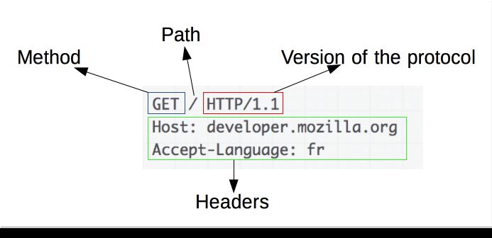

---
tags:
  - network
---

# HTTP
参考：
* [HTTP | MDN](https://developer.mozilla.org/zh-CN/docs/Web/HTTP)

超文本传输​​协议（Hypertext Transfer Protocol，HTTP）是一个用于传输超媒体文档（例如 HTML）的应用层协议。它是为 Web 浏览器与 Web 服务器之间的通信而设计的，但也可以用于其他目的。该协议用于规定一个客户端（用户）和服务端（网站）之间**请求和应答的标准**。

HTTP 请求与响应是指：客户端和服务端通过交换各自的消息（与数据流正好相反）进行交互。客户端，也称为 用户代理程序（user agent），一般是浏览器，发起一个 HTTP 请求 requests 到服务器上指定端口（默认端口为80）；应答 responses 的服务器，也称为 源服务器（origin server），收到请求后会向客户端返回一个状态，比如 `HTTP/1.1 200 OK`，以及返回的内容，如请求的文件、错误消息、或者其它信息，也有可能是接受客户端发送过来数据，如 HTML 表单，返回处理结果。

## HTTP 请求

一个 [HTTP 请求](https://developer.mozilla.org/zh-CN/docs/Web/HTTP/Messages)由以下元素组成：
- **起始行 start-line**：包含三个元素
    - 一个 HTTP 的 method 定义客户端的动作行为。通常是获取资源 `GET` 或者发送表单值 `POST`
    - 要获取的资源的路径，通常是 URL，它没有 protocol（`http://`），域名 domain ，或是TCP的端口 port（HTTP 一般在 `80` 端口）
    - HTTP协议版本号
- **头部信息 Headers**（可选）：消息头用在客户端和服务器通讯时传递附加信息，不区分大小写的字符串，整个 header（包括其值）表现为单行形式
- **主体信息 body**（可选）：对于一些像 POST 方法，报文的 `body` 包含 HTML 表单数据（与响应报文的 `body` 类似）

## HTTP 响应

响应报文包含了下面的元素：
- **状态行 status-line**：
    - HTTP 协议版本号
    - 一个状态码 status code，来告知对应请求执行成功或失败，以及失败的原因。常见的状态码是 `200`，`404`，或  `302 `
    - 一个状态信息，这个信息是非权威的状态码描述信息，可以由服务端自行设定。一个简短的，纯粹的信息，通过状态码的文本描述，帮助人们理解该 HTTP 消息。
- **头部信息 headers**：与请求头部类似，不区分大小写的字符串，紧跟着的冒号 `:` 和一个结构取决于 header 类型的值
- **主体信息 body**（可选项）：不是所有的响应都有 body（如 `201` 或 `204` 的响应通常不会有 `body`）。比起请求报文，响应报文中更常见地包含获取的资源  `body`

常见的状态码是：
- `200 OK` 表明请求已经成功
- `404 Not Found` 代表客户端错误，指的是服务器端无法找到所请求的资源。返回该响应的链接通常称为坏链 broken link 或死链 dead link，它们会导向链接出错处理 link rot 页面。
- `302 Found` 重定向状态码，表明请求的资源被暂时的移动到了由 Location 头部指定的 URL 上。浏览器会重定向到这个URL， 但是搜索引擎不会对该资源的链接进行更新。

## 基于 HTTP 的 APIs
基于 HTTP 的最常用 API 是 XMLHttpRequest API，可用于在 user agent 和服务器之间交换数据。 现代Fetch API 提供相同的功能，具有更强大和灵活的功能集。