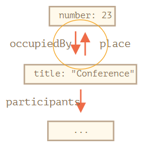

---
tags:
  - network
  - javascript
---

# JSON
参考：
* [介绍 JSON](https://www.json.org/json-zh.html)
* [JSON - JavaScript | MDN](https://developer.mozilla.org/zh-CN/docs/Web/JavaScript/Reference/Global_Objects/JSON)
* [JSON: What It Is, How It Works, & How to Use It](https://www.copterlabs.com/json-what-it-is-how-it-works-how-to-use-it/)

JSON（**J**ava**S**cript **O**bject **N**otation，JavaScript 对象标记）是一种轻量级的数据交换格式，它是一种与语言无关的纯数据规范，常用作存储/传输嵌套（分层）式数据的格式，支持将对象 （或其他类型的数据）简单封装在其他对象中，这种拓展性可存储更复杂数据结构。

JSON 数据格式十分简单，建构于两种结构，一种是「名称/值」对的集合形式，另一种是有序列表形式。大部分现代计算机语言都以某种形式支持这两种数据结构，这使得 JSON 数据基于各种编程语言的系统之间**交换**成为可能

* **无序的「名称/值」对集合 A collection of name/value pairs**：JSON 对象是一个无序的「名称/值」对集合。对象以花括号 `{}` 包含。名称与值之间以冒号 `:` 分隔，「名称/值」对之间使用逗号 `,` 分隔。
    ```json
    var jason = {
    	"age" : "24",
    	"hometown" : "Missoula, MT",
    	"gender" : "male"
    };
    ```
    使用**点记法**可访问特定键的数据。:warning: 键是**必须是双引号 `""` 括起来**的字符串
    :bulb: 不同的语言中，该数据解构被定义为对象 `object`、纪录 `record`、结构 `struct`、字典 `dictionary`、哈希表 `hash table`、有键列表 `keyed list`、关联数组 `associative array` 等。

* **有序的值列表 An ordered list of values**：JSON 数组以中括号 `[]` 包含，值之间使用逗号 `,` 分隔。


    ```json
    var family = [{
        "name" : "Jason",
        "age" : "24",
        "gender" : "male"
    },
    {
        "name" : "Kyle",
        "age" : "21",
        "gender" : "male"
    }];
    ```
    使用**索引**和**点记法**访问数据
    :bulb: 在大部分语言中这种数据格式被定义为数组 Array（而且元素一般是更复杂的数据形成嵌套格式）

:warning: JSON 不支持注释，向 JSON 添加注释无效。

## 工具
由于混合使用了嵌套的大括号、方括号和逗号， 很容易使 JSON 出现错误。可以借助语法检测工具，或专业的代码编辑器检查 JSON 代码文件的语法是否存在错误。

* [JSONLint](https://jsonlint.com/) 工具用于分析 JSON 代码，查找语法错误。
* [JSON Formatter Oline](https://jsonformatter-online.com/) 在线将 JSON 数据转换为更适合阅读的展示模式

## 常用方法
JSON 的常规用途是网络中进行数据传输，浏览器使用 JavaScript 语言对 JSON 数据进行解析，常用方法有 `JSON.parse(jsonData)`。

JSON 支持多种 JavaScript 数据结构/类型 `object`，`array`，`string`，`number`，`boolean` 和 `null`，JSON 会有自己的独立标准处理/转换这些数据。

### JSON.parse
JSON 数据都是主要由字符串构成，一般获取服务器的响应后，浏览器使用方法 `JSON.parse()` 将 JSON 数据**反序列 deserialize**/转换为 JavaScript 对象。

```js
let json = '{ "name":"Bill Gates", "age":62, "city":"Seattle"}';

// 使用函数 JSON.parse() 把文本转换为 JavaScript 对象
var obj = JSON.parse(json);

console.log(obj.name) // "Bill Gates"
```

对于嵌套对象依然可以解析

```js
let userData = '{ "name": "John", "age": 35, "isAdmin": false, "friends": [0,1,2,3] }';

let user = JSON.parse(userData);
alert( user.friends[1] ); // 1
```

#### reviver
函数 `JSON.parse()` 可传递第二个可选参数 `reviver` 它接受一个回调函数，在其中设置转换规则。JSON 数据的每个 `(key,value)` 都会执行该回调函数的处理，并返回相应的值。

```js
let str = '{"title":"Conference","date":"2017-11-30T12:00:00.000Z"}';

let meetup = JSON.parse(str);
// JSON 数据中的字符串默认转换为 JavaScript 字符串类型
alert( meetup.date.getDate() ); // Error!
```

为函数 `JSON.parse(data, reviver)` 传递第二个参数 `reviver`  ，在该回调函数中设置 `date` 键的值转换为 `Date` 对象（而非字符串）

```js
let str = '{"title":"Conference","date":"2017-11-30T12:00:00.000Z"}';

let meetup = JSON.parse(str, function(key, value) {
  if (key == 'date') return new Date(value);
  return value;
});

alert( meetup.date.getDate() ); // 现在正常运行了！
```

:bulb: `reviver` 回调函数适用于所有键值对，包括 JSON 结构中的嵌套对象

### JSON.stringify
当发送的数据需要使用 JSON 格式，可以使用方法 `JSON.stringify()` 将 JavaScript 对象序列化 serialize，即转换成 JSON 数据结构

```js
let student = {
  name: 'John',
  age: 30,
  isAdmin: false,
  courses: ['html', 'css', 'js'],
  wife: null
};

let json = JSON.stringify(student);

alert(typeof json);   // string

alert(json);
/* JSON 编码的对象：
{
  "name": "John",
  "age": 30,
  "isAdmin": false,
  "courses": ["html", "css", "js"],
  "wife": null
}
```

示例得到的 `json` 字符串是一个被称为 JSON 编码 JSON-encoded/序列化 serialized/字符串化 stringified/编组化 marshalled 的对象，它与对象字面量有几个重要的区别：

- 字符串使用双引号（JSON 中没有单引号或反引号）所以示例中 `'John'` 被转换为 `"John"`。
- **对象属性名称也是双引号的**，这是强制性的，所以示例中 `age:30` 被转换成 `"age":30`。

:bulb: JSON 支持以下的 JavaScript 数据类型，调用方法 `JSON.stringify(data)` 会根据自己的标准规范对这些数据进行转换

- 对象 `{ ... }` 一般将属性值会转换为字符串
- 数组 `[ ... ]` 一般将字符串元素转换为双引号的字符串，保持数组顺序结构
- 原始数据类型
    - `strings` 转换为双引号的字符串
    - `numbers` 保留数字格式
    - `boolean` 保留 `true` 和 `false` 格式
    - `null` 保留 `null` 格式

```js
// 数字在 JSON 还是数字
alert( JSON.stringify(1) )   // 1

// 字符串在 JSON 中还是字符串，只是被双引号扩起来
alert( JSON.stringify('test') )   // "test"

alert( JSON.stringify(true) );   // true

alert( JSON.stringify([1, 2, 3]) );   // [1,2,3]
```

:warning: 一些特定于 JavaScript 的对象属性会被 `JSON.stringify` 跳过，包括：

- 函数属性（方法）。
- Symbolic 属性。
- 存储 `undefined` 的属性。

```js
let user = {
  sayHi() { // 被忽略
    alert("Hello");
  },
  [Symbol("id")]: 123, // 被忽略
  something: undefined // 被忽略
};

alert( JSON.stringify(user) ); // {}（空对象）
```

最棒的是函数 `JSON.stringify(data)` 支持嵌套对象转换。

```js
let meetup = {
  title: "Conference",
  room: {
    number: 23,
    participants: ["john", "ann"]
  }
};

alert( JSON.stringify(meetup) );
/* 整个结构都被字符串化了
{
  "title":"Conference",
  "room":{"number":23,"participants":["john","ann"]},
}
*/
```

:warning: 重要的限制不得转换有循环引用的对象，否则会造成转换失败了。

```js
let room = {
  number: 23
};

let meetup = {
  title: "Conference",
  participants: ["john", "ann"]
};

meetup.place = room;       // meetup 引用了 room
room.occupiedBy = meetup; // room 引用了 meetup

JSON.stringify(meetup); // Error: Converting circular structure to JSON
```



#### replace
函数 `JSON.stringify(data, [replacer])` 可以设置一个可选参数 `replacer` 以指定需要转换的属性，可以排除过滤掉循环引用的属性。参数 `replace` 可以通过传递一个数组（数组元素是对象中需要转换的属性名称)，也可以是一个回调函数（回调函数中指定筛选/转换规则）。

```js
let room = {
  number: 23
};

let meetup = {
  title: "Conference",
  participants: [{name: "John"}, {name: "Alice"}],
  place: room // meetup 引用了 room
};

room.occupiedBy = meetup; // room 引用了 meetup

alert( JSON.stringify(meetup, ['title', 'participants']) );
// {"title":"Conference","participants":[{},{}]}
```

示例可能过于严格，由于嵌套对象的属性不在数组中，所以 `participants` 是空的，可以手动将所有需要转换的对象属性添加到列表中（包括内嵌对象的属性，除了循环引用的属性之外）

```js
let room = {
  number: 23
};

let meetup = {
  title: "Conference",
  participants: [{name: "John"}, {name: "Alice"}],
  place: room // meetup 引用了 room
};

room.occupiedBy = meetup; // room 引用了 meetup

alert( JSON.stringify(meetup, ['title', 'participants', 'place', 'name', 'number']) );
/*
{
  "title":"Conference",
  "participants":[{"name":"John"},{"name":"Alice"}],
  "place":{"number":23}
}
*/
```

但是手动列出对象的所有需要转换的属性实在麻烦，那么可以传递一个回调函数，用以指定转换的规则。这个函数会获取每个键/值对，包括嵌套对象和数组项，为每个 `(key,value)` 调用该函数并返回相应的值（该值将替换按照原有规则生成的值）。:bulb: 如果需要值被跳过，会设置为 `undefined`。`replacer` 中的 `this` 的值是包含当前属性的对象（即递归处理内嵌的属性时，`this` 指向的是内嵌对象）。

```js
let room = {
  number: 23
};

let meetup = {
  title: "Conference",
  participants: [{name: "John"}, {name: "Alice"}],
  place: room // meetup 引用了 room
};

room.occupiedBy = meetup; // room 引用了 meetup

alert( JSON.stringify(meetup, function replacer(key, value) {
  return (key == 'occupiedBy') ? undefined : value;   // 一般键值对返回原值，只有当键为 occupiedBy 时返回 undefined 即跳过该属性
}));

/* key:value pairs that come to replacer:
:             [object Object]
title:        Conference
participants: [object Object],[object Object]
0:            [object Object]
name:         John
1:            [object Object]
name:         Alice
place:        [object Object]
number:       23
*/
```

在上述示例输出结果中，部分键值对的键是空的 `:[object Object]`它们表示了该值是整个目标对象，它是使用特殊的「包装对象」产生的，如第一个键值对表示 `{"": meetup}` ，存在该键值对为了给 `replacer` 提供尽可能多的功能，如果有必要它有机会分析并替换/跳过整个对象。

#### 格式化
函数 `JSON.stringify(value, replacer, spaces)` 允许传递第三个可选参数是用于优化格式的空格数量。在网络传递时所有字符串化的对象都没有缩进和额外的空格，但在解析 JSON 数据并输出可以通过该参数进行「美化」，一般用于日志输出。

```js
let user = {
  name: "John",
  age: 25,
  roles: {
    isAdmin: false,
    isEditor: true
  }
};

alert(JSON.stringify(user, null, 2));
/* 两个空格的缩进：
{
  "name": "John",
  "age": 25,
  "roles": {
    "isAdmin": false,
    "isEditor": true
  }
}
*/

/* 对于 JSON.stringify(user, null, 4) 的结果会有更多缩进：
{
    "name": "John",
    "age": 25,
    "roles": {
        "isAdmin": false,
        "isEditor": true
    }
}
*/
```

#### 自定义序列化规则
[对象可以设置方法`toString` 指定转换为字符串的规则](../JavaScript/语法基础/对象.md#对象原始值转换)，类似地，对象可以设置方法 `toJSON` 指定转换为 JSON 的规则，如果对象中方法 `toJSON()` 可用，`JSON.stringify` 会自动调用它。

```js
let room = {
  number: 23
};

let meetup = {
  title: "Conference",
  room
};

alert( JSON.stringify(meetup) );
/*
  {
    "title":"Conference",
    "room": {"number":23}               // 将嵌套引用对象的具体数据「拷贝」后进行相应的转换，由于 JSON 结构中只能是「裸值」
  }
*/

// 为对象添加 toJSON 方法
let room = {
  number: 23,
  toJSON() {
    return this.number;   // 转换为 JSON 格式时直接返回数字，当 room 嵌套在另一个编码对象中时该规则依然可用
  }
};

let meetup = {
  title: "Conference",
  room
};

alert( JSON.stringify(room) ); // 23

alert( JSON.stringify(meetup) );
/*
  {
    "title":"Conference",
    "room": 23
  }
*/
```