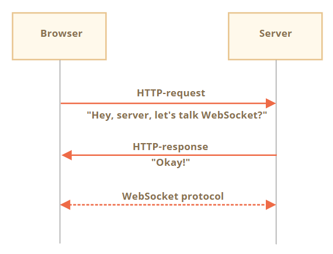

# WebSocket
在 [RFC 6455](http://tools.ietf.org/html/rfc6455) 规范中描述的 `WebSocket` 协议提供了一种在浏览器和服务器之间**建立持久连接来交换数据**的方法，数据可以作为「数据包」在两个客户端和服务器之间传递，而不会断开连接和其他 HTTP 请求，对于需要连续数据交换的服务，例如网络游戏，实时交易系统等，WebSocket 尤其有用。

## 建立连接
使用构造函数 `WebSocket` 创建一个 WebSocket 连接，然后它将立即开始连接。

```js
let socket = new WebSocket("ws://javascript.info");
```

:warning: 在连接期间，浏览器（使用 header）询问服务器是否支持 WebSocket 协议，如果服务器响应支持，那么通信就以 WebSocket 协议继续进行，**该协议根本不是 HTTP**。 创建 WebSocket 连接需要在 url 中使用特殊的 `ws` 或 `wss` 协议。



```js
// 由 new WebSocket("wss://javascript.info/chat") 发出的请求 header
GET /chat
Host: javascript.info
Origin: https://javascript.info
Connection: Upgrade
Upgrade: websocket
Sec-WebSocket-Key: Iv8io/9s+lYFgZWcXczP8Q==
Sec-WebSocket-Version: 13
```

:bulb: 类似于 HTTPS，WebSocket 同样也有一个加密的 `wss://` 协议，因为 `ws://` 数据不是加密的，对于任何中间人来说其数据都是可见的，并且旧的代理服务器不了解 WebSocket，它们可能会因为看到「奇怪的」 header 而中止连接；而 `wss://` 是基于 TLS 的 WebSocket，类似于 HTTPS 是基于 TLS 的 HTTP，传输安全层在发送方对数据进行了加密在接收方进行解密，因此应该始终使用更可靠的 `wss://` 协议。

```js
// 如果服务器同意切换为 WebSocket 协议，服务器应该返回响应码 `101`
101 Switching Protocols
Upgrade: websocket
Connection: Upgrade
Sec-WebSocket-Accept: hsBlbuDTkk24srzEOTBUlZAlC2g=
```

:bulb: `Sec-WebSocket-Accept: Sec-WebSocket-Key` 表示使用特殊的算法重新编码，浏览器使用它来确保响应与请求相对应。

:bulb: 构造函数 `WebSocket` 第二个参数（可选）可用于设置其他 header 以使用扩展和子协议，如 `Sec-WebSocket-Extensions` 和 `Sec-WebSocket-Protocol`。如果服务器支持这些扩展/子协议，应该使用同意使用的协议和扩展的列表进行响应。

```js
let socket = new WebSocket("wss://javascript.info/chat", ["soap", "wamp"]);
```

### 连接状态
通过属性 `socket.readyState` 获取连接状态，返回一个数值表示相对应的状态

- **`0`** CONNECTING 连接还未建立，
- **`1`** OPEN 通信中，
- **`2`** CLOSING 连接关闭中，
- **`3`**  CLOSED 连接已关闭

## 事件监听
一旦 socket 被建立，我们就应该监听 socket 上的 4 个事件

- 事件 **`open`** 表示连接已建立
- 事件 **`message`** 表示接收到数据
- 事件 **`error`** 表示 WebSocket 错误
- 事件 **`close`** 表示连接已关闭

如果需要发送数据就使用方法 `socket.send(data)`

## 数据传输
创建连接成功后就可以使用 WebSocket 协议传输数据，使用方法 `.send()` 发送文本或二进制数据。

WebSocket 通信由数据片段 "frames" 组成，有以下几种类型，在浏览器里仅直接使用文本或二进制 frames：

- text frames 包含各方发送给彼此的文本数据。
- binary data frames 包含各方发送给彼此的二进制数据。
- ping/pong frames 被用于检查从服务器发送的连接，浏览器会自动响应它们。
- connection close frame 以及其他服务 frames。

:bulb: 当我们收到数据时，文本总是以字符串形式呈现，而对于二进制数据，它是由 `socket.bufferType` 属性设置的，默认为 `"blob"`，因此二进制数据通常以 `Blob` 对象呈现。[Blob](https://zh.javascript.info/blob) 是高级的二进制对象，它直接与 `<a>`，`` 及其他标签集成在一起；但是对于二进制处理，要访问单个数据字节，可以将其改为 `"arraybuffer"`

```js
socket.bufferType = "arraybuffer";
socket.onmessage = (event) => {
  // event.data 可以是文本（如果是文本），也可以是 arraybuffer（如果是二进制数据）
};
```

### 限速
当用户的网速很慢时数据将会缓冲（储存）在内存中，并且只能在网速允许的情况下尽快将数据发送出去。

属性 `socket.bufferedAmount` 储存目前已缓冲的字节数，等待通过网络发送，我们可以检查它控制是否继续调用 `socket.send(newData)` 发送新数据。

```js
// 每 100ms 检查一次 socket
// 仅当所有现有的数据都已被发送出去时，再发送更多数据
setInterval(() => {
  if (socket.bufferedAmount == 0) {
    socket.send(moreData());
  }
}, 100);
```

## 连接关闭
当一方想要关闭连接时（浏览器和服务器都具有相同的权限），它们使用方法 `close()` 会发送一个带有数字码 numeric code 和文本形式的原因的 "connection close frame"

```js
socket.close([code], [reason]);
```

参数说明：
- `code` 是一个特殊的 WebSocket 关闭码（可选），WebSocket 码有点像 HTTP 码，但它们是不同的，特别是小于 `1000` 的码都是被保留的，如果我们尝试设置这样的码，将会出现错误。常见的[数字码](https://tools.ietf.org/html/rfc6455#section-7.4.1)有
    - `1000` 默认，正常关闭
    - `1006` 没有办法手动设定这个数字码，表示连接丢失（没有 close frame）
    - `1001` 一方正在离开，如服务器正在关闭或浏览器离开了该页面
    - `1009` 消息太大，无法处理
    - `1011` 服务器上发生意外错误
- `reason` 是一个描述关闭原因的字符串（可选）

另一方通过监听事件 `close`并调用处理器获取关闭码和关闭原因

```js
// 关闭方：
socket.close(1000, "Work complete");

// 另一方
socket.onclose = event => {
  // event.code === 1000
  // event.reason === "Work complete"
  // event.wasClean === true (clean close)
};
```

具体实例演示可查看：[聊天示例](https://zh.javascript.info/websocket#liao-tian-shi-li)

:bulb: 另一种与服务器建立持久连接的方法是[使用 `EventSource` 对象创建连接](https://zh.javascript.info/server-sent-events)，它允许服务器通过这个连接发送消息（单向），这使得 `EventSource` 成为 `WebSocket` 的一个可行的替代方案（简单版本）。