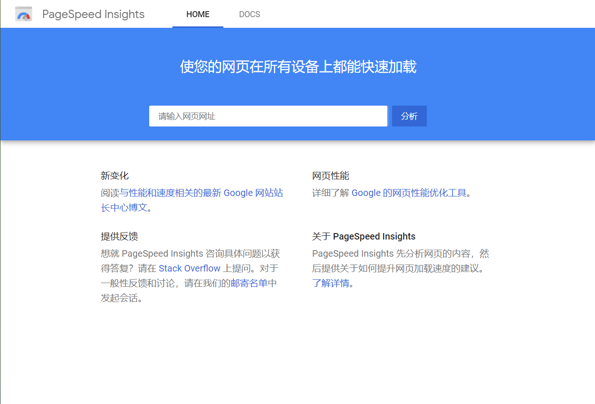

---
tags:
  - network
---

# 网站加载优化
参考：[PageSpeed Insights 简介](https://developers.google.com/speed/docs/insights/about#faq)

[PageSpeed Insights](https://developers.google.com/speed/pagespeed/insights/) 是一个网站性能优化工具。它分析网页的内容，针对移动设备和桌面设备生成网页的实际性能报告，并提供关于如何改进相应网页的建议。可在线使用（[示例](https://developers.google.com/speed/pagespeed/insights/?url=simpl.info%2Fcssfilters)），也可以使用插件 ：
* [Grunt PageSpeed 插件](https://www.npmjs.com/package/grunt-pagespeed)
* [PageSpeed Node module](https://github.com/addyosmani/psi/)
* [PageSpeed Insights Node module](https://github.com/addyosmani/psi/)
* Chrome 插件 [Google PageSpeed Insights Extension](https://chrome.google.com/webstore/detail/google-pagespeed-insights/edbkhhpodjkbgenodomhfoldapghpddk?hl=zh-CN)（Chrome 开发者工具内置的 PageSpeed Insights 已[停用](https://developers.google.com/speed/pagespeed/insights_extensions)）

**注意**：由于网络连接性能有很大差异，因此，优化建议针对的是网页性能中与网络无关的方面，例如服务器配置、网页的 HTML 结构，以及网页使用外部资源（例如，图片、JavaScript 和 CSS 内容）的情况。实现这些建议应该能够改进网页的相对性能。不过，网页的绝对性能仍将受用户网络连接的影响。

网页加载速度性能受多种因素影响，最为重要的是以下两个因素：
* **阻碍呈现的往返次数**：加载阻碍呈现的资源所需的往返次数。如果网页的大部分资源都会阻碍呈现，PageSpeed Insights 会认为相应网页有较大的优化空间。开发者可以调查以下规则，以进行优化：
    * 避免着陆页重定向
    * 清除阻碍呈现的 JavaScript 和 CSS 内容
    * 使用浏览器缓存
    * 优先加载可见内容以及缩短服务器响应时间。
* **响应大小**：响应的总体大小，包括 HTML 主要资源和所有子资源。如果通过压缩或缩减大小可清除响应主体的大部分内容，PageSpeed Insights 会认为相应网页有较大的优化空间。开发者可以调查以下规则，以进行优化：
    * 启用压缩功能
    * 缩减资源大小和优化图片

示例：[Udacity项目二-网页优化](https://zhuanlan.zhihu.com/p/31401516)

1. 将项目[托管到 Github 上](https://zhuanlan.zhihu.com/p/30966179)
2. 利用[网页版 Pagespeed Insights](https://developers.google.com/speed/pagespeed/insights/) 进行网页测试
3. 根据 Pagespeed Insights 给出的提示进行多次修改、优化、检测