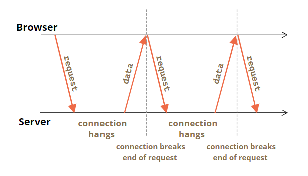

---
tags:
  - network
---

# 长轮询
从服务器获取新信息的最简单的方式是定期轮询，每隔固定事件客户端向服务器发送请求获取消息（即使数据并无更新），这种方法可以及时更新数据但是频繁固定的请求可能会造成服务器很大负担；长轮询则是另一种是与服务器保持持久连接的更好方式，它十分简单不使用任何特定的协议，也可以实现「无延迟」地传递消息以保持数据是最新的。

长轮询 Long polling 基本流程：

1. 请求发送到服务器，与服务器之间建立一个**挂起 pending 连接**
2. 服务器不会关闭该连接
3. 直到有数据更新时，服务器将其作为响应发送回给客户端，然后连接就会中断
4. 浏览器读取响应后立即又发出一个新的请求，与服务器之间建立一个挂起的连接……如此循环



:bulb: 如果连接丢失，可能是因为网络错误，浏览器会立即发送一个新请求。

```js
// 实现长轮询的客户端 subscribe 函数
async function subscribe() {
  let response = await fetch("/subscribe");

  if (response.status == 502) {
    // 状态 502 是连接超时错误，
    // 连接挂起时间过长时可能会发生，
    // 远程服务器或代理会关闭它
    // 让我们重新连接
    await subscribe();
  } else if (response.status != 200) {
    // 一个 error —— 让我们显示它
    showMessage(response.statusText);
    // 一秒后重新连接
    await new Promise(resolve => setTimeout(resolve, 1000));
    await subscribe();
  } else {
    // 获取并显示消息
    let message = await response.text();
    showMessage(message);
    // 当 fetch 请求被处理完成后，会再次调用 subscribe() 再次建立一个挂起的连接
    await subscribe();
  }
}

subscribe();
```

具体实例演示可查看：[聊天](https://zh.javascript.info/long-polling#shi-li-liao-tian)

:warning: 在消息很少的情况下，长轮询很有效。如果消息比较频繁，那么请求 - 接收 requesting-receiving 消息的图表就会变成锯状状 saw-like，由于每个消息都是一个单独的请求，并带有 header，身份验证开销（authentication overhead）等，效率较低。此时应该选择其他方法，如 [Websocket](https://zh.javascript.info/websocket) 或 [Server Sent Events](https://zh.javascript.info/server-sent-events)。