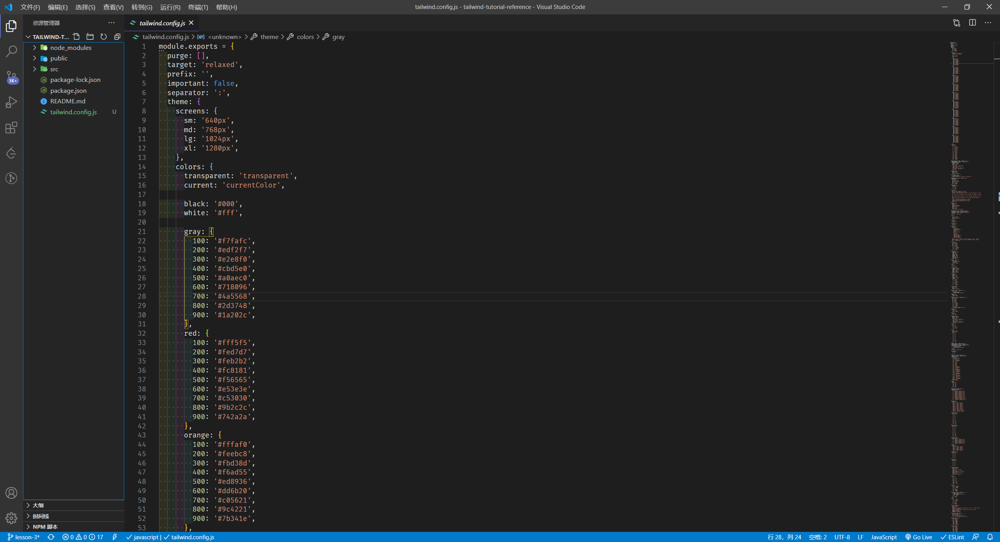

---
tags:
  - tailwind
---

# 安装与编译
Tailwind 一般通过 npm 安装，以模块引入项目中，并需要经过编译后才可以使用。

## 安装
```bash
# Using npm
npm install tailwindcss

# Using Yarn
yarn add tailwindcss
```

## 引入 Tailwind
将 Tailwind 基础类引入到项目的样式表中，如项目的样式在 `src/styles.css` 文档中

```css
/* 📁 styles.css */
@tailwind base;

@tailwind components;

@tailwind utilities;
```

:bulb: 如果使用 postcss 插件或其他打包工具，如 webpack，则使用 `@import` 关键字导入

```css
@import "tailwindcss/base";

@import "tailwindcss/components";

@import "tailwindcss/utilities";
```

## 创建 Tailwind 配置文件
可以在配置文件 `tailwind.config.js` 中增添或修改覆写原有的基础类（:warning: 但不建议修改原有的基础类）在终端输入以下命令即可创建该配置文件：

```bash
npx tailwindcss init
```

```js
// 📁 tailwind.config.js
// 在该文档中配置 tailwind
module.exports = {
  future: {},
  purge: [],
  theme: {
    extend: {},
  },
  variants: {},
  plugins: [],
}
```
:bulb: Tailwind 的配置文件虽然是可选的，但强烈建议在初始化项目时创建该文件，VS Code 插件 [Tailwind CSS IntelliSense](https://marketplace.visualstudio.com/items?itemName=bradlc.vscode-tailwindcss) 需要项目中存在该文件才启动。

:bulb: 如果需要将所有预设的基础类列出到配置文件中，可以在终端命令添加 `--full` 指令，然后可以参照原有的基础类，添加定制的基础类

```bash
npx tailwindcss init --full
```



:bulb: 虽然 Tailwind 提供 [CDN 方式载入](https://tailwindcss.com/docs/installation#using-tailwind-via-cdn)，但强烈**不**建议使用，因为无法使用很多 Tailwind 的功能，而且最重要的是无法定制基础类。

## 编译
有多种方式编译 tailwind 生成 CSS 样式表文档

* 使用 [PostCSS 插件](https://tailwindcss.com/docs/installation#using-tailwind-with-post-css)
    :bulb: 需要在终端输入 `npm install postcss-cli` 安装相应的 CLI，具体配置和编译流程可参考教程 [Setting up Tailwind and PostCSS](https://www.tailwindcss.cn/course/setting-up-tailwind-and-postcss/) 或官方文档  [PostCSS documentation](https://github.com/postcss/postcss#usage)
    在项目中创建 post-css 配置文档
    ```js
    // 📁 postcss.config.js
    module.exports = {
      plugins: [
        // ...
        require('tailwindcss'),
        require('autoprefixer'),   // 可以添加其他的 CSS 插件
        // ...
      ]
    }
    ```

* 使用 [Tailwind CLI](https://tailwindcss.com/docs/installation#using-tailwind-cli)
    所安装的 Tailwind 模块已内置 CLI，可用于编译
    ```bash
    npx tailwindcss build styles.css -o output.css
    ```

* 使用[打包工具](https://tailwindcss.com/docs/installation#build-tool-examples)，如 Webpack

:bulb: 可以将编译代码整合为 npm script，如使用 Tailwind CLI 编译，可以在 `package.json` 中添加相应的命令

```js
// 📁 package.json
// 样式表源代码在文档 src/styles.css 中
// 编译生成的代码在 public/styles.css 中
{
  // ...
  "scripts": {
    "build-css": "tailwindcss build src/styles.css -o public/styles.css"
  },
}
```
:warning: 当配置文件和原始的 `style.css` 等文件修改后需要经过编译才可生效。